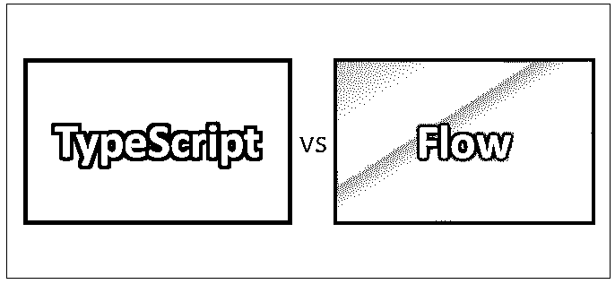
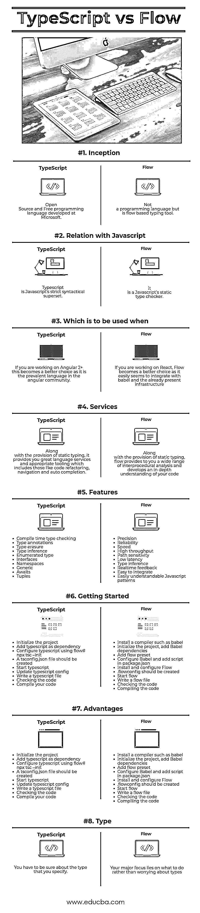

# 类型脚本与流程

> 原文：<https://www.educba.com/typescript-vs-flow/>

## 类型脚本与流之间的差异

[TypeScript 是微软开发的一种](https://www.educba.com/what-is-typescript/)开源编程语言，延续了作为扩展的 [Javascript](https://www.educba.com/what-is-javascript/) ，更广为人知的是 angularJS 2 的语言。它集成了许多现代编程范例和特性，使得 javascript 的使用更加简单高效。另一方面，Flow 不是一种编程语言，而是 Javascript 的静态类型检查器，也就是说，它是一种生产力工具，可以下载并安装在本地，在您的代码上运行，分析代码，从中生成一些有意义的见解。它有捕捉类型错误的独特能力。

### 以打字打的文件

Typescript 包括一个类、模块和语言接口。所有这些都是为了让大规模开发变得更容易。Typescript 支持可选的静态类型特性，这提供了许多优势，例如它为编译器提供了更好的代码可读性和理解性，以及更好的错误滞留。所有这些都极大地改进了使用 typescript 的文档处理过程，并提供了一个清晰简洁的视图。

<small>网页开发、编程语言、软件测试&其他</small>

### 流动

*   另一方面，flow 的目标是推导出那些行为不稳定且不可预料的代码片段。它还建议程序员如何处理问题。
*   Flow 提供了许多 IDE 特性所需的主干，例如错误自动完成、高亮显示和自动化重构。您还可以配置支持 Javascript 的常规文本编辑器，如 visual studio 代码和 atom。
*   由于其开箱即用的实用性，Flow 被认为是比 TypeScript 更简单的语言。开发人员必须学习类型脚本语法，例如类型注释，以及如何修改代码。
*   他们必须非常确定他们正在指定和使用的类型。另一方面，通过使用“流分析”技术，flow 拥有从现有代码片段中自动分配类型信息的能力，这种技术可以自己发现类型错误。

### TypeScript 和 Flow 之间的直接比较(信息图表)

下面是 TypeScript 与 Flow 之间的 8 大比较:

### TypeScript 和 Flow 之间的主要区别

让我们讨论一下 TypeScript 和 Flow 之间的一些主要区别:

1.  在许多情况下，与 flow 相比，Typescript 与许多框架、库和编译器具有更好的兼容性，例如 angularJs，而如果您正在使用 react.js，使用 Flow 应该是显而易见的选择。不是说反应式不支持 typescript 只是由于本机的不可用性，需要对您的代码进行一些额外的调整，比如类型转换。
2.  当您必须使用类型检查静态类功能，甚至不需要编写非标准的 Javascript 代码(即要求编译回 Javascript 的代码)时，Flow 是更好的选择。您可以在注释中编写类型注释，而不是在可执行代码本身中使用它们来使用该功能。
3.  Typescript 为您提供了一些额外的语言服务，如代码完成功能、导航和重构功能，而 flow 旨在建立对代码的更深层次的理解，并负责进行过程间分析。

### 打字稿和流程对照表

下面是描述 TypeScript 和 flow 之间的比较的要点列表。

| **比较的基础** | **打字稿** | **流量** |
| **盗梦空间** | 微软开发的开源免费编程语言 | 不是一种编程语言，而是一种基于流程的打字工具 |
| **与 Javascript 的关系** | Typescript 是 Javascript 的严格语法超集。 | 这是一个 Javascript 的静态类型检查器 |
| **在**时使用 | 如果你正在使用 Angular 2+，这将是一个更好的选择，因为它是 Angular 社区中流行的语言。 | 如果你在 React 上工作，Flow 会成为一个更好的选择，因为它似乎很容易与 babel 和已经存在的基础设施集成。 |
| **服务** | 除了提供静态类型，它还为您提供了出色的语言服务和适当的工具，包括代码重构、导航和自动完成。 | 除了提供静态类型，flow 还为您提供了广泛的过程间分析，并加深了您对代码的理解 |
| **特性** | 

*   Compile-time type check
*   Type comment
*   Type erasure
*   Type inference
*   enumeration type
*   joggle/interface
*   Namespace
*   generic
*   wait for
*   tuple

 | 

*   precision
*   reliability
*   speed
*   High throughput
*   Path sensitivity
*   Low latency
*   Type inference
*   Real time feedback
*   Easy integration
*   Easy to understand Javascript pattern

 |
| **入门** | 

*   Initialize project
*   Add typescript as a dependency
*   使用流量# npx 配置类型脚本 TSC–初始化
*   You should create a tsconfig.json file
*   启动以打字打的文件
*   Update typescript configuration
*   Writing typescript files
*   Check code
*   Compile your code.

 | 

*   Install a compiler such as Babel.
*   Initialize the project and add the dependency of Babel.
*   Add process preset
*   Configure the Tower of Babel and add scripts in package.json
*   And configure the installation process.
*   Create process configuration
*   Start process
*   Write process files
*   Check code
*   Compile code

 |
| **优势** | 

*   兼容 java 描述语言
*   Type annotation
*   Declaration document
*   kind
*   And module namespace.
*   Generics

 | 

*   Type comment
*   type conversion
*   Duck typing
*   Concise and lengthy
*   Code is more concise.
*   Better readability
*   Easier to modify.

 |
| **类型** | 您必须确定您指定的类型 | 你主要关注的是做什么，而不是担心类型 |

### 结论

Typescripts vs Flow 都是各自领域中令人惊叹的产品。类型脚本和流程都有助于您编写正确的代码。选择工具没有对错之分，所以选择您的业务需求和项目需求。我希望你一定喜欢它。TypeScript vs flow 本帖。请继续关注我们的博客，获取更多类似的帖子。

### 推荐文章

这是一个指南，介绍了 Typescript 和 Flow 之间的主要区别。我们还讨论了 Typescript 与 Flow 的直接比较、主要差异、信息图和比较表。您也可以看看以下文章——

1.  [Iaas 或 Azure 通行证](https://www.educba.com/azure-paas-vs-iaas/)
2.  [JavaScript vs TypeScript](https://www.educba.com/typescript-vs-javascript/)
3.  [角度 JS 与 Vue JS 差异](https://www.educba.com/angular-js-vs-vue-js/)
4.  [让](https://www.educba.com/javascript-var-vs-let/) [vs JavaScript Var](https://www.educba.com/javascript-var-vs-let/)

