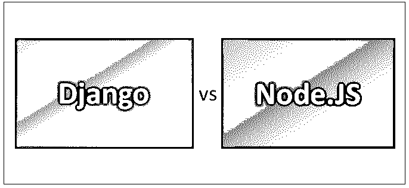
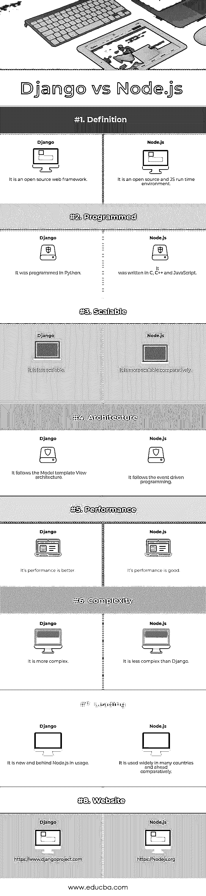

# Django vs Node.js

> 原文：<https://www.educba.com/django-vs-node-js/>

## Django 和 Node.js 的区别

Django 是一个开源的 web 框架。它是用 Python 写的。这是基于不重复自己的原则。Django 在开发 web 应用程序或网站的各种 python 框架中处于最高级别。Django 在创建新的 web 应用程序方面有很好的特性和优势。Node.js 是一个开源的 JavaScript 运行时环境。它被广泛用于许多操作系统，如 Linux、Windows、Mac OS 等。Node.js 用于使用服务器端 JavaScript 开发高级网络应用程序。

### 姜戈

*   Django 是由 Django 软件基金会在 2005 年开发的，由 Adrian Holovaty 和 Simon Willison 设计。Django 的主要特性是高级 python web 框架，因为这个框架提供了设计应用程序的最佳方式。由于开发人员需要遵循 Django 中的规则或方法来实现项目，因此与底层框架相比，自由度相对较小，但创建的应用程序将会整洁干净。
*   Django 主要遵循模型模板视图(MTV)设计模式。除了模板之外，它和 MVC 框架也很相似。和 MVC 一样，MTV 在模型中也有数据访问层。模型处理交互、关联数据或验证数据的过程。模板层被称为表示层，它处理应该在网页或应用程序上显示的内容。视图是业务层，因为它直接访问模型并显示适当的模板。视图就像模型和模板之间的桥梁。
*   Django 是可用于各种操作系统的免费开源工具。它鼓励快速开发，适合快速启动和运行。Django 使用了独特的东西，即应用程序的概念。这意味着，在 Django 中，每个项目或 web 应用程序都可以包含多个应用程序。它也可以有一个应用程序。Django 允许你轻松地将应用程序从一个项目转移到另一个项目。

### 节点. js

*   Node.js 由 Ryan Dahl 设计，Joyent 开发。它于 2009 年首次发布。它是用 C、C++和 JavaScript 编写的。换句话说，Node.js 是一个 JavaScript 平台，其功能类似于 web 服务器，允许开发人员使用 JavaScript 编写完整且高度可伸缩的 web 应用程序。Node.js 构建于 Google V8 JavaScript 引擎之上。有成千上万的开源库支持 Node.js。
*   Node.js 有很多特性，比如事件驱动模型、并发性、简单和轻量级以及非阻塞输入输出。在事件驱动模型中，Node.js 在服务器上产生一个且只有一个操作系统线程，它维护一个小堆请求。这一事件被称为连接正在建立；处理一个事务，从连接和连接关闭接收数据。回调函数与这些事件相关联，因此函数 id 在任何事件完成时被触发。
*   Node.js 已经证明了它是为了获得最大的并发性和可伸缩性而构建的。Node.js 是所有脚本语言中最简单的，因为它使用 JavaScript。它的重量也很轻。非阻塞输入输出是指 web 服务器接收请求并发回响应，而不等待任何输入或输出的过程。这使得它更具可扩展性。

### Django 和 Node.js 的正面比较(信息图)

下面是 Django 和 Node.js 的前 8 名对比:

<small>网页开发、编程语言、软件测试&其他</small>

### Django 和 Node.js 的主要区别

下面是解释 Django 和 Node.js 之间主要区别的一些要点:

1.  Django 提供了很好的安全性，在开发应用程序时，开发人员不需要担心安全问题。Node.js 也提供了很好的安全性，但是开发者需要确保这一点。
2.  Django 真的很通用，因为它可以用于内容管理、计算平台和大型 web 应用程序开发。Node.js 可用于不同范围的 JavaScript web 应用程序。它为您提供了从头开发应用程序的自由和空间。
3.  Django 主要不是指全栈 web 开发。Node.js 越来越受欢迎，因为它使全栈 java 成为现实，开发人员可以为后端和前端应用程序编写代码。
4.  Django 几乎没有社区可以支持。Node.js 社区非常活跃，帮助程序员提高自己并提供解决方案，改进框架。
5.  Django 让开发更高效，成本更低。Node.js 使开发变得容易，但是它减慢了这个过程。
6.  如果开发者懂 Python，Django 很容易学。不然学起来很复杂。如果个人懂 JavaScript，Node.js 很容易学。
7.  Django 有很多特性丰富了开发者的框架，比如内容开发、站点地图和用户认证。Node.js 也有很棒的特性，比如非阻塞输入输出。
8.  Django web 应用程序开发非常稳定。Node.js 系统主要缺乏不稳定性。
9.  Django 有很好的学习曲线。Node.js 简单、直接、易学。
10.  Django 主要用于大型应用，支持多线程编程。Node.js 不支持多线程编程，不适合运行大型计算。

### Django 和 Node.js 对照表

以下是积分列表；描述 Django 和 Node.js 之间的比较。

| ****对比**的依据** | 姜戈 | **Node.js** |
| **定义** | 它是一个开源的 web 框架。 | 它是一个开源的 JS 运行时环境。 |
| **已编程** | 它是用 Python 编程的。 | 它是用 C、C++和 JavaScript 编写的 |
| **可扩展** | 它的可扩展性较差 | 相比之下，它更具可扩展性 |
| **架构** | 它遵循模型模板视图架构。 | 它遵循事件驱动编程。 |
| **性能** | 它的性能更好。 | 它的性能不错。 |
| **复杂度** | 它更复杂。 | 它没有姜戈复杂。 |
| **领先** | 它是新的，在使用上落后于 Node.js。 | 它在许多国家得到了广泛的应用，并相对领先。 |
| **网站** | https://www.djangoproject.com | https://Nodejs.org |

### 结论

Django vs Node.js 是两种不同的工作语言。这些 Django 和 [Node.js 是开发者做 web 应用开发最流行的](https://www.educba.com/node-dot-js-commands/)和最新的技术。对于 web 开发人员来说，Python、Django、JavaScript 和 Node.js 是开发的首选。

从开发人员的角度来看，升级技能或现有知识总是必要的。在长时间研究一种技术的同时学习不同的技术是有好处的。它有助于了解您的学习灵活性，最重要的是，了解 It 世界的技术需求。我希望你喜欢在 Django vs Node.js 上学习这篇文章。!

### 推荐文章

这是 Django 和 Node.js 之间最大差异的指南。在这里，我们还将讨论 Django 和 Node.js 的直接比较、主要差异，以及信息图和比较表。您也可以看看以下文章——

1.  [Ruby vs Node](https://www.educba.com/ruby-vs-node/)
2.  [角度 JS 对节点 JS](https://www.educba.com/angular-js-vs-node-js/)
3.  姜戈和烧瓶
4.  [Node.js 和 Asp.net](https://www.educba.com/node-js-vs-asp-net/)

