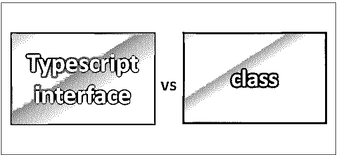
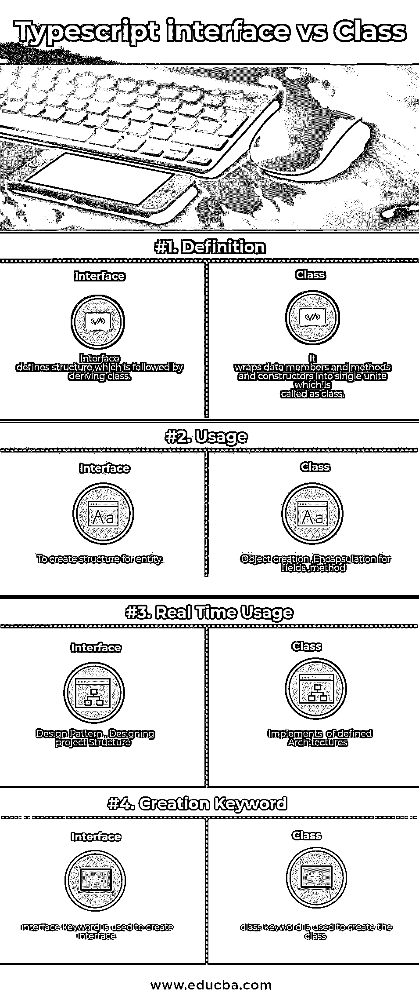

# Typescript 接口与类

> 原文：<https://www.educba.com/typescript-interface-vs-class/>

## Typescript 接口与类的区别

接口定义了结构，后面是派生类。它是任何实体都遵循的契约，接口包含很多东西，比如属性、事件、方法，这些都被称为接口的成员。接口包含这些成员的唯一声明；这些成员将由该接口的派生类来实现。interface 关键字用于声明接口。

### 示例:接口声明

**语法:**

<small>网页开发、编程语言、软件测试&其他</small>

`interface  interface_name
{
}
interface Employee {
firstName:string,
lastName:string,
sayHello: ()=>string
}
var customer: Employee = {
firstName:"Tom",
lastName:"Hanks",
sayHello: ():string =>{return "Hi there"}
}
console.log("Customer Object ")
console.log(customer.firstName)
console.log(customer.lastName)
console.log(customer.sayHello())`

上面的例子定义了一个接口。客户对象属于雇员类型。它现在将绑定到对象上，以定义接口指定的所有属性。

在编译时，它将生成下面给出的 JavaScript 代码。

`//Generated by typescript 1.8.10
var customer = { firstName: "Tom", lastName: "Hanks",
sayHello: function () { return "Hi there"; }
};
console.log("Customer Object ");
console.log(customer.firstName);
console.log(customer.lastName);
console.log(customer.sayHello());`

**上述示例代码的输出:**

客户对象

汤姆(男子名)

汉克斯

你好

类是对象的蓝图；就是[面向对象编程语言](https://www.educba.com/functional-programming-vs-oop/)的概念。一个类提供 OOPs 的封装特性。它将数据成员、方法和构造函数包装成一个单元，这个单元称为类；这样，它提供了封装。Typescript 不支持早期的类[；它得到了一个](https://www.educba.com/typescript-interview-questions/) [ES6 版本 Typescript](https://www.educba.com/es6-vs-es5/) 的支持。class 关键字用于在 Typescript 中创建类。

**语法:**

`class class_name {
//to do
}`

一个类包含数据成员、方法和构造函数；

数据成员，也称为字段，它表示由类创建的对象的属性

一个合适的领带是一个对象的状态，像钢笔的颜色，高度，宽度将被称为一个对象的属性。

方法代表一个对象的行为，就像笔的功能是书写；咖啡机可以制作不同种类的咖啡；这被称为对象的行为。

构造函数用来为一个定义好的类生成一个对象，作为需要的地方，它还负责初始化一个类的一个字段。

这三者被称为一个类的成员，由类封装在一个单元中。

考虑 typescript 中的类雇员。

`class Employee {
}
On compiling, it will generate the following JavaScript code.
//Generated by typescript 1.8.10
var Employee = (function () {
function Employee() {
}
return Employee;
}());`

### 示例:声明类

`class CarDemo {
//field declaration
engine:string;
//constructor declaration
constructor(engine:string) {
this.engine = engine
}
//function  declaration
show():void {
console.log("Engine is  :   "+this.engine)
}
}`

在上面的例子中，类名是 CarDemo，有一个字段名引擎，该引擎有一个初始化字段名引擎的构造函数；这个关键字引用了当前的类实例，这就是为什么。engine = engine 编写，只有一个方法名，显示构造函数初始化的字段值。

编译上面的代码，就会生成下面的 JavaScript 代码。

`//Generated by typescript 1.8.10
var CarDemo = (function () {
function CarDemo(engine) {
this.engine = engine;
}
CarDemo.prototype.show = function () {
console.log("Engine is  :   " + this.engine);
};
return CarDemo;
}());`

创建上述类的实例对象

若要创建类的实例，请使用 new 关键字，后跟类名。下面给出了相同的语法

**语法**

`var object_name = new class_name([ arguments ])`

new 关键字负责实例化。

表达式的右边调用构造函数。如果构造函数是参数化的，则应该向其传递值。

`//creating an object
var obj = new CarDemo("XXSY1");
//access the field
console.log("Reading attribute value Engine as :  " + obj.engine);
//access the function
obj.show();`

上述代码的输出如下

将属性值引擎读取为 XXSY1

功能显示发动机是:XXSY1

### Typescript 接口和类之间的直接比较

下面是 Typescript 接口和类之间的 4 大区别:

### Typescript 接口和类之间的主要区别

让我们讨论一下 Typescript 接口和类之间的一些主要区别:

1.  该接口定义了用于派生该接口的类的结构。接口包含成员函数的唯一声明。
2.  类负责通过给出接口的函数体来实现接口结构；它通过将数据成员和函数包装到一个称为类的盒子中来提供封装。
3.  interface 关键字用于创建一个包含数据成员、函数的接口。
4.  class 关键字用于创建包含数据成员、函数和构造函数的类。
5.  该接口在代码编译期间被完全移除。而类在代码编译期间不移除。
6.  一个接口可以通过扩展关键字来扩展另一个接口；接口提供继承。接口不扩展类；它为类定义了一个结构。接口通过一起扩展多个接口来支持多个继承。
7.  该类通过 implements 关键字实现接口；一个类也可以通过使用 extends 关键字来扩展其他类。这样，一个子类可以使用父类。这个特性称为继承，类不支持多个继承，因为一次只有一个接口由类实现。有了接口就有可能了。

### 类型脚本接口和类对照表

让我们看看 Typescript 接口和类的详细描述。

| 【Typescript 接口与类的比较基础 | **界面** | **类** |
| **定义** | 接口定义了一个结构，其后是派生类。 | 它将数据成员、方法和构造函数包装成一个单元，这个单元称为类。 |
| **用途** | 为实体创建结构。 | 对象创建、字段封装、方法 |
| **实时使用量** | 设计模式，设计项目结构 | 已定义架构的实现 |
| **创作关键词** | interface 关键字用于创建接口。 | class 关键字用于创建类。 |

### 结论

[Typescript](https://www.educba.com/what-is-typescript/)interface vs class 在[软件开发区](https://www.educba.com/software-development-vs-web-development/)都有不同的用途。接口为类提供了结构构建块，而这种结构是由类实现的，通过该类可以创建类的对象。

我们会用一个接口来开发一个开发者未来开发的软件的基本结构；类通过提供接口方法体来实现接口。在软件开发的初始阶段，当需求不明确时，创建接口是很容易的，因为它提供了更改的灵活性，因为类将实现它。

### 推荐文章

这是 Typescript 接口和类之间主要区别的指南。我们还讨论了 Typescript 接口与类的直接比较、关键差异、信息图和比较表。您也可以看看以下文章——

