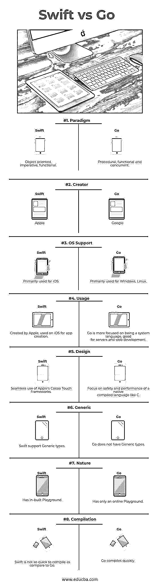

# Swift vs Go

> 原文：<https://www.educba.com/swift-vs-go/>

## Swift 与 Go 的区别

Swift 是苹果公司为 iOS、macOS、watch OS 和 Linux 等操作系统开发的通用编程语言。Swift 支持多种编程范式，它本质上是面向对象的、功能性的和命令式的。它被大量设计为与苹果的 Cocoa 和 Cocoa Touch 框架一起工作。Go 是一种编程语言，也被称为 Golang，由谷歌在 2009 年创建。Go 支持多范例，如过程、功能和并发。它的语法传统上来自 C，但它做了大量的修改，以提高简单性和安全性等特性。

### 迅速发生的

*   Swift 4 版本是 Swift landscape 的最新版本。它采用了 C 和 Objective-C 的优点，没有 C 兼容性的限制。它使用与 Mac OS 和 iOS 上现有的 Objective-C 系统相同的运行时环境，这使得 Swift 4 程序可以在许多现有的 iOS 6 和 OS X 10.8 平台上运行。
*   Swift 没有单独的库导入来支持输入/输出或字符串处理等功能。它还附带了操场功能，Swift 程序员可以在这里编写代码并立即执行以查看结果。Swift 的第一版发布于 2010 年。
*   Swift 的最新版本为学习目的提供了一个平台。一个开发者需要有 Xcode 软件才能在操场上开始 Swift 编码。web 开发人员对 Swift 的语法会更加熟悉。任何对 JavaScript 或[其他脚本语言](https://www.educba.com/programming-languages-vs-scripting-languages/)有一些编程经验的人都会发现使用 Swift 更容易。
*   Swift 有许多有利可图的特性，这些特性使它成为一种新兴的编程语言。Swift 的设计者从其他各种编程语言中汲取了灵感，如 Objective-C、Rust、Haskell、Ruby、Python、C#和 CLU。它利用了安全编程模式，这是现代编程特性的关键要素之一。
*   Swift 通过提供对现有 Cocoa 框架的无缝访问，提供了一种编写 iOS 和 OS X 应用程序的绝佳方式。Swift 拥有将语言的过程部分和面向对象部分结合起来的神奇能力。

### 走

*   用 C 修改后的 Go 语法是为了保持代码的可读性和紧凑性。它增加了文字语法，允许更容易地迭代集合数据结构，如字符串、映射等。
*   Go 及其工具的大部分特性都遵循了 UNIX 的模式，考虑到了实用性，所以开发者现在可以更专注于开发逻辑，而不是合并到语言结构中。
*   你不必编译你的 Go 代码来运行它。它将被自动编译和运行。围棋的一个主要优势是它简洁而快速。
*   人们确实在里面写了很多剧本。当涉及到[网络编程](https://www.educba.com/web-services-interview-questions/)，微服务或者[移动开发](https://www.educba.com/mobile-app-development-training-and-certification/) t 时，Go 可以作为一个非常强大的工具。在许多用例中，Go [网络开发](https://www.educba.com/career-in-web-development/)已经被证明比 Swift 更快。

### Swift 和 Go 信息图的直接比较

以下是 Swift 和 Go 的 8 大区别:

<small>网页开发、编程语言、软件测试&其他</small>

### Swift 和 Go 的主要区别

Swift 和 Go 性能之间的主要差异在以下几点进行了解释:

1.  Swift 是一种非常复杂的语言，而 Go 是一种简约的语言，很容易学习和掌握。
2.  Swift 使用引用计数机制而不是标记和清除策略来进行垃圾收集，而 Go 使用自动垃圾收集。
3.  Swift 的库和支持是以苹果为中心的，虽然是开源的，有官方的 Linux 端口(T1)，但没有官方的 Windows 支持(T3)，而 Go 是开源的，并不特定于某个产品或操作系统。
4.  Swift 更适合在 iOS 上编写应用程序，而 Go 更适合编写服务器和网络开发。
5.  Swift 语法仍然可能改变，因为这种语言还没有最终版本，而 Go 现在是 1.3 版本，本质上更加稳定。
6.  [Swift 有](https://www.educba.com/install-swift/)一个内置的操场，看起来类似于 iPython 的笔记本，而 Go 只有一个在线操场，让你在线运行有限的围棋程序子集。
7.  Swift 支持泛型类型，而 Go 不支持泛型类型。
8.  Swift 展望未来；它包含了编程语言设计和研究的现代思想，而 Go 则着眼于过去，拒绝任何关于语言设计的现代思想。
9.  Swift 专注于一个非常狭窄和具体的任务，即编写 iOS 应用程序，而 Go 的目标是一个非常广泛的任务，即编写通用后端服务。
10.  就其声明语法而言，Swift 更像 Rust 语言，而 Go 有一个接近 Python 的短形式变量声明和一个更接近 C++ 的长形式[声明。](https://www.educba.com/c-programming-language-basics/)
11.  Swift 更适合在 Cocoa 框架上进行客户端开发，而 Go 更适合写服务器和 web 应用的服务器功能。

### Swift 和 Go 对照表

以下是要点列表，描述了 Swift 和 Go 性能之间的主要差异。

| 【Swift 与 Go 的比较基础 | 雨燕 | **出发** |
| **范式** | 面向对象、命令式、函数式 | 程序性、功能性和并发性 |
| **创建者** | 苹果，苹果公司 | 谷歌 |
| **操作系统支持** | 主要用于 iOS | 主要用于 [Windows](https://www.educba.com/what-is-windows/) ，Linux |
| **用途** | 由 Apple 创建，在 iOS 上用于创建应用程序 | Go 更侧重于成为一种系统语言，适合服务器和 web 开发。 |
| **设计** | 无缝使用苹果的 Cocoa Touch 框架 | 关注像 C 这样的本地编译语言的安全性和性能 |
| **通用** | Swift 支持通用类型 | Go 没有泛型类型 |
| **性质** | 有内置操场 | 只有一个在线游乐场 |
| **编译** | Swift 的编译速度不如 Go 快 | Go 编译很快 |

### 结论

简而言之，Swift 和 Go 都有各自的优点，这取决于程序员理解现实需求的技巧和能力。Swift 通常被描述为自顶向下、自底向上的语言。它有利于编写安全的程序，而且与 Go 相比，它提供了强大的泛型，允许编写通用库来扩展语言的功能。Swift 不提供任何并发语言特性，而是倾向于将其留给库。Go 更适合写程序，而不是库。如果你想构建程序，Go 很容易学习和编写。它为并发性提供了很好的支持，尽管您仍然需要小心避免竞争情况。

Go 与 Swift 采用截然不同的方法来提高开发人员的工作效率。Swift 提供(并检查)来自 C# 、Java 和 C++的[开发人员所熟悉的广泛的类型级特性。Go 的哲学是“少即是多”，为映射和数组提供泛型，其他的很少，只为多态性提供特征(接口)。](https://www.educba.com/c-sharp-vs-js/)

通过对 Go 和 Swift 语言的上述功能和特性的解释，开发人员可以选择更好的语言来满足他们的项目需求。归根结底，这取决于项目的性质、它的特定需求，以及开发人员最终对语言的掌握程度。

### 推荐文章

这是 Swift 与 Go 性能之间最大差异的指南。在这里，我们讨论了 Swift 与 Go 性能的直接比较、关键差异以及信息图和比较表。您也可以看看以下文章——

1.  [Go vs Java——有什么特点](https://www.educba.com/go-vs-java/)
2.  [C 与 Java 的有用区别](https://www.educba.com/c-vs-java/)
3.  [JavaScript vs C#](https://www.educba.com/c-sharp-vs-javascript/)
4.  [函数式编程与面向对象编程](https://www.educba.com/functional-programming-vs-oop/)
5.  [编程与 Web 开发的差异](https://www.educba.com/programming-vs-web-development/)
6.  [C 与 C++:特性](https://www.educba.com/c-vs-c-plus-plus/)
7.  [C vs C++性能:有哪些函数](https://www.educba.com/c-vs-c-plus-plus-performance/)
8.  [Swift 与 Objective C:差异](https://www.educba.com/swift-vs-objective-c/)
9.  [C 与 C#:有用的好处](https://www.educba.com/c-vs-c-sharp/)

