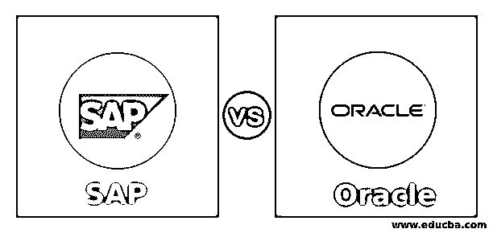
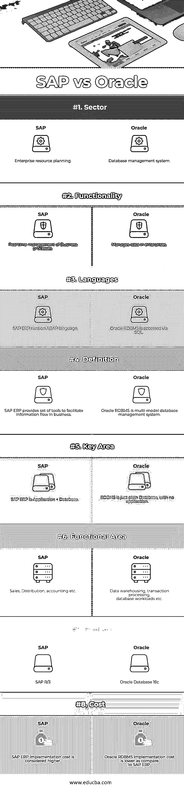

# SAP 与 Oracle

> 原文：<https://www.educba.com/sap-vs-oracle/>

## SAP 与 Oracle 的区别

SAP 是 Systems，Applications，and Products(系统、应用和产品)的首字母缩写，它帮助用户开发有助于监控系统并向客户提供预期产品的应用程序。应用程序中的用户界面帮助用户与系统进行良好的交互，并了解系统的错误或硬件问题。Oracle 是用于 Oracle 数据库的术语，它帮助维护在线事务并管理系统中的工作负载。Oracle 的含义是隐藏的知识，这正是 Oracle 数据库对用户的意义。Oracle 使用 SQL 作为数据库管理的编程语言。

### SAP 与 Oracle 的面对面比较(信息图表)

以下是 SAP 与 Oracle 的 7 大区别:

<small>网页开发、编程语言、软件测试&其他</small>

### SAP 与 Oracle 的主要区别

SAP 和 Oracle 都是企业资源规划软件，但它们之间有一些关键的区别。让我们讨论一下 SAP 和 Oracle 之间的一些主要区别:

*   Oracle 中的数据库管理有助于组织完美地处理公司的支出和资源细节，并在需要时获取数据。对于 SAP 来说，这一过程并不容易，因为它没有数据库，并且与系统中内置的应用程序一起工作。因此，我更喜欢 Oracle 用它自己的编程语言来管理数据和相关的东西。
*   区别可以这样解释。SAP 基于应用程序的核心功能，而 Oracle 基于它能提供的各种功能。简而言之，SAP 主要关注它提供的功能，而不是扩展种类。我们可以说 SAPHANA 在系统上启用了人工智能。Oracle 具有不同的功能，并为所有应用程序提供基本的数据库功能。丰富的功能使该应用程序比竞争应用程序更能覆盖市场。
*   SAP 和 Oracle 支持外部应用程序与其功能协同工作，这有助于应用程序正常工作。需要注意的一点是，SAP 需要安装外部软件来支持应用程序。当使用外部软件时，SAP 的工作方式会有所不同，因为它有一个单独的仪表盘与相同的外部软件结合使用。这有助于用户区分 SAP 是单独使用还是与任何其他应用程序结合使用。Oracle 支持相同的功能，并且外部数据库和 Oracle 数据库结合使用时提供的配置更少，其工作方式类似于同一系统中的外部软件。
*   SAP 在审计管理方面做得很好，这有助于组织安排支出，文件记录也做得很好，报告可以立即准备好。这使得用户能够通过 SAP 存储信息并明智地使用它。SAP 提供了许多工具来快速生成报告。该选项在 Oracle 中不可用，用户需要使用该应用程序自己创建报告。
*   用户很容易被酷炫的仪表盘吸引。SAP 在仪表板方面有优势，因为他们的仪表板带有拖放选项。此外，仪表板与用户交互，用户可以使用提供的选项选择仪表板。SAP 中也提供基于角色的仪表板。Oracle 没有各种各样的仪表板，并且他们的仪表板不能与其他应用程序集成以使它们更有用。用户友好的仪表盘是 SAP 的一大优势。

### SAP 与 Oracle 对比表

让我们讨论一下 SAP 与 Oracle 之间的主要比较:

| **SAP** | **甲骨文** |
| SAP 不向用户提供任何预构建的模板。此外，他们必须在系统中手动记账。 | Oracle 以预构建的格式为用户提供了不同的模板，因此用户可以使用任何模板来帮助他们的项目。对用户的计费也是自动的。 |
| SAP 中的人力资源功能得到了很好的管理，使用适当的软件实现了应用程序的自动化和适当精简。 | 虽然 Oracle 中考虑了人力资源职能，但由于所使用的资源和技术，人力资源职能没有得到很好的管理。 |
| 专家可以帮助用户，但支持不如 Oracle。安全性受到保护，用户可以通知他们应用程序中的安全漏洞。 | Oracle 提供的服务是全天候的，专家们密切合作来解决问题并很好地管理应用程序。Oracle 提供的支持令人印象深刻。 |
| SAP 在 ERP 系统中有一个合适的基础，因为它在 Oracle 之前就开始了，因此它可以支持系统中的各种其他应用程序，并提供工具的升级。 | Oracle 与 SAP 竞争很好，但在与其他应用程序集成时，Oracle 不如 SAP。 |
| 不同应用程序的集成是从底层完成的，因此当一个应用程序被升级时，其他应用程序也被升级，这使得系统平稳地工作，而不会增加用户的工具升级时间。这有助于应用程序正常工作。 | 应用程序的集成不是从底层开始的，因此当应用程序更新时，其他应用程序也需要手动更新。Oracle 可以看作是其他应用程序的组合，因此在这里集成并不容易。 |
| 开发者对 SAP 的支持是巨大的，任何答案都可以通过谷歌搜索找到。 | Oracle 得到了公司的大力支持，但是开发人员基础薄弱，因此除了客户支持之外，文档是与 Oracle 打交道的唯一知识来源。 |
| 从制造到给客户开账单都包含在这个应用程序中，所有这些都在一个界面中完成。 | 财务规划在这里更受关注，应用程序始终致力于改进基于财务应用程序的应用程序。 |

### 结论

这两种应用程序都适合在 ERP 中使用，因为它们提供了不同的应用程序和各种方法来实现解决方案。两个应用程序的数据库都是集中的，这有助于在需要时收集信息。这些应用程序可以轻松处理任何规模的业务，因此用户很难在这些应用程序之间做出选择。供应链的整合贯穿其应用始终。

### 推荐文章

这是 SAP 与 Oracle 的对比指南。在这里，我们通过信息图和比较表来讨论 SAP 与 Oracle 的主要区别。您也可以看看以下文章，了解更多信息–

1.  [Oracle vs SQL Server](https://www.educba.com/oracle-vs-sql-server/)
2.  [Teradata vs 甲骨文](https://www.educba.com/teradata-vs-oracle/)
3.  [WebLogic vs JBoss](https://www.educba.com/weblogic-vs-jboss/)
4.  [MySQL vs 甲骨文](https://www.educba.com/mysql-vs-oracle/)

