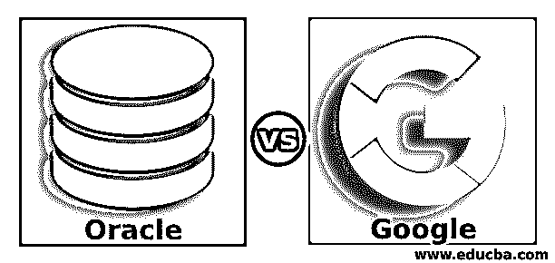
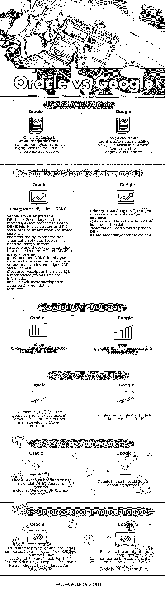

# 甲骨文 vs 谷歌

> 原文：<https://www.educba.com/oracle-vs-google/>

## 甲骨文与谷歌的区别

下面的文章提供了 Oracle 与 Google 的对比概要。Oracle 是一个 RDBMS(即关系数据库管理系统)，因此通常称为 Oracle RDBMS。Oracle 数据库是一个多模式的数据库管理系统，在企业应用中得到广泛应用。在将 Oracle 数据库引入市场后，它将关系模型扩展到了对象关系模型。因此它使得在关系数据库中存储非常复杂的商业模型成为可能。

甲骨文的历史演变非常有趣。3 friend 的团队开发 Oracle 数据库——Larry Ellison、Bob Miner 和 Ed Oates，由 Larry Ellison 领导(1977 年在 SDL 的一家公司软件开发实验室)。Oracle 数据库是广泛使用和可信的关系数据库引擎之一。

<small>网页开发、编程语言、软件测试&其他</small>

一个 [Oracle 数据库是用汇编语言](https://www.educba.com/what-is-assembly-language/)，C，C++编程语言编写的。Oracle 数据库可以在所有主流平台上运行，包括 Windows、UNIX、Linux 和 Mac OS。Oracle 数据库通常用于运行在线事务处理( [OLTP](https://www.educba.com/what-is-oltp/) )、数据仓库(DW)应用程序和混合(OLTP & DW)数据库工作负载。

谷歌是美国跨国公司之一，它以搜索引擎而闻名。谷歌还有许多其他业务/运营，包括云计算、互联网分析运营、各种广告技术、网络应用开发、浏览器和操作系统开发。谷歌公司被用来寻找不同种类的信息，如图片、在线广告技术、地图和网站，还开发应用程序，甚至只是非常有趣的纵横字谜线索的答案。

谷歌的前身是谷歌公司。与甲骨文相似，谷歌也有一段非常有趣的演变历史。它是由劳伦斯·爱德华·佩奇(美国人)和谢尔盖·米哈伊洛夫维奇·布林(俄罗斯人)在 1998 年 9 月 4 日他们还是学生的时候创立的。

谷歌是世界上非常著名的互联网搜索引擎，因为它使用自己的专利算法；该算法的设计方式是检索和获取搜索结果，以便从可靠的数据源中提供最合适的信息。谷歌的算法是有专利的，它被命名为 PageRank。

谷歌已经开始了一项在功能上非常受欢迎的使命——“组织世界的信息，并使其普遍可用和有用。”

### 甲骨文与谷歌的面对面比较(信息图表)

以下是甲骨文与谷歌的六大区别:

### Oracle 与 Google 的主要区别

Oracle vs Google 都是市场上的热门选择；让我们讨论一些主要差异:

*   Oracle 数据库是一个多模式的数据库管理系统，它是一个高度使用的 RDBMS 来构建企业应用程序，而 Google 正在 [Google 云平台](https://www.educba.com/what-is-google-cloud-platform/)上自动扩展 NoSQL 数据库即服务(DBaaS)。
*   Oracle BI business suite 是专为提供行业首个集成服务和端到端企业绩效管理系统而构建和设计的。谷歌的分析工具是一个软件工具，它允许用户生成各种类型的报告，从而在高级仪表板面板上汇总数据。
*   有关于 Oracle BI 集成的可用信息，但是 Google Analytics 工具有各种 API 来帮助用户收集、配置和报告用户与用户在线内容的交互。
*   在 Oracle 中，复制方法(即确保在多个节点上冗余存储数据的方法)是通过主-主复制和主-从复制实现的。在 Google Cloud Datastore 中，复制方法是通过使用 Paxos 的多主复制实现的。
*   在 Oracle 中，分区方法(即在不同节点上存储不同数据的方法)是通过水平分区实现的。而在 Google Cloud Datastore 中，分区方法是通过分片过程实现的。在 Oracle 数据库中，还提供了可选的 Oracle 分区。
*   Google Cloud Datastore 为用户定义的 Map/Reduce 方法提供了一些 API，而 Oracle 数据库不支持 Map Reduce。
*   使用 PL/SQL 编程语言可以实现 Oracle 数据库的服务器端脚本编写。而谷歌云也可以通过使用谷歌应用引擎来实现。

### Oracle 与 Google 对比表

下面是甲骨文和谷歌之间最重要的比较

| **比较的基础** | **甲骨文** | 谷歌 |
| **关于&的描述** | Oracle 数据库是一个多模式的数据库管理系统，是构建企业应用的常用关系数据库。 | 谷歌云数据存储，它在谷歌云平台上自动扩展 NoSQL 数据库即服务(DBaaS)。 |
| **主要和辅助数据库模型** | **Primary DBM:** Is Relational DBMS.**辅助 DBM:** 在 Oracle DB 中，它使用。辅助数据库模型是文档存储、图形 DBMS 信息、键值存储和 RDF 存储信息。

*   **文档存储:**文档存储的特点是其数据的无模式组织。其中的记录不需要有统一的结构，这些记录也可以有嵌套结构。
*   **图形 DBMS:** 又称为面向图形的 DBMS。在这种类型中，数据可以在图形结构中表示为节点和边。
*   RDF Store:RDF(Resource Description Framework)是一种描述信息的方法，专门用于描述 it 资源的元数据。

 | **Primary DBM:** Google is a Document store, i.e., document-oriented database systems, and this is characterized by its schema-free data organization.谷歌没有主要的 DBM；它使用二级数据库模型。 |
| **云服务可用性** | Oracle 不提供云服务和支持。 | 谷歌提供云服务和支持。 |
| **服务器端脚本** | In Oracle DB, PL/SQL is the programming language used in Server-side scripting.

它还使用 java 开发存储过程。

 | Google 将 Google App Engine 用于其服务器端脚本。 |
| **服务器操作系统** | Oracle DB 可以在所有主流平台/操作系统上运行，包括 Windows、UNIX、Linux 和 Mac OS。 | 谷歌拥有自托管的服务器操作系统。 |
| **支持的编程语言** | Below are the programming languages supported by the Oracle database:C，C#，C++，Objective C，Java，JavaScript，Clojure，Cobol，Perl，PHP，Python，Visual Basic，Delphi，Eiffel，Erlang，Fortran，Groovy，Haskell，Lisp，OCaml，Ruby，Scala，Tcl。 | Below are the programming languages supported by Google and its data store:.Net，Go，Java，JavaScript (Node.js)，PHP，Python，Ruby。 |

### 结论

谷歌与甲骨文之间的斗争已经持续了很多年，它可以被认为不仅仅是一场技术大战。在 Google 与 Oracle 的比较中，Oracle 与 Google 相比处于第一位，因为 Oracle 具有多种数据存储和方便访问的特性，而 Google 在某些特性上是落后的。示例:与谷歌云相比，Oracle BI 有许多特性。

甚至谷歌也在许多其他功能上超过了甲骨文；例如，它提供了简单和免费的 API，方便团队的支持。小型企业、大型企业和中型企业都可以采用 Oracle。但是谷歌云平台可以被自由职业者(也称为单人操作)、非营利公司/组织、公共管理、小型企业、中型企业和大型企业采用和使用。

### 推荐文章

这是甲骨文 vs 谷歌的指南。在这里，我们用信息图和比较表来讨论 Oracle 和 Google 的主要区别。您也可以看看以下文章，了解更多信息–

1.  [SAP vs 甲骨文](https://www.educba.com/sap-vs-oracle/)
2.  [谷歌分析 vs Mixpanel](https://www.educba.com/google-analytics-vs-mixpanel/)
3.  [Oracle vs PostgreSQL](https://www.educba.com/oracle-vs-postgresql/)
4.  [MongoDB vs PostgreSQL](https://www.educba.com/mongodb-vs-postgresql/)

