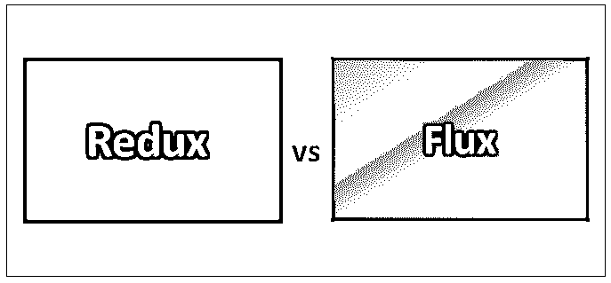
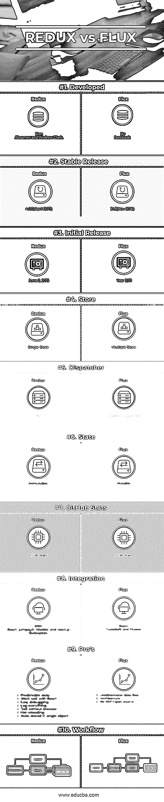
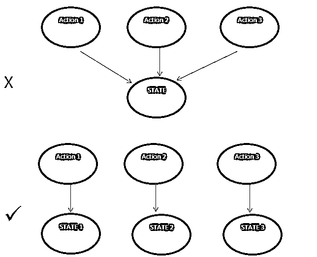
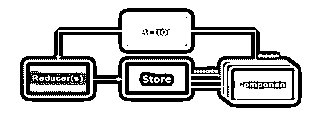
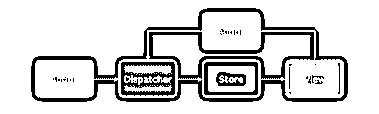

# 还原与通量

> 原文：<https://www.educba.com/redux-vs-flux/>

## Redux 与 Flux 之间的差异

FLUX 是架构， [REDUX 是库](https://www.educba.com/what-is-redux/)。FLUX 更适合作为建筑应用用户界面的应用架构。脸书使用 flux 应用程序架构来创建客户端基于 web 的应用程序。它用单向数据流补充了 React 的可组合视图。Redux 是一个用于管理应用程序状态的开源 JavaScript 库。它通常与 React 或 Angular 等库一起用于构建用户界面。Redux 使其用户能够编写可以在不同环境(无论是客户机、服务器还是本机环境)下工作的应用程序，具有一致的行为和 east 测试。除此之外，它还提供了令人惊叹的开发体验，例如使用时间旅行调试器实时编辑代码。

### Redux 和 Flux 之间的直接对比(信息图表)

以下是 Redux 与 Flux 之间的 10 大差异

<small>网页开发、编程语言、软件测试&其他</small>

### Redux 和 Flux 的主要区别

Redux 与 Flux 之间的一些关键差异解释如下

1.  Flux 和 REDUX 的主要区别之一是 Redux 缺少 Dispatcher。
2.  在不清除状态的情况下从存储区重新加载代码。事实上，商店里有两样东西。这些是“状态变化逻辑”和“当前状态本身”。如果这两个 Flux vs Redux 的东西都在同一个对象上，那么在热重载时就会出现问题，也就是热模块重载。(注意——热重装的意思是:在一个人使用模块开发了一个 app 之后，那么重装的热部分就可以替换你的模块，而不改变应用的状态。这是很好的特色，因为应用程序永远不会重新加载；它只是在保存时交换正确的 JS)。回到代码重载，人们可能会丢失存储在存储对象上的状态。这个问题的解决方案在 REDUX 中，这里这两个功能已经分开。这里一个对象保存状态，另一个包含所有的状态改变逻辑。
3.  每一个动作都会重写一个状态——对于调试时执行的几个动作，状态会改变，这个新状态必须添加到以前的状态对象中。在 FLUX 中，会发生什么以及 REDUX 如何解决这个问题，请参考下图。

4.  接收到的动作上的数据适用性——在 Flux 中，基于接收到的动作对数据执行什么操作的逻辑已经写在存储中(存储是每个 Flux 应用程序中的一种播放器)。Flux applications 的架构还提供了选择公开数据的内容和数量的灵活性。在 Redux 中，这个逻辑保留在 reducer 函数中，每个动作都会调用这个函数。在这里，没有专用的 reducer 函数就不能定义存储(Redux 中的 reducer 是一种简单的函数，它根据之前的状态和接收到的动作返回新的状态)。
5.  简单性——在大多数情况下，Redux 保留了 Flux 的几乎所有优点，无论是在记录或重放动作、数据流、突变依赖性方面，还是在不受 Dispatcher 和 store registration 干扰的情况下添加新的优点(撤销-重做、热重装)。人们很容易理解 Redux 的 API 配置，它比 Flux 简单。

### Redux 与通量对照表

主要的比较讨论如下:

| **比较的基础** | **还原** | **通量** |
| **发达** | 丹·阿布拉莫夫和安德鲁·克拉克 | 通过 facebook |
| **稳定发布** | 2017 年 4 月 | 2016 年 11 月 |
| **初始发布** | 2015 年 6 月 2 日 | 2011 年 |
| **商店** | 单店 | 多家商店 |
| **调度员** | 不 | 单一调度程序 |
| **状态** | 不变的 | 易变的 |
| **GitHub 统计数据** | 43.2K 颗星星 | 15500 颗星星 |
| **整合** | 有了 React、jumpsuit、Meatier 和 react.js 样板文件 | 反应，TuxedoJS 和 Fluxxor |
| **职业选手的** | 

*   Predictable state
*   Cooperate well
*   Easy debugging
*   Record everything
*   Testing without browser
*   Hot reloading
*   State is stored in a single object.

 | 

*   Unidirectional data flow
*   structure
*   无手动音量调节
*   open-source

 |
| **工作流程** | 

 | 

 |

### 结论

FLUX 用户得到简单的应用架构。由于各个组件之间的关系没有歧义，因此维护工作和移动要容易得多。最重要的是，Flux 是一致的和更可重复的，从开发的角度来看，这是一件合乎逻辑的事情。创造行动更容易；商店经理处理行动也更容易。

Redux 拥有更多的开发者基础，虽然它是在 Flux 之后，但它拥有一些比 Flux 更重要的关键功能。处理乐观更新、在服务器上渲染、在执行路由传输之前获取数据、热重载和撤销-重做功能更可取。两者都用于制作用户界面——框架和模式。

最后，回到我们开始的地方，这完全取决于项目需求和范围。这些初始规划和需求阶段根据用户的需求决定偏好。两者都有满足需求的潜力，但是范围是可用性的唯一定义。

### 推荐文章

这是 Redux 与 Flux 之间最大差异的指南。在这里，我们还讨论了 Redux 与 Flux 之间的区别，并通过信息图和比较表说明了主要区别。您也可以看看以下文章——

1.  [反作用力与角度 4](https://www.educba.com/reactjs-vs-angular-4/)
2.  [Ruby vs Python 性能](https://www.educba.com/ruby-vs-python-performance/)
3.  [Typescript vs ES6](https://www.educba.com/typescript-vs-es6/)
4.  [反应 js vs view js](https://www.educba.com/react-js-vs-vue-js/)

