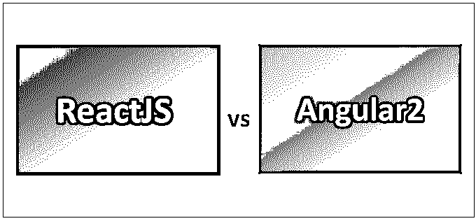
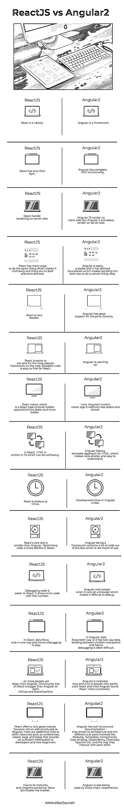

# 反应与角度 2

> 原文：<https://www.educba.com/reactjs-vs-angular2/>

## ReactJS 与 Angular2 之间的差异

React 是一个用于用户界面开发的 JavaScript 库。它由脸书维护，并得到一个由个人开发者组成的社区的支持。它是开源的。React 也用作开发单页面应用程序或移动应用程序的平台。ReactJS 也称为 React。Angular 基于 TypeScript，是一个开源的前端 web 开发框架。它是由谷歌的 Angular 团队开发的，也得到个人贡献者的支持。Angular 的第一个版本被称为 AngularJS，其后续版本如 Angular 2、3 等。，改名为 Angular，是同一个团队对 AngularJS 的完全改写。

### ReactJS 和 Angular2 的面对面比较(信息图)

下面是 ReactJS 与 Angular2 的 15 大差异

<small>网页开发、编程语言、软件测试&其他</small>

### ReactJS 和 Angular2 的主要区别

以下是描述 ReactJS 与 Angular2 之间主要差异的要点列表

*   React 改变了构建 web 应用程序的方式。它的组件对此负责。单一责任的软件设计原则认为，在理想情况下，一个组件应该只做一件事，如果它增长并承担额外的责任，它应该被分成更小的子组件，react 也应该如此。
*   React 在创建时实施的其他原则是代码可读性和代码可维护性**，**意味着代码需要被其创建者和其他开发人员理解和维护。这些特性在构建大型项目时扮演着重要的角色，并且在系统复杂性增加时变得非常有益。
*   Angular 也有一些很棒的特性，比如改进的性能、改进的依赖注入、web 组件友好的设计、服务器端呈现支持以及改进的移动兼容性。它被构造成一个组件树，并且添加了不可变的和可观察的对象来进一步增强它的功能。

### ReactJS 与 Angular2 对照表

下面是最上面的比较:

| **反应堆** | **角度** |
| React 是一个库 | 角度是一个框架 |
| React 只有视图层。 | Angular 拥有完整的 MVC 功能。 |
| React 在服务器端处理渲染。 | Angular JS 在客户端渲染，但是 Angular 2 及以上在服务器端渲染。 |
| React 有许多方法来做同样的事情，这使它变得令人困惑，并且没有定义最佳实践。 | Angular 很容易扩展，它有明确的界限，这使得决定做某件事的最佳方式很容易。 |
| React 非常灵活。 | Angular 对 3 rd 党库的支持很大。 |
| React 更容易使用，并且是网络上最流行的框架。React 很容易找到可重用的代码。 | Angular 正在迎头赶上。 |
| React Native 是构建移动应用的 React 类型，更快更稳定。 | Angular 的移动原生应用 Ionic 相对不太稳定，速度较慢。 |
| 在 React 中，HTML 是用 JS 写的，可能会比较混乱。 | Angular 遵循 HTML 的模板方法，这使得代码更短，更容易理解。 |
| React 有时很乏味。 | 角度的开发时间很快。 |
| React 的核心尺寸小于 Angular。优化代码在 React 中更加灵活。 | Angular 作为一个框架包含了大量开箱即用的代码，并没有太大的用处。 |
| 调试代码更容易反应。它显示了一个带有行号的错误代码， | Angular 只有在浏览器上运行时才会中断，这使得它很难调试。 |
| 在 React 中，数据仅单向流动，因此调试很容易。 | 在 Angular 中，数据是双向流动的，也就是说，它在子节点和父节点之间有双向数据绑定，因此调试通常很困难。 |
| 更多的人使用反应而不是角度。在 Github 和 StackOverflow 上，React 的社区规模都比 Angular 大。 | Angular 是一个相对较新的产品，很多早期使用 React 和尝试 Angular 的人发现 React 更方便。 |
| React 提供了一个非常好的教程，但是没有 Angular 那么结构良好，还有到其他资源的链接，例如会议、视频、工具和博客，为开发人员和新手提供了足够的信息。 | Angular 有结构良好的文档，显示其架构和不同的子部分，如模块、模板、组件、数据绑定、依赖、指令、注入等。以及他们相互交流的方式。 |
| 由于其成熟和长期存在，React 主导着市场。 | Angular 也被许多大公司采用。 |

### 结论

本文阐明了 React 和 Angular 的重要特性。Angular2 vs ReactJS 框架都具有强大的功能和支持。很难断定哪一个更好。这两种技术各有千秋，而且有很多人可以提出很好的论据来支持每一种技术。尽管如此，仍然可以设置一些基本规则来决定应该使用 Angular2 还是 ReactJS。大多数人会发誓

React 在市场上已经存在很长时间了，几乎所有 Angular 开发人员都曾经使用过 React，几乎每个人都建议至少从 React 开始。意，对于新手来说，React 比较合适。因此，angular 变得很复杂，应该留给更高级的用户，或者当某人对 React 非常熟悉的时候。

第一次安装和设置两者都很困难，因为它涉及许多调整和技巧，但除此之外，开发人员的旅程基本上是相同的，不管他/她是使用 React 还是 Angular。该组织也大多让开发人员来决定他/她想要选择哪一个，因此这种比较有时是基于个人偏好的。

### 推荐文章

这是 ReactJS 与 Angular2 之间最大差异的指南。在这里，我们还将讨论 ReactJS 与 Angular2 的主要区别，包括信息图和比较表。您也可以看看下面的 Angular2 vs ReactJS 文章，了解更多信息——

1.  [角度 JS 对角度 2](https://www.educba.com/angular-js-vs-angular-2/)
2.  [角度 JS 对节点 JS](https://www.educba.com/angular-js-vs-node-js/)
3.  [反作用力与角度 4](https://www.educba.com/reactjs-vs-angular-4/)
4.  [MongoDB vs Hadoop](https://www.educba.com/hadoop-vs-mongodb/)

