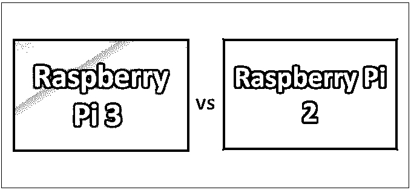
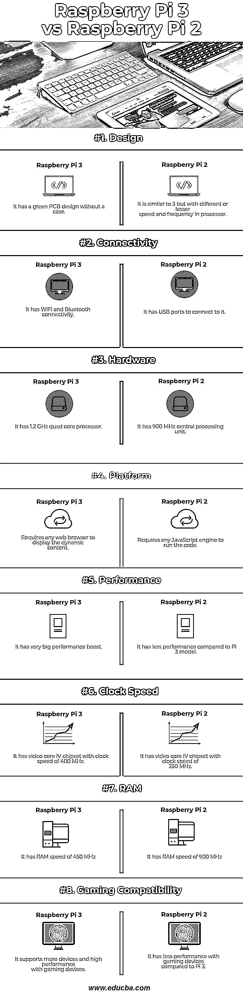

# 树莓派 3 vs 树莓派 2

> 原文：<https://www.educba.com/raspberry-pi-3-vs-raspberry-pi-2/>

## 树莓 Pi 3 与树莓 Pi 2 的区别

[Raspberry Pi 是由 Raspberry Pi 基金会组织在英国开发的一组](https://www.educba.com/what-is-raspberry-pi/)单板串联的小型计算机，旨在鼓励发展中国家的学校教授[计算机科学的基本概念](https://www.educba.com/career-in-computer-science/)。最新版本的最高内存是 1 GB 的 RAM。提供的功率容量为 1.5W 至 6.7W，中央处理器(CPU)速度为 1.4 GHz 32/64 bit，一个单元兼容四核 ARM Cortex。显卡提供商是 Broadcom。

硬件配置单元包括博通制造的处理器，推出的第一款机型是 2015 年发布的 Raspberry Pi Zero。 [Raspberry Pi Zero 体积小](https://www.educba.com/raspberry-pi-zero-vs-3/)，减少了输入输出(I/O)和通用输入输出(GPIO)能力。Raspberry Pi 的硬件配置在存储器的容量和对不同外围设备的支持方面有各种版本。Raspberry Pi 中使用的 Broadcom SoC 类似于第一代智能手机中使用的芯片。

<small>网页开发、编程语言、软件测试&其他</small>

[树莓有不同的型号，像型号](https://www.educba.com/how-to-install-raspberry-pi/) A，型号 B，还有 Zero。树莓 Pi 2 版本的博通芯片版本型号为 BCM2836，频率为 900 MHz，采用 1.2 GHz 的 64 位四核 ARM Cortex 处理器。树莓 Pi 3 型号拥有 1.4 GHz 速度的处理器和 64 位四核 ARM Cortex 处理器。

### 树莓 Pi 3 和树莓 Pi 2 之间的直接比较

以下是树莓 Pi 3 和树莓 Pi 2 的 8 大区别:

### 树莓 Pi 3 和树莓 Pi 2 的主要区别

无论是树莓 Pi 2 还是树莓 Pi 3 都是市场上的热门选择；让我们讨论一下 Raspberry Pi 3 和 Raspberry Pi 2 之间的一些主要区别:

1.  在 Raspberry Pi 3 中，不同设备的启动时间很长，而在 Raspberry Pi 2 中启动时间较短。
2.  在 Raspberry Pi 3 中，软件安装时间较短，而在 Raspberry Pi 2 版本中，软件安装时间较长。
3.  在 Raspberry Pi 3 中，SoC 通常很容易变热，需要一些冷却剂来控制温度水平，而在 Raspberry Pi 2 中，不需要散热器，因为 SoC 上的温度不容易达到很高。
4.  在 Raspberry Pi 3 中，外围设备通常可以使用无线连接进行连接，而在 Raspberry Pi 2 中，外围设备可以通过通电的 USB 集线器进行连接。
5.  在 Raspberry Pi 3 中，每秒帧数的渲染能力为 37.9 FPS，而在 Raspberry Pi 2 中，每秒帧数的速度为 25.4 FPS。
6.  在 Raspberry Pi 3 中，局域网速度测试的网络速度在以太网关闭方面给出了最佳速度，在以太网打开方面给出了最低速度，而与 Raspberry Pi 3 相比，Raspberry Pi 2 在 USB WLAN 打开方面具有相同的速度。同样在互联网 WLAN 方面，树莓 Pi 3 的性能最好。
7.  在树莓 Pi 3 中，性能增益比树莓 Pi 2 更多。与 Raspberry Pi 2 相比，Raspberry Pi 3 速度更快，并具有各种性能增益优势。
8.  在 Raspberry Pi 3 中，Micro SD 卡是一种基于摩擦的机制，而不是一直使用到 Raspberry Pi 2 版本的弹簧加载推-推类型。
9.  在树莓 Pi 3 中，使用基准测试工具 Whetstone Pi A7 进行的性能测试显示得分为 711，而树莓 Pi 2 的得分为 432，这清楚地表明树莓 Pi 3 具有更多优势。
10.  在 Raspberry Pi 3 中，空闲功耗更低，即 2.5 W，而在 Raspberry Pi 2 中，空闲功耗为 3.2 W，更高。
11.  在 Raspberry Pi 3 中，欠载功率为 3.8 W，这与 Raspberry Pi 3 和 Raspberry Pi 2 版本的情况相同。
12.  在树莓 Pi 3 中，功耗更少。CPU 速度更快，核心处理器图形速度更快，内置 Wi-fi 和蓝牙。Raspberry Pi 2 版本中缺少的所有这些功能对于最新版本及其用户来说都是一个高性能的提升。
13.  在 Raspberry Pi 3 中，针对 256 MB 速度性能设置限制的 RAM 内存测试花费的时间为 8 分钟，而在 Raspberry Pi 2 模型中，花费的时间为 22 分钟以上。
14.  在树莓 Pi 3 中，ARM Cortex 64 位处理器与之前的版本(如树莓 Pi 2)相比，以不同的方式支持操作系统。

### 树莓 Pi 3 和树莓 Pi 2 对照表

让我们来看看树莓 Pi 3 和树莓 Pi 2 的详细对比。

| **树莓 Pi 3 与树莓 Pi 2 的比较基础** | **树莓派 3** | **树莓派 2** |
| **设计** | 它采用绿色 PCB 设计，没有外壳。 | 它类似于 3，但处理器的速度和频率不同或更低。 |
| **连通性** | 它有 WiFi 和蓝牙连接。 | 它有 USB 端口与之连接。 |
| **硬件** | 它有一个 1.2 GHz 的四核处理器。 | 它有一个 900 兆赫的中央处理器。 |
| **平台** | 需要任何网络浏览器来显示动态内容 | 需要任何 JavaScript 引擎来运行代码 |
| **性能** | 它有一个非常大的性能提升 | 与 Pi 3 模型相比，它的性能较差 |
| **时钟速度** | 它有一个视频核心四芯片组，时钟速度为 400 兆赫 | 它有一个视频核心四芯片组，时钟速度为 250 兆赫 |
| **RAM** | 它的 RAM 速度为 450 MHz | 它的 RAM 速度为 900 MHz |
| **游戏兼容性** | 它支持更多的设备和高性能的游戏设备 | 与 Pi 3 相比，它在游戏设备上的性能较低 |

### 结论

Raspberry Pi 3 具有不同种类的性能提升和高速能力，以及与许多设备的不同集成能力。Raspberry Pi 3 具有无线连接功能，如 Wi-Fi、蓝牙 4.2、更快的以太网和以太网供电(PoE)，而 Raspberry Pi 2 缺乏这些功能。就与不同设备的集成而言，树莓 Pi 3 比树莓 Pi 2 更受欢迎

Raspberry Pi 3 有很大的性能提升，它的内存、处理和缓存速度很高，大大提升了性能，并且比 Raspberry Pi 2 有很多性能改进功能。功耗在树莓 Pi 3 方面更少。

### 推荐文章

这是树莓 Pi 3 和树莓 Pi 2 之间的主要区别的指南。在这里，我们还讨论了 Raspberry Pi 3 和 Raspberry Pi 2 的主要区别，以及信息图和比较表。你也可以看看下面的树莓 Pi 2 vs 树莓 Pi 3 的文章，了解更多信息

1.  [桔子皮与树莓皮的 10 大差异](https://www.educba.com/raspberry-pi-vs-orange-pi/)
2.  [Raspberry PI 与 Arduino–10 有价值的比较](https://www.educba.com/raspberry-pi-vs-arduino/)
3.  [香蕉派 vs 树莓派](https://www.educba.com/raspberry-pi-vs-banana-pi/)
4.  [树莓 Pi 3 vs Arduino:差异](https://www.educba.com/raspberry-pi-3-vs-arduino/)
5.  [Apple Watch 第一代的重要性](https://www.educba.com/apple-watch-first-generation/)

