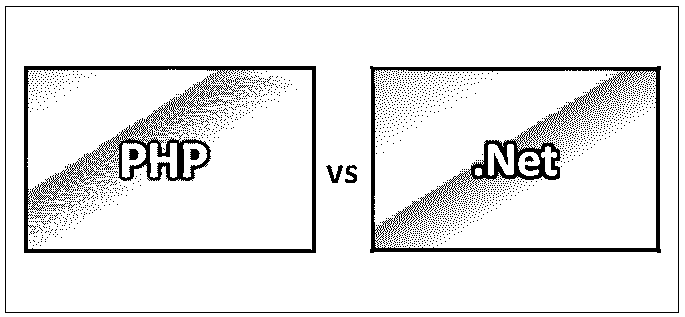
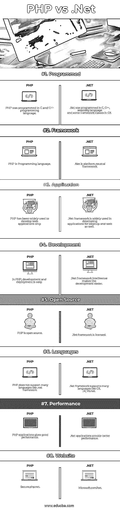

# PHP vs.Net

> 原文：<https://www.educba.com/php-vs-dot-net/>

## PHP 与. Net 的区别

[PHP 是一种用于 web 开发的](https://www.educba.com/what-is-php/)开源[编程语言](https://www.educba.com/web-development-interview-questions/)。它支持类似 Unix 和 Windows 的平台。PHP 代码也可以嵌入到 [HTML 语言](https://www.educba.com/html-interview-questions/)中，用作[服务器端脚本语言](https://www.educba.com/programming-languages-vs-scripting-languages/)。它使应用程序更加动态和简单。它可以在命令行工具和 GUI 应用程序的帮助下执行。.Net 是一个主要运行在微软平台或 Windows 上的软件框架。.Net 不是操作系统或编程语言。[。Net 是操作系统和编程语言之间的一层。这使得开发人员可以很容易地用任何语言编写代码，因为不同的语言只有不同的语法。](https://www.educba.com/what-is-dot-net/)

### 服务器端编程语言（Professional Hypertext Preprocessor 的缩写）

*   PHP 是由拉斯马斯·勒德尔夫和 Zend technologies 创建和开发的，并于 1995 年发布。最后一个稳定发布是 2018 年的 7.2.5。是用 C 和 [C++语言](https://www.educba.com/c-programming-language-basics/)写的。PHP 文件名有如下扩展名。php、. php3、. php4、. php5、. php7、. phps. php 也简称 PHP:超文本预处理器。
*   PHP 的语法类似于 C 语言。它可以很容易地连接到 Oracle、 [MySQL、SQL Server](https://www.educba.com/mysql-vs-sql-server/) 等数据库。PHP 使用了 PHP 解释器来处理代码。
*   PHP 非常简单、高效、安全和灵活。PHP 广泛应用于[小型 web 应用](https://www.educba.com/how-to-build-web-applications-using-mongodb/)中，比其他语言更受欢迎。一只带有 [PHP 标志的蓝色大象](https://www.educba.com/php-commands/)代表了 PHP 的吉祥物。哎呀， [PHP 3 和 PHP 4 中引入的一个概念，](https://www.educba.com/php-versions/)让编程变得更容易。

### .网

*   .Net 于 2002 年发布。它是许可的，也是开源的。.Net 框架组件像 CLI 和 CLR 都是用 C、C++和[汇编语言](https://www.educba.com/what-is-assembly-language/)写的。微软开发的。大多数用 C#编写的框架类都是在 CLR 中执行的。
*   它支持许多编程语言，如 C#、Vb.net、J#、托管 C++等。它提供了一组通用的库，可以从基于 various.Net 的编程语言中访问。对于每种语言，都有相同的类库集。如今，微软的 provided.Net 框架可以自由地与 Windows 兼容。作为操作系统的一部分，它自动意味着。net 框架安装在系统中。
*   它是一个框架，因为它为所有支持的语言提供了广泛的编程和公共平台。它提供了一个公共类库，可以从任何支持的语言中调用。
*   .Net framework 编译代码并将其转换为 IL(中间语言)，这意味着编译后的可执行文件包含 IL，而不是机器语言可执行文件。它负责 any.Net 应用程序运行时的执行。它的主要组件是公共语言运行库(CLR)。Net 框架类库(FCL)、公共语言规范(CLS)、公共类型系统(CTS)、元数据和程序集。
*   .Net 框架提供了许多特性，如互操作性、语言独立性、平台独立性。它还加强了安全类型。它支持跨平台。它有自己的安全机制。它也有助于管理内存。垃圾收集器(GC)在特定的时间间隔后运行，以移除未使用的对象，并将该内存分配给新对象。中的垃圾收集器用法。net 框架被称为分代。它还增强了应用程序的性能。

### PHP 和。网

下面是 PHP 和。网络:

<small>网页开发、编程语言、软件测试&其他</small>

### PHP 和。网

PHP 和。Net 是市场上流行的选择；让我们讨论一下 PHP 和。网络:

1.  PHP 不会大量占用系统资源，这使得 PHP 可以快速运行，并且不会降低其他进程的速度。.与 PHP 相比，Net 使用更多的系统资源，并且它需要较高的系统配置来使系统流畅。
2.  PHP 提供了更多编码和工作的自由，因为它是开源的。In.Net，自由是有限的，因为我们只能使用 visual studio IDE 进行开发。
3.  PHP 开发人员可以使用文本编辑器进行开发，如 Notepad++而不是成熟的 IDE。In.Net，我们只需要使用 mainly VS IDE。
4.  PHP 是高度可扩展的，因为大多数高流量网站都在使用它，比如维基百科。.Net 也是可扩展的，网站使用像栈溢出等。
5.  PHP 是免费的。.Net 是微软的产品，需要购买许可证才能使用该产品。要用。net，它还需要购买 windows，而且对大多数人来说很贵。同样，windows 托管和使用 VS IDE 也需要许可，这使得开发成本更高。
6.  PHP 在使用它作为编程语言的开发人员中非常流行。.根据使用情况，Net 不如 PHP 受欢迎。
7.  PHP 非常简单易学。.网络语言比较复杂，也比较难学。
8.  PHP 显示出了更大的灵活性和对各种操作系统的兼容性。但它是可疑的。net 框架。

### PHP 和。净比较表

下面是 PHP 和。网

| **PHP vs.Net 比较的基础** | **PHP** | **。网络** |
| **已编程** | PHP 是用 C 和 C++编程语言编写的。 | .Net 是用 C，C++，汇编语言和一些 C#的框架类编程的。 |
| **框架** | PHP 是一种编程语言。 | .Net 是一个平台中立的框架 |
| **应用** | PHP 仅被广泛用于开发 web 应用程序。 | .Net framework 也广泛用于开发桌面和 web 应用程序。 |
| **开发** | 在 PHP 中，开发和部署很容易。 | .Net framework intellisense 使开发变得更加容易。 |
| **开源** | PHP 是开源的。 | .Net framework 已获得许可。 |
| **语言** | PHP 不支持像。net 框架。 | .Net 框架支持许多语言，如 C#、J#、Vb.net |
| **性能** | PHP 应用程序提供了良好的性能。 | .Net 应用程序提供了更好的性能。 |
| **网站** | Secure.php.net | Microsoft.com/net |

### 结论

PHP 和 vs.Net 都是用来开发 web 应用程序的。PHP 是开源的，免费的，平台上很容易获得。.Net 是一个框架，需要从微软购买[许可证才能使用。这两个 PHP vs.Net 都是高度可伸缩的。](https://www.educba.com/powerful-features-of-microsoft-access/)

PHP 在提供一致性、统一变量语法、敏感上下文和抽象语法方面更强，这使得语言具有一致性。 [PHP 简单易学](https://www.educba.com/php-commands/)，市场上使用最广泛。PHP 在在线资源、大量模板引擎和开发人员、大量编辑器和工具方面拥有强大的支持。

两种 PHP vs.Net 语言都有各自的强项。在构建应用程序时，有许多事情需要考虑，选择合适的语言来开发应用程序是一项复杂的任务。选择时会考虑语言的利弊，最重要的是，性能、可伸缩性、成本、支持和可维护性是主要考虑因素。

### 推荐文章

这是 PHP 和 and.Net 之间最大区别的指南。我们还讨论了 PHP vs.Net 的头对头比较，关键差异，以及信息图和比较表。你也可以看看下面的 PHP vs.Net 文章来了解更多

1.  [HTML 与 PHP——惊人的对比](https://www.educba.com/html-vs-php/)
2.  [爪哇 vs.Net 的差异](https://www.educba.com/java-vs-dot-net/)
3.  [Ruby vs PHP——哪个更好](https://www.educba.com/ruby-vs-php/)
4.  [c#与 Js 相比的最大优势](https://www.educba.com/c-sharp-vs-js/)
5.  [MongoDB vs PostgreSQL 指南](https://www.educba.com/mongodb-vs-postgresql/)
6.  [MongoDB vs Hadoop:惊奇指南](https://www.educba.com/hadoop-vs-mongodb/)
7.  [MongoDB vs Oracle:想了解一下特性](https://www.educba.com/mongodb-vs-oracle/)
8.  [MongoDB vs 卡珊德拉:惊奇指南](https://www.educba.com/mongodb-vs-cassandra/)
9.  [PHP 与 C#:差异](https://www.educba.com/php-vs-c-sharp/)
10.  [想了解 SQL Server 面试问题](https://www.educba.com/sql-server-interview-questions/)
11.  C#与 JavaScript:最好的区别是什么

