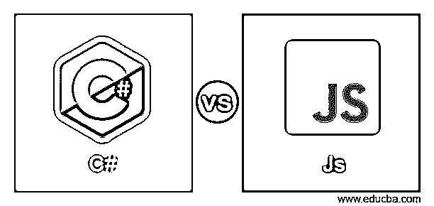
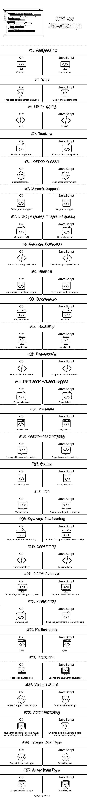

# C#与 Js

> 原文：<https://www.educba.com/c-sharp-vs-js/>

## C#与 Js 的区别

C#是优雅的、类型安全的面向对象语言，它允许开发人员构建运行在[上的健壮且非常安全的应用程序。Net 框架](https://www.educba.com/java-vs-dot-net/)。通过使用 C#，我们可以创建 Windows 客户端应用程序、XML Web 服务、分布式组件和客户端-服务器应用程序。它提供了非常先进的代码编辑器，使得代码的编辑非常方便和人性化，而 JavaScript 是使网页具有交互性的[脚本语言](https://www.educba.com/programming-languages-vs-scripting-languages/)。这是客户端编程，这意味着代码将在用户的 web 浏览器中运行，而无需 web 服务器的资源。它用于执行动态任务，如测验和投票。

### 什么是 C#？

C#是一种多范例编程语言，它包含一种非常具有表现力的语法。它是由微软公司开发设计的。它的语法包含花括号，和 C，C++，Java 差不多。该应用程序是使用 c#构建的，将运行 on.Net 框架。这种语言纠正了 c++的许多复杂性，并提供了许多高级特性，如空值类型、枚举、委托、lambda 表达式和直接内存访问。

<small>网页开发、编程语言、软件测试&其他</small>

C#语言的主要优势如下:

*   语言集成查询(LINQ)表达式使强类型查询成为一流的语言构造。
*   它支持封装、继承和多态的概念，因为它是一种面向对象的语言。
*   它支持内嵌的 [XML 文档](https://www.educba.com/xml-commands/)注释。
*   它是静态类型的。
*   它有一个运算符和转换重载。

### Js 是什么？

JavaScript 是世界上最流行、最广泛使用的编程语言之一。它比任何其他编程语言都发展得快。像网飞、沃尔玛、贝宝这样的大公司正在构建内部应用程序。

可以做全栈开发者，前端开发者，后端开发者。

你能用它做什么？

很长一段时间，JavaScript 只在浏览器中使用，用来构建交互式网页；在社区的巨额投资和像脸书这样的大公司的投资之后，你可以建立谷歌:

*   成熟的网页和[移动应用](https://www.educba.com/mobile-applications/)。
*   聊天和视频流服务等实时网络应用。
*   命令行工具。
*   奥运会的发展。

JavaScript 代码在哪里运行？

JavaScript 最初被设计成只能在浏览器上运行；每个浏览器都有可以运行 JavaScript 代码的 JavaScript 引擎。

**普通浏览器中的 JavaScript 引擎:**

火狐–蜘蛛猴

铬合金 v8

2009 年，工程师们将 chrome 中的开源 Java 引擎嵌入到一个 C++程序中；他们称之为程序节点。Node 是一个包含 Google V8 JavaScript 引擎的 C++程序。现在有了这个，我们可以在浏览器之外运行 JavaScript 代码。浏览器和节点为 Javascript 代码提供了运行时环境。

**JavaScript 的优势:**

*   这是网络开发的一个重要元素。
*   UI/UX 设计、下拉框和搜索框可以变得交互，并且可以用 CSS 和 JavaScript 很好地设置。
*   服务器不承担 web 部署的负载。
*   它在开发时间上相对更灵活。
*   它很受开发人员的欢迎，所以用 javascript 开发项目的资源更容易找到。
*   学习 javascript 就容易多了。
*   原生浏览器支持:需要编译类型脚本代码，并在 JavaScript 代码中输出结果。
*   代码中不需要注释。
*   JavaScript 的代码灵活性非常好。

### C#与 Js 的直接比较(信息图表)

下面是 C#与 Js 的 27 大区别:

### C#与 Js 的主要区别

C#和 Js 都是市场上的热门选择；让我们讨论一下 C#和 Js 之间的一些主要区别:

*   JavaScript 是一种基于原型的语言，但 c#不是。
*   Javascript 是一种用于网络浏览器的脚本语言。它也被称为新 PHP，但 C#不提供任何类似的功能。
*   JavaScript 是动态弱类型，而 C#是静态强类型。
*   JavaScript 初级编程范式是过程化的，但是 C#初级编程范式是(基于类的)面向对象的。
*   Javascript 没有整数数据类型，但是 C#有整数数据类型。
*   Javascript 没有数组数据类型，但是 C#支持数组数据类型。
*   在 JavaScript 中，我们使用 **"** 函数[函数名]"，在 C#中我们使用**"**void[函数名]"或者其他函数类型。)
*   C#运行。NET framework，它最适合制作桌面应用程序，而 [Javascript](https://www.educba.com/careers-in-javascript/) 在浏览器中运行，所以对于制作游戏和测试其他应用程序，Javascript 更好。
*   C#是一种编译型编程语言。JavaScript 是一种脚本语言。所以 JavaScript 可能会因为运行时的语法错误而失败。

### C#与 Js 对照表

C#与 Js 的主要比较如下:

| **c#与 Js 的比较基础** | **C#** | **JavaScript** |
| **由**设计 | 微软 | Brendan Eich |
| **类型** | 类型安全的面向对象语言 | 面向对象的语言 |
| **静态打字** | 静态 | 动态 |
| **平台** | 对平台的限制 | 跨平台兼容 |
| **λ支持** | 支持λ | 不支持 lambda |
| **通用支持** | 大通用支持 | 没有通用支持 |
| **LINQ(语言综合查询)** | [支持 LINQ](https://www.educba.com/what-is-linq/) | 不支持 |
| **垃圾收集** | 自动垃圾收集 | 不进行垃圾收集 |
| **平台** | 惊人的跨平台支持 | 更少的跨平台支持 |
| **一致性** | 非常一致 | 可怕的 |
| **灵活性** | 非常灵活 | 灵活性较差 |
| **框架** | Supports.Net 框架 | 支持各种框架 |
| **前端/后端支持** | 支持前端 | 支持两种 |
| **多才多艺** | 不太全能 | 非常全能 |
| **服务器端脚本** | 不支持服务器端脚本 | 支持服务器端脚本 |
| **语法** | 简洁的语法 | 复杂语法 |
| **这里** | Visual studio | 记事本，记事本++，崇高 |
| **操作员超载** | 支持运算符重载 | 不支持运算符重载 |
| **可读性** | 可读性强 | 可读性较差 |
| **哎呀概念** | 哎呀简化了伟大的语法 | 支持 OOPS 概念 |
| **复杂度** | 更复杂的 | 理解起来不那么复杂 |
| **性能** | 高 | 小于 |
| **资源** | 很难找到资源 | 轻松找到 JavaScript 开发者 |
| **关闭脚本** | 不支持关闭脚本 | 支持闭包脚本 |
| **过线** | JavaScript 通过其调用和响应函数结构隐藏了大部分内容 | C#为编程提供了对线程的显式控制 |
| **整数数据类型** | 支持整数数据类型 | 不支持 |
| **数组数据类型** | 支持数组数据类型 | 不支持 |

### 结论

基于以上 C#与 Js 的比较，我们可以说 C#是一种严格类型的面向对象编程语言，用于开发控制台应用程序；没有桌面[应用](https://www.educba.com/microsoft-office-application/)和 C#就无法运行。NET 框架，而 JavaScript 是一种客户端脚本语言，主要用于在 web 应用程序中制作交互效果，可以在任何 web 浏览器中执行。

### 推荐文章

这是 C#与 Js 的对比指南。在这里，我们讨论 C#和 Js 的直接比较，主要区别，以及信息图和比较表。您也可以看看以下文章，了解更多信息–

1.  [Python vs C#](https://www.educba.com/python-vs-c-sharp/)
2.  [HTML vs JavaScript](https://www.educba.com/html-vs-javascript/)
3.  [JavaScript vs C#](https://www.educba.com/c-sharp-vs-javascript/)
4.  [C# vs JavaScript:有什么好处](https://www.educba.com/c-sharp-vs-javascript/)

