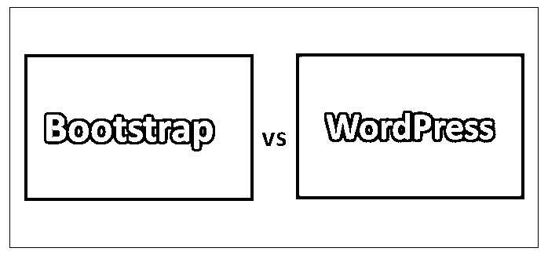
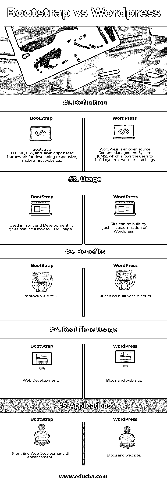

# Bootstrap vs WordPress

> 原文：<https://www.educba.com/bootstrap-vs-wordpress/>

## Bootstrap 和 WordPress 的区别

[Bootstrap 是](https://www.educba.com/what-is-bootstrap/)基于 HTML、CSS 和 [JavaScript 的框架](https://www.educba.com/javascript-vs-jquery/)，用于开发响应迅速、移动优先的网站。它有助于建立有吸引力的网站。 [Bootstrap 是一个强大的](https://www.educba.com/bootstrap-commands/)，移动优先的前端框架，用于更快更容易的 web 开发。Bootstrap 为开发人员构建界面提供了一个干净统一的解决方案。WordPress 是一个开源内容管理系统(CMS)，允许用户建立动态网站和博客。WordPress 是管理媒体文件和文件夹的工具。WordPress 是网络上最受欢迎的博客系统，允许从其后端 CMS(内容管理系统)和组件定制、更新和管理网站。

### 引导程序

*   马克·奥托和雅各布·桑顿在 Twitter 上开发了 bootstrap。它于 2011 年 8 月作为开源产品在 GitHub 上发布。Bootstrap 3，框架由贯穿整个库的移动优先样式组成，而不是在单独的文件中。我们可以定制 Bootstrap 的组件、更少的变量和 jQuery 插件来得到你自己的版本。 [Bootstrap 包含](https://www.educba.com/bootstrap-interview-questions/)十几个定制的 jQuery 插件。
*   我们可以很容易地将它们全部或一个一个包括进来。Bootstrap 包含十几个可重用的组件，用于提供图标、导航、下拉菜单、警告、弹出窗口等等。Bootstrap 提供了一个具有网格系统、链接样式和背景的基本结构。简单易学——只要有 HTML 和 CSS 知识，任何人都可以开始使用 Bootstrap。所有流行的浏览器都支持它。最棒的是，它是开源的。

### WordPress

*   WordPress 是一个开源的[内容管理系统](https://www.educba.com/best-ecommerce-sites/) (CMS)。它是存储所有数据的软件，如文本、照片、音乐、文档等。并发布在我们的网站上。它有助于编辑、发布和修改网站内容。WordPress 最初是由马特·莫楞威格和迈克·利特尔于 2003 年 5 月 27 日发布的。WordPress 在 2009 年 10 月被宣布为开源。
*   WordPress 允许管理用户信息，例如改变用户的角色(贡献者、订户、作者、编辑或管理员)，创建或删除用户，更改密码和用户信息。用户管理器的主要作用是认证 [WordPress 允许修改站点视图](https://www.educba.com/uses-of-wordpress/)和功能。它包括图像、样式表、模板文件和自定义页面。WordPress 是管理媒体文件和文件夹的工具，在这里你可以轻松地上传、组织和管理我们网站上的媒体文件。有几个插件可以根据用户的需求提供定制的功能和特性。
*   WordPress 允许以文章的形式导入数据。它导入自定义文件、评论、文章页面和标签。WordPress 允许将整个内容翻译成用户喜欢的语言。WordPress 提供了几个[搜索引擎优化](https://www.educba.com/the-beginners-guide-to-technical-seo/) (SEO)工具，让现场 SEO 变得简单。WordPress 是一个开源平台，免费提供。

### Bootstrap 和 WordPress 之间的直接比较(信息图表)

以下是 Bootstrap 和 WordPress 的 5 大区别:

<small>网页开发、编程语言、软件测试&其他</small>

### Bootstrap 和 WordPress 的主要区别

Bootstrap vs WordPress 都是市场上的热门选择；让我们讨论一下 Bootstrap 和 WordPress 之间的一些主要区别:

*   用 Bootstrap 开发网站需要很多东西；这不是一个单一的步骤来开发网站开发者必须有一个强大的 CSS 和 HTML 知识背景来建立网站；这将需要更多的带宽和时间来开发网站。
*   而在 WordPress 的情况下，网站可以很容易地在几个小时内建立，它将需要更少的带宽。任何没有技术背景的人都可以在 WordPress 的帮助下建立一个网站。因为它是完全可定制的。
*   在 Bootstrap 中，你必须编写代码；那么，只有它将工作意味着你必须有编码知识来做一项任务。
*   在 WordPress 中，一切都是可定制的；你只需拖放，不需要担心代码的备份；它会自动工作。
*   Bootstrap [提供了一个网格系统](https://www.educba.com/bootstrap-grid-system/),根据需要将网页的 UI 划分成网格视图；懂前端开发代码的开发者就能做到。
*   而在 WordPress 的情况下，你只需要根据你的 web 开发需求[进行拖拽。](https://www.educba.com/web-development-interview-questions/)
*   Bootstrap 是一个前端框架，它是 CSS 和 JavaScript 的集合，共同控制网页的呈现。这个演示包括你的文本的颜色，按钮的外观，以及当你在移动设备上查看时，你的站点是如何变化的。例如:四列折叠成一列，你的大菜单变成一个小图标，等等。
*   WordPress 是一个内容管理系统(CMS)；它允许你创建新的页面，上传图片，调整菜单中出现的项目，以及做一系列与网站内容相关的其他任务。
*   Bootstrap 是开源的，不用交钱；引导程序不依赖于 WordPress。
*   WordPress 依靠 [bootstrap 来管理不同设备上的 UI](https://www.educba.com/install-bootstrap/)；如果我们不想使用 bootstrap，我们必须使用一些其他的 UI 框架来完成相同的任务，或者自己创建所有的规则和行为。
*   Bootstrap 不提供用户管理、系统、搜索引擎优化。
*   WordPress 提供用户管理，允许管理用户信息，例如改变用户的角色(订户、贡献者、编辑、作者或管理员)，创建或删除用户，更改密码和用户信息。用户管理器的主要作用是身份验证。允许修改网站视图和功能。它包括图像、样式表、模板文件和自定义页面。它提供了许多搜索工具。

### 自举和 WordPress 对照表

下面讨论 Bootstrap 和 WordPress 之间的主要比较:

| 【Bootstrap 与 WordPress 的比较基础 | **自举** | **WordPress** |
| **定义** | Bootstrap 是基于 HTML、CSS 和 JavaScript 的框架，用于开发响应迅速、移动优先的网站。 | WordPress is an open-source Content Management System (CMS),

它允许用户建立动态网站和博客

 |
| **用途** | 用在前端开发中，给 HTML 页面一个漂亮的外观。 | 一个网站可以通过定制 WordPress 来建立。 |
| **好处** | 改进用户界面视图。 | Sit 可以在几小时内建成。 |
| **实时使用量** | [网页开发。](https://www.educba.com/career-in-web-development/) | 博客和网站。 |
| **应用程序** | 前端 Web 开发，UI 增强 | 博客和网站。 |

### 结论

Bootstrap 和 WordPress 都用于 Web 开发，选择哪一个取决于我们的需求。就像在 [Bootstrap](https://www.educba.com/what-is-bootstrap/) 的情况下，我们必须根据业务的需求编写 UI 代码。

开发人员必须了解 CSS 和 HTML 的知识来做编码。而任何没有技术技能的人都可以用 WordPress 开发一个网站，因为它是完全可定制的。所以根据要求，我们必须做出选择。

### 推荐文章

这是 Bootstrap 和 WordPress 之间最大区别的指南。我们也讨论了 Bootstrap 和 WordPress 的直接比较，关键区别，以及信息图表和比较表。你也可以看看下面的 Bootstrap vs WordPress 文章来了解更多

1.  [WordPress 与 Tumblr——哪个更好](https://www.educba.com/wordpress-vs-tumblr/)
2.  [棱角分明 vs 击倒对手想了解好处](https://www.educba.com/angular-vs-knockout/)
3.  [WordPress 与 Django 的差异](https://www.educba.com/wordpress-vs-django/)
4.  [角度与自举](https://www.educba.com/angular-vs-bootstrap/)
5.  [WordPress 和 HTML——哪个更好](https://www.educba.com/wordpress-vs-html/)
6.  [WordPress vs Weebly——惊人的差异](https://www.educba.com/wordpress-vs-weebly/)
7.  [自举面试问题](https://www.educba.com/bootstrap-interview-questions/)
8.  [Bootstrap vs Jquery:差异](https://www.educba.com/bootstrap-vs-jquery/)
9.  [Bootstrap vs jQuery UI:有什么区别](https://www.educba.com/bootstrap-vs-jquery-ui/)
10.  [神奇的自举 4 备忘单](https://www.educba.com/bootstrap-4-cheat-sheet/)

