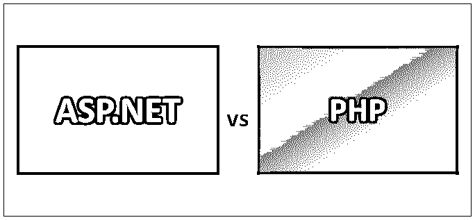
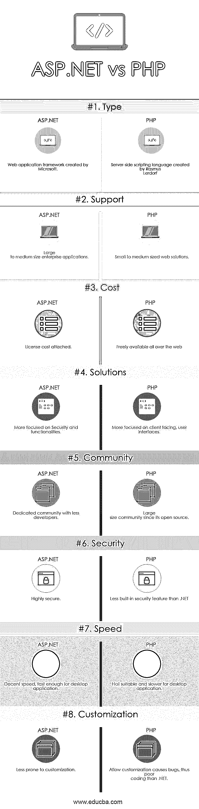

# ASP.NET vs PHP

> 原文：<https://www.educba.com/asp-net-vs-php/>

## ASP.NET 与 PHP 的区别

ASP.Net 是微软和微软支持的动态服务器页面的衍生产品。net 编程语言，用于 web 应用开发。 [PHP 是 Rasmus Lerdarf 的](https://www.educba.com/what-is-php/)通用服务器端脚本语言，可扩展为超文本预处理器，也用于 web 应用开发。ASP.Net 可以作为付费许可产品购买，可用于大中型企业应用程序。另一方面，PHP 是免费的开源产品，只能用于中小型 web 应用程序。

### ASP.NET

*   除了作为一个网络开发平台，Apart 还提供了一个编程模型，一个全面的软件基础设施和各种其他服务，这些都是建立一个强大的电脑和手机网络应用所必需的。它于 2002 年 1 月首次发布，是微软动态服务器页面(ASP)技术的继承者。ASP.NET 是独立于语言的，这意味着开发人员可以利用任何。NET 支持的语言来创建。NET 应用程序。
*   C#和 VB.NET 是编写应用程序最常用的两种语言。based 直接基于 Visual Basic，而 C#是与。NET 框架。[ASP.NET 框架为](https://www.educba.com/asp-dot-net-framework/)[、HTML、](https://www.educba.com/html-vs-css/)和 JavaScript 提供了出色的支持。因为它是建立在公共语言运行时(CLR)之上的，所以它允许程序员使用任何支持的。网语。
*   ASP.NET 被高度利用来创建动态网页。它提供了一种将服务器代码与 HTML 结合起来的轻量级和更快的方法。开发人员可以写下符合最新 web 标准的优雅站点。它也有助于添加视频，链接到社交媒体网站。ASP.NET 是一个健壮的框架，开发人员可以用它编写任何类型的应用程序。此外，我们可以使用任何风格来创建应用程序。

### 服务器端编程语言（Professional Hypertext Preprocessor 的缩写）

*   PHP 作为一个小型开源项目开始了它的旅程，经过多年的发展，它最终得到了发展。有许多流行的数据库，可以有效地与 PHP 代码集成。它的代码通常由 PHP 解释器处理，解释器作为 web 服务器中的一个模块来实现。
*   web 服务器组合解释和执行 PHP 代码的结果，这些代码可以是任何类型的，包括图像。PHP 在执行时非常灵活。当在 Unix 端编译成 Apache 模块时，它的执行甚至会更顺畅。PHP 还支持相当多的主要协议，如 POP3、IMAP 和 LDAP。
*   新增的对 Java 和分布式对象架构的支持使得多层开发首次在 PHP 中成为现实。ecosystem.PHP 在其源代码发行版中包含了大量免费的开源库。它基本上是一个互联网感知系统，内置模块用于[访问 FTP 服务器](https://www.educba.com/what-is-ftp-server/)和许多数据库服务器。有各种 C 程序员熟悉的函数，如“stdio”系列，它们在标准 PHP 版本中可用。

### ASP.NET 和 PHP 的面对面比较(信息图)

下面是 ASP.NET 和 PHP 性能之间的 8 大差异:

<small>网页开发、编程语言、软件测试&其他</small>

### ASP.NET 和 PHP 的主要区别

让我们讨论一下 ASP.NET 和 PHP 之间的一些主要区别:

*   ASP.NET 是微软提供的付费 web 应用框架，而 PHP 是开源的服务器端脚本语言。
*   ASP.NET 更适合大中型组织，而 PHP 更适合服务于初创和小型组织。
*   付费的 ASP.NET 在 IT 界有相当大的市场份额，而 PHP 是开源的，开发者可以免费获得，市场份额比 ASP.NET 高。
*   ASP.NET 社区致力于解决问题，并包含相当数量的开发人员，而 PHP 是开源的，有着巨大的社区规模。
*   ASP.NET 能够很好地服务和创建桌面应用程序，而 PHP 在桌面应用程序方面比 ASP.NET 慢。
*   ASP.NET 更适合主要关注安全性和功能性的应用程序，而 PHP 更适合主要关注用户界面的应用程序。
*   ASP.NET 框架在编译前通知开发者他们是否在编码中犯了任何错误，因此更安全且不容易出错，而 PHP 没有这样的选项让开发者在预编译阶段知道坏代码。
*   对于初学者来说，学习和理解 ASP.NET 可能是一个相当大的挑战，需要时间来掌握，而 PHP 作为一种脚本语言，更容易学习和理解。
*   ASP.NET 有相关的许可费用，而 [PHP 是开源的，可以免费获得](https://www.educba.com/php-alternatives/)。
*   ASP.NET 不允许任何不规则性，但仍然能够运行，而 PHP 是高度可定制的，因此更容易出现错误，尽管用它可以高效地编写 web 脚本。

### ASP.NET 和 PHP 对照表

下面讨论 ASP.NET 和 PHP 性能之间的主要比较。

| **ASP.NET vs PHP 的对比基础** | **ASP.NET** | **PHP** |
| **类型** | 微软创建的 Web 应用程序框架 | 由拉斯马斯·勒德尔夫创建的服务器端脚本语言 |
| **支持** | 大中型企业应用程序 | 中小型网络解决方案 |
| **成本** | 附加许可费用 | 在网络上可以免费获得 |
| **解决方案** | 更加关注安全性和功能性 | 更加关注面向客户的用户界面 |
| **社区** | 开发人员较少的专用社区 | 大型社区，因为它是开源的 |
| **安全** | 高度安全 | 内置安全功能少于。网 |
| **速度** | 体面的速度，足够快的桌面应用程序 | 不适合桌面应用程序，速度较慢 |
| **定制** | 不易定制 | 允许定制会导致错误，从而导致糟糕的编码。网 |

### 结论

PHP 是世界上在互联网上使用最多和最流行的语言，它帮助开发者开发了很多应用程序。它的社区很大，可以在网上免费获得。开发人员可以在更短的时间内开始使用 PHP，因为它更容易学习。它是一个开源平台，不像 ASP.NET 是一个付费的微软平台。PHP 是编程语言和 web 框架的混合体，而 ASP.NET 是一个简单的应用程序框架。

一个 ASP.NET 框架拥有最惊人的库集合。它有许多特性，因此允许开发者创建一个具有内置和拖放特性的网站。所有这些品质都有一个许可费的价格标签。PHP 开发人员缺乏使用像 ASP.NET 这样广泛使用的 web 框架的选择。在 ASP.NET 的生态系统中，程序员可以用 C#、VB 和 F#等任何语言编写代码。但是程序员缺乏用 PHP 编写代码的选择。因此，PHP 允许开发人员从广泛的 web 框架中进行选择，从而以灵活的方式编写应用程序。

在 ASP.NET vs PHP 中，ASP.NET vs PHP 都工作得很有效率，给出了符合他们口味的商业案例和所需的功能套件。ASP.NET 和 PHP 都有各自的优缺点。开发人员的技能和业务案例需求将决定这些技术的使用。

### 推荐文章

这是 ASP.NET 和 PHP 之间最大区别的指南。我们还讨论了 ASP.NET 和 PHP 的直接比较、主要区别、信息图和比较表。你也可以看看下面的 ASP.NET vs PHP 的文章来了解更多

1.  [Go 与 Java-有用的区别](https://www.educba.com/go-vs-java/)
2.  [ASP 与 ASP.NET——找出差异](https://www.educba.com/asp-vs-asp-dot-net/)
3.  [Django 与 PHP 的比较](https://www.educba.com/django-vs-php/)
4.  [ASP.NET vs c#](https://www.educba.com/asp-net-vs-c-sharp/)
5.  [PHP vs.Net——哪个更好](https://www.educba.com/php-vs-dot-net/)
6.  [Go vs PHP:有什么特点](https://www.educba.com/go-vs-php/)
7.  [MongoDB vs PostgreSQL:有什么好处](https://www.educba.com/mongodb-vs-postgresql/)
8.  [MongoDB vs Hadoop:有什么好处](https://www.educba.com/hadoop-vs-mongodb/)
9.  [MongoDB vs Postgres:有什么好处](https://www.educba.com/mongodb-vs-postgres/)
10.  [MongoDB vs 甲骨文；功能](https://www.educba.com/mongodb-vs-oracle/)
11.  [MongoDB vs Cassandra:有什么特点](https://www.educba.com/mongodb-vs-cassandra/)
12.  [ASP.NET vs . NET:差异](https://www.educba.com/asp-dot-net-vs-dot-net/)
13.  [MongoDB vs DynamoDB:最好的区别是什么](https://www.educba.com/mongodb-vs-dynamodb/)
14.  [MongoDB vs SQL:想知道哪个最好](https://www.educba.com/mongodb-vs-sql/)
15.  [PHP 与 C#:最佳特性](https://www.educba.com/php-vs-c-sharp/)

