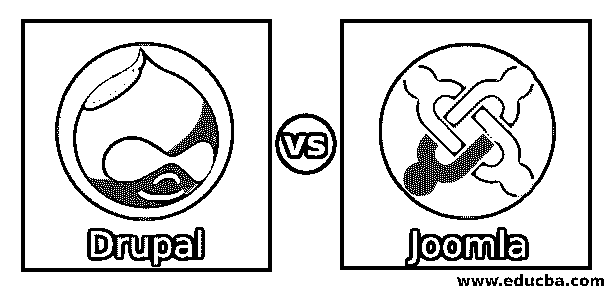
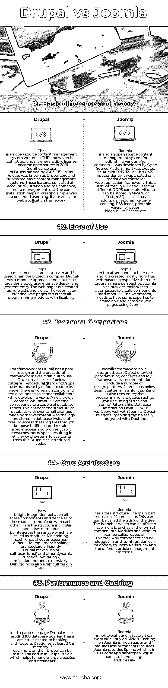

# Drupal vs Joomla

> 原文：<https://www.educba.com/drupal-vs-joomla/>

## Drupal 和 Joomla 的区别

随着一切都在互联网上发生，互联网上的内容组织良好并保持最新是非常重要的。为了方便起见，市场上有各种各样的内容管理系统。也就是说，这些包括 WordPress、Drupal、Joomla 等。Drupal 是一个开源管理系统，有助于管理互联网上的内容。它被许多组织使用，并维护所有网站。Joomla 也是一个开源平台，可以创建不同的网站和应用程序。它可以连接到任何数据库，如 MySQL 或 PostgreSQL，以轻松管理和交付内容。让我们来看看 Drupal 和 Joomla CMS 的区别。

### Drupal 和 Joomla 的面对面比较(信息图)

下面是 Drupal 和 Joomla 之间的 5 大区别

<small>网页开发、编程语言、软件测试&其他</small>

### Drupal 和 Joomla 的主要区别

两者都是市场上的热门选择；让我们讨论一些主要差异:

*   市场上有这么多的 CMS，Joomla vs Drupal 也有很强的竞争力。Joomla 在斯瓦希里语中是“所有人在一起”的意思。它是仅次于 WordPress 的第二大使用和流行的 CMS。它基于 PHP 和 SQL 数据库。
*   另一方面，Drupal 在 CMS 竞赛中排名第三。它主要用于构建企业网站。它也是技术上最先进的 CMS 之一。
*   当我提到费用时，Drupal 和 Joomla 都是免费的，但是你可以在选择高级包时获得高级特性。Drupal 不容易开发，除非你有编程技能，否则你需要付费才能使用它。

### Drupal 与 Joomla 对比表

Drupal 和 Joomla 之间的主要比较如下:

| **比较的基础** | **Drupal** | **Joomla** |
| **基本区别和历史** | 这是一个用 PHP 编写的开源内容管理系统，在通用公共许可证下发布。它在 2001 年成为开源软件。Drupal 的大量使用始于 2003 年。最初的版本被称为 Drupal core，支持基本的内容管理系统。这些功能包括帐户注册和维护、菜单管理等。核心安装有助于创建一个简单的网站或多用户博客。它还充当 web 应用程序框架。 | Joomla 也是一个用于发布各种 web 内容的开源内容管理系统。它是由开源物质公司开发的，创建于 2015 年 8 月。为了独立使用这个 CMS，它被创建在一个模型视图控制器 web 应用程序框架上。这也是用 PHP 写的，使用了不同的 OOPS 概念。所有数据都可以存储在 MySQL 或 PostgreSQL 中。它还具有额外的功能，如页面缓存、RSS 提要、页面的可打印版本、博客、新闻快讯等。 |
| **易用性** | Drupal 被认为是最难学的，当项目很复杂时会用到它。Drupal 采用模块化方法，因此提供了良好的用户界面设计和内容输入。使用块和视图创建网页。创建网页的网站管理员可以灵活地创建所有的编程模块。 | 另一方面，Joomla 要简单一些，它主要是从网站管理员的角度而不是从程序员的角度创建的。Joomla 还为网站管理员提供工具箱来创建组件和模块。网站管理员需要有一些专业知识来使用 Joomla 创建新的复杂的网页。 |
| **技术对比** | The framework of Drupal has a poor design, and the procedural framework makes it difficult to use.Drupal 使用以下模式:

1)程序性

2)挂钩

Drupal 默认使用数据库来存储它的视图。没有版本控制，开发人员在开发视图时也不能协作。每当创建一个新的视图或内容时，它都对应于两个数据库表。这改变了数据库的结构，即使网站管理员做了很小的改变。

另外，日志存储在数据库中，而不是文件中。通过数据库访问这些日志文件很困难，需要特殊的访问权限和配置文件。此外，它会占用大量空间，导致系统效率低下。为了克服这个问题，Drupal 引入了 Syslog。

 | Joomla’s framework is well designed, uses Object-oriented programming concepts and an MVC framework. Its implementations include a number of design patterns. Joomla has below design patterns:3)symphony 2

4) Zend

它还使用企业编程语言，如 Java(包括 Struts 和 Spring)

像数据库抽象层(DBAL)这样的模式与 Joomla 配合得非常好。对象关系映射可以很容易地与教条集成。

 |
| **核心架构** | 所有这些组件之间紧密集成，因此所有这些组件都可以相互通信。这里的结构是圆形的，表面上有许多点，这些点被称为模块。维护这种代码变得很困难。为了有效地实现挂钩架构，Drupal 广泛地使用了 call_user_func()和其他动态函数调用/反射方法。在 Drupal 中，调试也是一项困难的任务。 | Joomla 有一个树状结构。主要部分由 Joomla 核心组成。这也可以叫树干。可以是 API 的分支可以有更多组件形式的分支。模块和部件可以被称为这棵树的叶子。任何组件都可以插入，它的集成可以通过 Joomla 的安全性和不同的文章管理功能来完成。 |
| **性能和缓存** | 为了加载一个特定的页面，Drupal 会进行大约 100 次数据库查询。这些是与挂钩架构相关的问题。它需要至少 2 GB 的内存。如果启用了缓存，那么 Drupal 会更快。Drupal 中的插件是 Solr，它有助于处理大型网站和数据库。 | Joomla 是轻量级的，速度更快。它可以在 512MB 上高效工作。在 Joomla 上缓存要容易得多，需要的资源也更少。Joomla 提供了 Sphinx，是 C++代码，比 Solr 快。它还可以轻松处理大流量。 |

### 结论

Joomla 和 Drupal 的使用取决于你的使用。如果你想要一个用户友好的选项，那么 Joomla 可以被选中。它的生态系统更小。它是 SEO 友好的，任何人都可以开始使用它。当一个巨大的网站有许多功能和定制时，可以使用 Drupal。它有许多增强性能的内置函数，但只有精通编码和编程的开发人员才能轻松应对。所以明智地在 Drupal 和 Joomla 之间做出选择，完成你的第一个网站！

### 推荐文章

这是 Drupal 和 Joomla 之间最大差异的指南。在这里，我们还将讨论信息图和比较表的主要区别。你也可以看看下面的文章。

1.  [WordPress 和 Tumblr](https://www.educba.com/wordpress-vs-tumblr/)
2.  [WordPress vs Drupal](https://www.educba.com/wordpress-vs-drupal/)
3.  [树莓派 0 比 3](https://www.educba.com/raspberry-pi-zero-vs-3/)
4.  [WordPress vs Joomla](https://www.educba.com/wordpress-vs-joomla/)

