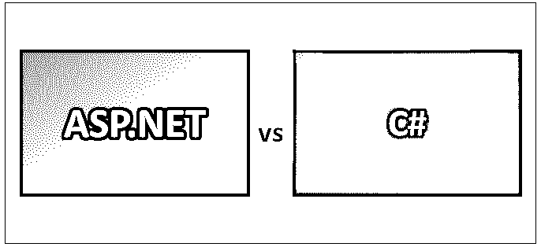
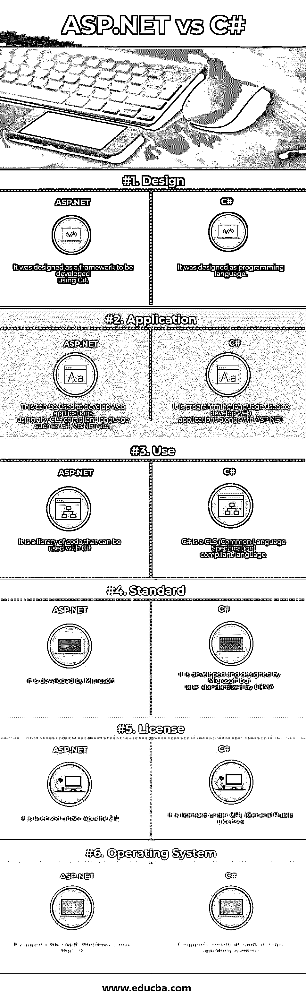

# ASP.NET vs c#

> 原文：<https://www.educba.com/asp-net-vs-c-sharp/>

## ASP.NET 与 C#的区别

ASP.NET 是一个用于 web 应用程序开发的开源框架，可以在网页上生成动态内容。这主要是写于。网络语言。这个框架也用于开发 web 服务。基于 ASP.NET 的 web 应用程序可以通过使用几种现有的工具来开发，如 Microsoft Visual Studio、Microsoft Expression Web、Macromedia HomeSite，这些工具可以根据需要使用。C#是一种面向对象的、函数式的、命令式的、通用的和基于组件的编程语言。C#编程语言主要是基于 C++、Java Pascal 和其他一些面向对象的编程语言开发的。

### C#

C#读作“C–Sharp”，它是面向对象的、函数式的、命令式的、声明式的、严格类型的、泛型的。C#由微软开发，由微软公司设计。它是在 2000 年由 NET 发起开发的，后来使用 ECMA-334(维护编程或脚本语言标准的公共团体)标准进行了标准化。它是在 GPL(通用公共许可证)许可下授权的。

<small>网页开发、编程语言、软件测试&其他</small>

### ASP.NET

微软开发了 ASP.NET 框架。该框架支持不同的操作系统，如 Windows、Mac OS 和 Linux。这是在 Apache License 2.0 版本下许可的。ASP.NET 于 2002 年首次发布，命名为。NET 框架，后来被称为 ASP.NET，也就是所谓的动态服务器页面(ASP)。ASP.NET 核心是 ASP.NET 框架的继承者。甚至像 Spring.NET 这样的第三方框架也存在于 Spring Framework for Java 中。

### ASP.NET 和 C#的正面比较(信息图)

下面是 ASP.NET 与 C#的 6 大区别

### ASP.NET 和 C#的主要区别

两者都是市场上的热门选择；让我们讨论一些主要的区别:

1.  ASP.NET 由微软公司销售和开发，用于在微软 Windows 环境下开发健壮的 web 应用程序，这是跨平台的，而 C#主要基于 C 和 C++编程语言，这些语言由 ISO(国际标准组织)和 ECMA(欧洲计算机制造商协会)标准推广。
2.  ASP.NET 工作在 HTTP 层之上，这是微软的一部分。NET 平台。而 C#是一种结构化的编程语言，用于生成一些有效的程序，这些程序支持具有重要特性的各种平台。
3.  ASP.NET 有不同的功能，如使用 HTTP 协议的 web 窗体模型，如页面状态、会话状态等。而 C#具有不同的功能，如自动垃圾收集、布尔条件、程序集版本控制属性和事件、委托和事件管理、标准库、自动垃圾收集(GC)、索引器、泛型、多线程和 Lambda 表达式。
4.  ASP.NET 是这些类型的编程语言的媒介，例如 C#提供 API(应用程序编程接口)或库，以简化具有现成功能的开发过程，而 C#用于编写不同类型的应用程序，例如 Web 应用程序、Web 服务和 Windows 应用程序(独立应用程序)。
5.  ASP.NET 在整个会话期间存储所有网页的页面状态和会话，以存储任何与会话相关的数据，并且可以基于对应用程序状态或页面状态可用的数据的要求来使会话超时，而 C#可以用于编写处理应用程序中的会话或状态的存储的实现。
6.  ASP.NET 有一个组件模型，它形成了对服务器端组件和服务器端页面的控制，当用户通过 IIS (Internet 信息服务)请求时，服务器端组件和服务器端页面通过呈现内容来呈现给用户界面，IIS 是一个由微软创建的可扩展的 web 服务器，用于委托用户请求，而 C#用于管理。NET 框架。
7.  ASP.NET 有不同类型的可用组件，其中最重要的有 Windows Communication Foundation(WCF)、Windows Presentation Foundation(WPF)、Windows Workflow Foundation (WF)、元数据和程序集、Windows 窗体、ASP.Net 和 ASP.Net AJAX、[ADO.Net](https://www.educba.com/ado-net-interview-questions/)、通用类型系统、通用语言规范(CLS)等。，其中 C#将用作客户端语言来利用这些组件。
8.  ASP.NET 有一个应用程序生命周期，它分为不同的组，如应用程序生命周期和页面生命周期；反过来，这些生命周期将有遵循某种标准来实现应用程序的子流程或组，而 C#将被用作实现这些流程的媒介，以根据需求运行应用程序。
9.  ASP.NET 具有不同的安全特性，如授权、身份验证、机密性、完整性，这些特性将在. NET 框架中使用基于表单的身份验证来实现，而 C#具有面向对象的特性来封装所需的类或方法，或者使用访问修饰符来隐藏实现的代码块

### ASP.NET 与 C#比较表

下面是最上面的比较:

| **比较的基础** | **ASP.NET** | **C#** |
| **设计** | 它被设计成一个使用 C#开发的框架 | 它被设计成一种编程语言 |
| **应用** | 这可用于使用任何 CLS 兼容语言(如 C#、VB.NET 等)开发 web 应用程序。, | 它是一种编程语言，用于与 ASP.NET 一起开发 web 应用程序 |
| **使用** | 这是一个可以和 C#一起使用的代码库 | C#是一种符合 CLS(公共语言规范)的语言 |
| **标准** | 它是由微软开发的 | 它由微软开发和设计，但后来被 ECMA 标准化。 |
| **执照** | 它是根据 Apache 2.0 许可的 | 它是根据 GPL(通用公共许可证)授权的 |
| **操作系统** | 它支持微软视窗，Linux，MacOS | 它几乎支持所有类型的主要操作系统 |

### 结论

ASP.NET 是一个 web 应用程序开发框架，用于使用不同的后端编程语言(如 C#)开发 web 应用程序，其中 C#被用作面向对象的编程语言，与 ASP.NET 一起开发 web 应用程序。ASP 是一种动态服务器页面技术，用在。NET 框架来开发 web 应用程序。在开发 ASP.NET 之前，ASP.NET 核心已经存在，这是最初的版本，后来升级了新的功能。

要开发 web 应用程序，需要一种编程语言和一个框架，通过从框架中导入所需的库来简化开发。特性和功能将内置在类似 ASP.NET 框架的框架中。在现代社会中，ASP.NET 和 C#对于开发一个 web 应用程序来说同样重要和必要。

### 推荐文章

这是 ASP.NET 和 C#之间最大区别的指南。在这里，我们还将讨论信息图和比较表的主要区别。您也可以看看以下文章，了解更多信息–

1.  [ASP vs ASP.NET](https://www.educba.com/asp-vs-asp-dot-net/)
2.  [Python 与 c#的区别](https://www.educba.com/python-vs-c-sharp/)
3.  [ASP.NET 面试问题](https://www.educba.com/asp-dot-net-interview-questions/)
4.  [JavaScript vs C#](https://www.educba.com/c-sharp-vs-javascript/)

