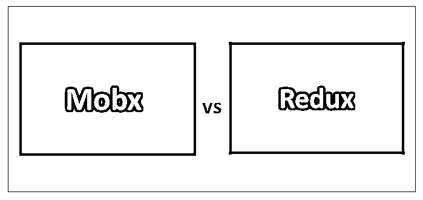
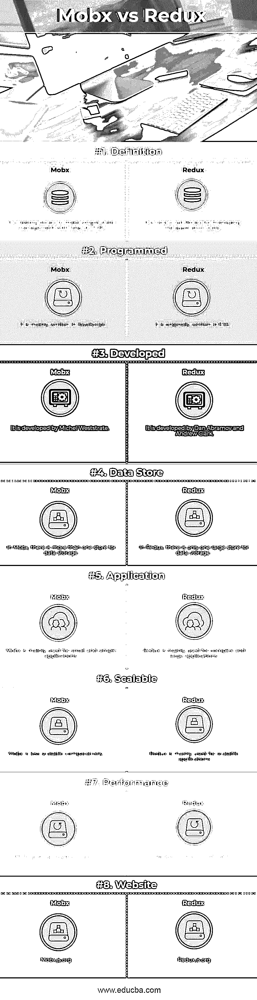

# Mobx vs Redux

> 原文：<https://www.educba.com/mobx-vs-redux/>

## Mobx 和 Redux 的区别

Mobx 是一个测试库，用于在 TFRP(透明地应用函数式反应式编程)的帮助下进行可扩展和简单的状态管理。这将有助于使国家保持一致。它遵循的概念是，可以从应用程序状态派生的所有内容都将自动派生。Redux 是一个用于维护应用程序状态管理的 javascript 库。Redux 有助于开发在所有环境中行为一致的应用程序。它还帮助开发人员轻松地开发、测试和调试代码。

### Mobx

*   Michel Weststrate 开发了 mobx。它最初于 2015 年发布。主要是用 JavaScript 写的。在状态中，像数组、引用一样，对象被认为是应用程序的数据单元。派生被认为是可以由应用程序状态自动处理的值，就像应用程序中的公式和图表一样。
*   反应主要负责输入输出操作和更新 DOM，网络请求需要自动按时处理。动作修改状态，Mobx 确保所有的改变都需要同步处理。
*   Mobx 可以在任何 ES5 环境下运行。它支持 node.js、rhino 和除 IE8 以外的所有浏览器。它也支持 react native。Mobx 通常由状态、派生、反应和动作组成。
*   需要注意的一点是，Mobx 不是一个框架，因为它不知道如何构建代码，如何处理和存储数据。Mobx 可以应用于任何现代 JS 环境。

### Redux

*   丹·阿布拉莫夫和安德鲁·克拉克开发了 redux。它最初于 2015 年发布。它是用 JavaScript 写的。它主要与库一起使用，为 React、angular 等前端技术构建用户界面。它支持跨平台。
*   Redux 也被称为直观的状态容器。它也可以与 React 和另一个库视图一起使用。如果你知道 flux 或者你已经开发了一些关于 flux 的东西，Redux 是非常简单的。
*   Redux 主要用于一定数量的数据随着时间的推移而发生变化的情况。如果数据变化不频繁，则 Redux 的使用较少。它被用作管理应用程序状态的模式。
*   一些库或前端技术(如 React)有自己的应用程序状态管理，因此在使用这些库时，应该了解它的内置功能。有时候开发完应用后，理解和编码变得复杂；很难知道这种状态是如何改变的。在这种情况下，Redux 是有用的。

### Mobx 和 Redux 的面对面比较(信息图)

下面是 Mobx 和 Redux 的 8 大区别

<small>网页开发、编程语言、软件测试&其他</small>

### Mobx 和 Redux 的主要区别

两者都是市场上的热门选择；让我们讨论一些主要的区别:

*   在 Mobx 中，可以保留反规范化的数据。在 Redux 中，保留的数据主要是规范化的数据。
*   Mobx 主要使用一个可观察对象来存储数据。Redux 主要使用 javascript 对象来存储数据。
*   在 Mobx 中，更新可以在可观察属性的帮助下自动完成。在 Redux 中，更新需要手动监控。
*   在 Mobx 中，状态可以被覆盖，这也称为不纯状态，因为状态可以简单地用新值更新。在 Redux 中，状态被称为纯状态，因为状态是只读的，不能简单地被覆盖。这意味着它使用不可变的状态。
*   在 Mobx 中，调试是很困难的，因为 Mobx 可用的工具不符合标准，这导致了许多次不可预测的响应。对于 Redux，有很多开发者工具可用；纯函数和较少的抽象使得调试更容易。使用通量范式也可以预测响应。
*   Mobx 更容易学习，学习曲线简单。如果你知道 OOPs 的概念，那么对于 javascript 开发者来说学习 Mobx 是很容易的。Redux 很难学，因为它有一个陡峭的学习曲线。它遵循函数式编程范式，需要付出很大的努力才能掌握事物。
*   在 Mobx 中，有很多内置的抽象，这导致代码更少。在 Redux 中，抽象更少，需要编写更多的代码。
*   Mobx 主要用于在更短的时间内快速开发应用程序。Redux 开发的应用程序通常需要时间，因为它们很复杂。
*   Mobx 的可维护性较差。Redux 更易维护。
*   与 Redux 相比，Mobx 的在线社区和开发者支持较少。Redux 在开发者和在线社区支持方面比 Mobx 领先很多。

### Mobx 与 Redux 对比表

主要比较如下所述:

| **比较的基础** | **Mobx** | **还原** |
| **定义** | 这是一个借助 TFRP 进行简单状态管理的测试库。 | 它是用于管理应用程序状态的 Javascript 库。 |
| **已编程** | 它主要是用 JavaScript 编写的 | 它最初是在 ES6 中编写的 |
| **发达** | 米歇尔·韦斯特斯特拉特发展了它 | 丹·阿布拉莫夫和安德鲁·克拉克发展了它。 |
| **数据存储** | 在 Mobx 中，数据存储不止一个存储。 | 在 Redux 中，只有一个大型存储用于数据存储。 |
| **应用** | Mobx 主要用于小而简单的应用程序 | Redux 主要用于复杂的大型应用程序。 |
| **可扩展** | 相比之下，Mobx 的可扩展性较差。 | Redux 主要用于可伸缩的应用程序 |
| **性能** | Mobx 提供了良好的性能 | Redux 效率并不高。 |
| **网站** | Mobx.js.org | Redux.js.org |

### 结论

两者都是用于以某种方式管理应用程序状态的库。两者都主要结合前端库，如 [react 和 angular](https://www.educba.com/angular-vs-react/) 来开发更具交互性的用户界面，并显示随时间变化的数据。

Mobx 主要适合初学者使用，因为它简单易学。对于那些对函数式编程技巧有很强理解的人，可以首选 Redux。可以看出，Redux 已经很好地建立起来，并且在开发人员中很受欢迎，而 Mobx 则没有那么受欢迎，但是 Mobx 可以成为管理应用程序状态的一个很好的选择。

两者都是很好的库，可以根据需求和资源的可用性来选择。快乐学习！!

### 推荐文章

这是 Mobx 和 Redux 之间主要区别的指南。在这里，我们还将讨论 Mobx 和 Redux 的主要区别，包括信息图和比较表。您也可以看看以下文章——

1.  [还原与通量](https://www.educba.com/redux-vs-flux/)
2.  [Drupal vs Joomla](https://www.educba.com/drupal-vs-joomla/)
3.  [Hadoop vs Spark](https://www.educba.com/hadoop-vs-spark/)
4.  [Bootstrap vs Jquery](https://www.educba.com/bootstrap-vs-jquery/)
5.  [Bootstrap vs jQuery UI:特性](https://www.educba.com/bootstrap-vs-jquery-ui/)
6.  [Bootstrap 4 cheat sheet 的最佳功能](https://www.educba.com/bootstrap-4-cheat-sheet/)

