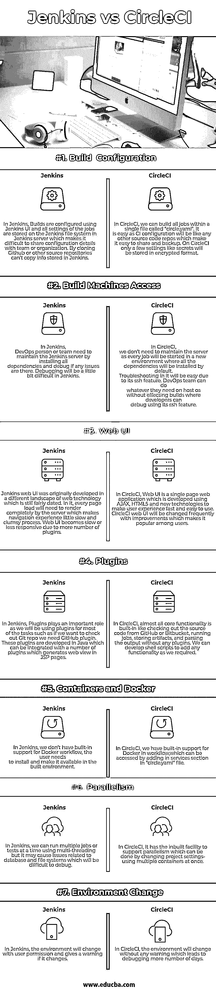

# 詹金斯 vs 切尔莱西

> 原文：<https://www.educba.com/jenkins-vs-circleci/>

## 詹金斯和切尔莱西的区别

[Jenkins 是一个用 Java 语言开发的](https://www.educba.com/what-is-jenkins/)持续集成和持续部署服务器。Jenkins 是一款跨平台、领先的屡获殊荣的持续集成自动化工具，其主要目标是构建和[持续测试软件](https://www.educba.com/software-testing-interview-questions/)并监控外部运行的作业的执行。CircleCI 是一个持续集成工具，被[软件开发团队](https://www.educba.com/software-development-vs-web-development/)用来在不同平台上更快、更容易地构建、测试和部署应用程序。CircleCI 支持所有类型的软件测试，包括 web、移动、桌面和容器环境。

### 詹金斯是什么？

持续集成意味着每当有人将代码推入任何软件或 SDK 源存储库组件时，触发非开发人员机器上的测试集合。Jenkins 使用管道为几乎任何语言和源代码库的组合提供持续集成服务。它的开源和扩展能力是它成功的主要原因。Jenkins 于 2004 年开发，最初名为 Hudson，2011 年晚些时候因与甲骨文发生纠纷而更名为 Jenkins。Jenkins 有 1200 多个插件可用于扩展 Jenkins 的功能。很多公司用詹金斯；其中一些是脸书、索尼、网飞、Tumblr、雅虎、易贝等。Jenkins 提供了简单的安装、配置、丰富的插件可用性、可扩展性和到不同计算机的分布式构建。

<small>网页开发、编程语言、软件测试&其他</small>

### 什么是 CircleCI？

CircleCI 提供简单的设置和维护，没有任何困难。这是一个基于云的系统，这意味着不需要专用的服务器，也不需要使用免费计划来维护/管理服务器，即使对于企业客户也是如此。CircleCI 可与 GitHub、亚马逊 EC2、Appfog、dotCloud 等集成。，并被许多公司使用，如脸书、Spotify、Kickstarter、RedBull、Harvest 和 Teespring 等。社区成员最强调 CircleCI 的属性，如 Github 集成、快速构建、简单设置、slack 集成、Docker 支持和出色的客户支持。CircleCI 具有以下特性，如快速设置、深度定制、智能通知、快速支持和自动并行。它缓存需求安装和第三方依赖项，而不是环境安装。

### 詹金斯和切尔莱西的对决(信息图)

以下是詹金斯和切尔莱西的 7 大区别:

### 詹金斯和切尔莱西的主要区别

詹金斯 vs CircleCI 都是市场上的热门选择；让我们讨论一下詹金斯和切尔莱西之间的一些主要区别:

*   Jenkins 可以通过多线程来支持多个作业，而 CircleCI 已经建立了对并行性的支持，这是项目设置可以实现的。
*   在 Jenkins 中，使用 web UI 配置构建，设置存储在 Jenkins 服务器中，而在 CircleCI 中，可以使用“circle.yaml”文件构建作业。
*   CircleCI 有最好的调试功能，“通过 SSH 调试”，这使得调试更容易，而 Jenkins，我们需要通过手动点击作业来调试。
*   CircleCI 在没有警告的情况下改变环境，这是一个问题，而只有当用户在 Jenkins 中指示时，它才会改变。
*   在 Jenkins 中，我们可以使用私有服务器缓存 Docker 图像，而在 CircleCI 中，我们不能缓存 Docker 图像。
*   在詹金斯，秘密将使用詹金斯证书和插件加密，而在 CircleCI，我们没有像詹金斯那样的安全性。

### 詹金斯和切尔莱西对照表

Jenkins 和 CircleCI 之间的主要比较如下:

| **比较的基础** | 詹金斯 | 循环 |
| **构建配置** | 在 Jenkins 中，使用 Jenkins UI 配置构建，并且作业的所有设置都存储在 Jenkins 服务器中的 Jenkins 文件系统上，这使得很难与团队或组织共享配置细节。通过克隆 Github 或其他源库不能复制存储在 Jenkins 中的信息。 | 在 CircleCI 中，我们可以在一个名为“circle.yaml”的文件中构建所有作业。这很容易，因为 CI 配置将像任何其他源代码仓库一样，使其易于共享和备份。在 CircleCI 上，只有少数像 secrets 这样的设置会以加密格式存储。 |
| **构建机器访问** | 在 Jenkins 中，DevOps 人员或团队需要通过安装所有依赖项来维护 Jenkins 服务器，并在出现任何问题时进行调试。在 Jenkins 中调试会有点困难。 | 在 CircleCI 中，我们不需要维护服务器，因为每个作业都将在一个新环境中启动，默认情况下，所有依赖项都将安装在这个新环境中。由于它的 ssh 功能，故障排除将变得很容易。DevOps 团队可以在主机操作系统上做他们需要的任何事情，而不会影响开发人员可以使用其 ssh 功能进行调试的构建。 |
| **网络用户界面** | Jenkins web UI 最初是在一个不同的 web 技术环境中开发的，这个环境仍然相当陈旧。在其中，每一个页面加载都需要完全由服务器来呈现，这使得导航体验有点缓慢和笨拙。由于插件数量增加，网络用户界面变得缓慢或反应迟钝。 | 在 CircleCI 中，Web UI 是一个使用 AJAX、HTML5 和新技术开发的单页 Web 应用程序，旨在使用户体验快速且易于使用。CircleCI 网络用户界面将会随着改进而频繁改变，这使得它在用户中很受欢迎。 |
| **插件** | 在 Jenkins 中，插件扮演着重要的角色，因为我们将在大多数任务中使用插件，例如如果我们想检查 Git repo，我们需要 GitHub 插件。这些插件是用 Java 开发的，可以与许多插件集成，这些插件在 [JSP](https://www.educba.com/jsp-interview-questions/) 页面中生成 web 视图。 | 在 CircleCI 中，几乎所有的核心功能都是内置的，比如从 GitHub 或 Bitbucket 中检查源代码，运行作业，存储工件，以及在没有任何插件的情况下解析输出。我们可以开发 shell 脚本来添加我们需要的任何功能。 |
| **集装箱和码头** | 在 Jenkins 中，我们没有对 Docker 工作流的内置支持；用户需要安装并使其在构建的环境中可用。 | 在 CircleCI 中，我们在工作流中内置了对 Docker 的支持，可以通过在“circle.yaml”文件的服务部分添加来访问。 |
| **并行度** | 在 Jenkins 中，我们可以使用多线程一次运行多个作业或测试，但这可能会导致与数据库和文件系统相关的问题，难以调试。 | 在 CircleCI 中，它有支持并行性的内置工具，这可以通过改变项目设置来实现——一次使用多个容器。 |
| **环境变化** | 在 Jenkins 中，环境会随着用户许可而改变，如果改变会给出警告。 | 在 CircleCI 中，环境会在没有任何警告的情况下发生变化，这导致调试的天数更多。 |

### 结论

最后是詹金斯 vs 切尔莱西的对比概述。我希望您能更好地理解 CircleCI vs Jenkins 自动化工具，并根据您的项目需求和成本使用它们。我们已经看到了 CircleCI vs Jenkins 的优缺点——人们可以根据项目需求(如预算、时间表和其他参数)来决定使用哪种工具。

### 推荐文章

这是詹金斯和切尔莱西之间最大差异的指南。在这里，我们讨论了 Jenkins 与 CircleCI 的直接比较、主要差异，以及信息图和比较表。您也可以看看以下文章，了解更多信息–

1.  [特拉维斯 CI](https://www.educba.com/jenkins-vs-travis-ci/) [vs 詹金斯](https://www.educba.com/jenkins-vs-travis-ci/)
2.  [詹金斯 vs TeamCity](https://www.educba.com/jenkins-vs-teamcity/)
3.  [Oracle vs OpenJDK](https://www.educba.com/oracle-vs-openjdk/)
4.  [Rundeck vs Jenkins](https://www.educba.com/rundeck-vs-jenkins/)

