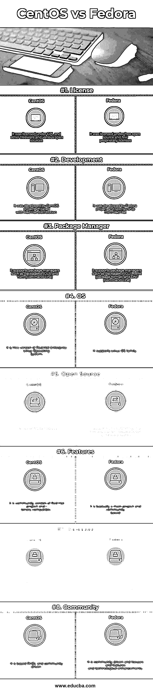

# CentOS vs Fedora

> 原文：<https://www.educba.com/centos-vs-fedora/>

## CentOS 和 Fedora 的区别

CentOS 是一种 Linux 发行版，是一个免费的、受社区支持的企业级社区平台，在功能方面与其上游源代码 Red Hat Linux 兼容。它支持 Linux 系列操作系统。它支持 PackageKit (GUI)和 Yum(命令行)等包管理器。Fedora 是一种由社区支持的 Fedora 项目开发并由 Red Hat 赞助的 Linux 发行版。它支持包管理器，如包工具包(GUI)、RPM(包格式)和 DNF(命令行)。让我们在这篇文章中详细讨论 CentOS 和 Fedora。

### CentOS 和 Fedora 的面对面比较(信息图)

以下是 CentOS 与 Fedora 之间的 8 大差异

<small>网页开发、编程语言、软件测试&其他</small>

### CentOS 和 Fedora 的主要区别

两者都是市场上的热门选择；让我们讨论一些主要的区别:

1.  CentOS 基于 RHEL 和相同的代码基础，可以使用，或从 RHEL 获得稳定性的好处，而 Fedora 是实现新功能的基础，在这种情况下是有益的。
2.  与 Fedora 相比，CentOS 的优势更大，因为它在安全功能和频繁的补丁更新以及长期支持方面具有高级功能，而 Fedora 缺乏长期支持和频繁的发布和更新。
3.  CentOS 属于红帽公司的 CentOS 商标，而 Fedora 属于红帽公司的 Fedora 商标，红帽公司还拥有 CentOS 和 Fedora 的域名。
4.  CentOS 包包含了整个发行版所需的所有东西，而 Fedora 通过网络而不是单一发行版来分发它的大部分包。
5.  CentOS 目前在超过 50 万个网站中使用的所有顶级网站中处于领先地位，而 Fedora 在大多数细分市场中明显落后。
6.  CentOS 在超过 225 个国家中的大多数国家处于领先地位，而 Fedora 在极少数国家的用户群较少。
7.  在不需要最新版本的情况下，CentOS 是首选，在旧版本中考虑稳定性，而 Fedora 在这种情况下不是首选。
8.  CentOS 正式支持 x86 和 x64 架构的操作系统，并支持物理地址扩展功能，而 Fedora 当前版本支持服务器、工作站和个人计算机。
9.  CentOS 超越了几乎所有使用它的 30%以上的 Linux 分布式 web 服务器，而 Fedora 主要关注技术创新和将新技术与 Linux 软件社区集成。
10.  CentOS 被开发出来，其设计基于 RHEL，这是一种付费订阅服务，而在 Fedora 中，用户可以升级软件而无需重新安装。
11.  CentOS 系统在安全性和网络可用性方面没有妥协，而 Fedora 默认具有安全性增强的 Linux 配置的内置特性。
12.  CentOS 有不同的版本，如 5、6、7，这些版本将支持到未来 10 年，因为它基于 RHEL，而 Fedora 支持的生命周期较短，因为它仅支持至少 13 个月，以此类推。
13.  CentOS 还有另一个特性叫做特殊兴趣组(SIGs ),它是 CentOS 社区组中有组织的部分，而 Fedora 有不同版本的操作系统包，如服务器、原子和工作站类型的版本。
14.  CentOS 包含主要的 CentOS 存储库，这些存储库被称为包含软件包的通道，而 Fedora 发布了 Fedora 的定制版本 Fedora Labs。
15.  CentOSwas 最初发布于 2004 年。它是在 GPL 和其他免费许可证下授权的。它支持 AMD 64 平台。它是由隶属于红帽的 CentOS 项目组开发的。
16.  Fedora 在各种自由和开放源码许可下获得了各种包的许可，包括一些专有的固件包。它最初发布于 2003 年。它的默认用户界面是 GNOME shell。

### CentOS 与 Fedora 对照表

主要比较如下所述:

| **比较的基础** | **厘斯** | **软呢帽** |
| **执照** | 它是在 GPL 和其他免费软件以及各种开源软件下授权的 | 它是在自由开源和少数专有许可下授权的 |
| **开发** | 它是由红帽发行公司的 CentOS 项目开发的 | 它是由 Fedora 项目和 Red Hat 赞助开发的 |
| **包管理器** | 它支持包管理器，如 PackageKit (GUI)和 Yum(命令行) | 它支持包管理器，如包工具包(GUI)、RPM(包格式)和 DNF(命令行) |
| **OS** | 它是红帽企业 Linux 操作系统的免费版本。 | 它支持 Linux 操作系统家族。 |
| **开源** | 它是免费和开源的。 | 它是免费的，在专利许可下功能很少 |
| **特性** | 这是一个社区版本的红帽项目和我二进制兼容。 | 这基本上是一个主要项目和社区为基础的 |
| **发布** | 它对频繁发布的关注较少 | 它更侧重于每六个月快速发布一次 |
| **社区** | 它以 RHEL 为基础，由社区驱动 | 它是由社区驱动的，关注焦点、功能和技术增强。 |

### 结论

CentOS 正被业界大多数计算机所使用，它是一个开源和免费的许可版本。它有许多先进的功能，为用户提供强大的功能，因此它已成为大多数用户的选择。此外，它是二进制兼容的，支持开箱即用的大多数 RHEL 功能。根据用途或应用，可以选择分布；例如，CentOS 可以用作服务器，而 Fedora 可以用作桌面。

Fedora 是开源的免费软件，它有一些专有的特性；从商业的角度来看，大多数用户在他们的计算机中并不选择它来降低项目成本，而在 CentOS 的情况下，它与 Fedora 相比没有什么优势，如技术进步功能和频繁的发布，大多数用户会考虑选择它作为 Linux 发行版。在 Linux 发行版的使用中，CentOS 在维护和安全特性更新方面更为可取。我希望现在你对这两者已经有了更好的理解。请继续关注我们的博客，获取更多类似的文章。

### 推荐文章

这是 CentOS 与 Fedora 之间最大差异的指南。在这里，我们还将讨论信息图和比较表的主要区别。您也可以看看以下文章，了解更多信息–

1.  [Linux vs Ubuntu](https://www.educba.com/linux-vs-ubuntu/)
2.  [CentOS vs Debian](https://www.educba.com/centos-vs-debian/)
3.  [Linux vs FreeBSD](https://www.educba.com/linux-vs-freebsd/)
4.  [CentOS vs Ubuntu](https://www.educba.com/centos-vs-ubuntu/)
5.  [Linux vs Android:好处](https://www.educba.com/linux-vs-android/)
6.  [iPhone 与 Android 的最大差异](https://www.educba.com/iphone-vs-android/)

