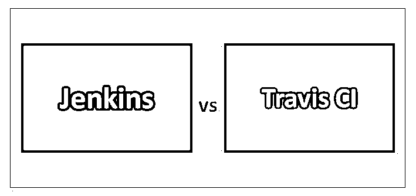
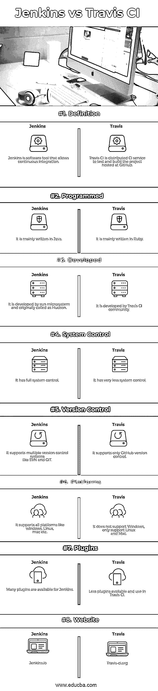

# 詹金斯 vs 特拉维斯 CI

> 原文：<https://www.educba.com/jenkins-vs-travis-ci/>

## 詹金斯和特拉维斯 CI 的区别

Jenkins 是一个软件工具，用于开发过程的持续集成。它是用 Java 写的。它被用作自动化工具来自动化所有的软件开发过程，如编码、测试和部署。Jenkins 不做任何类似检查代码或测试的事情；它只是在特定任务完成后给插件发出运行命令。Travis CI 被称为分布式 CI(持续集成)服务，用于构建和测试 GitHub 托管的项目。当代码被推送到 GitHub 时，Travis CI 帮助自动构建和测试代码。它需要将 git hub 项目与 Travis 同步，并开始测试您的应用程序。

### 詹金斯

*   Jenkins 是一个现成的开源工具。它最初发布于 2011 年。它最初被开发或命名为哈德逊。 [Jenkins 可以和几乎所有的插件](https://www.educba.com/jenkins-plugins/)一起使用，让持续集成流畅工作。Jenkin 的类型是持续交付，它主要[支持 Java SE 平台](https://www.educba.com/what-is-java-se/)。
*   这意味着 Jenkins 形成了一个要完成的任务流程，这个任务流程被称为 pipeline 或 Jenkins pipeline。当一个任务在管道中成功完成时，另一个任务将开始，以此类推。
*   Jenkins 只是一个指挥者，这使得开发人员的生活更容易跟踪成功的构建，并持续集成更改，并按时纠正缺陷。Jenkins 也被称为 CI 工具(持续集成工具)。
*   持续集成是一个过程，其中每个团队成员都在不同的模块上工作，并且在一天结束时，每个人都在 SCM(源代码管理，其中代码为团队集中)中提交他们的更改，并检查集成的代码工作良好或每天测试。
*   Jenkins 还提供安全性，如对项目的未授权访问和身份验证。它还有助于防止外部恶意攻击和威胁。在 Jenkins 的帮助下，可以轻松监控外部作业，并显示和记录结果。

### 特拉维斯·CI

*   Travis CI 仅适用于 GitHub 配置管理工具。主要是用 Ruby 写的。其类型仅为持续集成。它仅由 Travis CI 社区开发。它主要支持 web 平台。
*   Travis CI 具有强大的功能，如快速设置、实时构建视图、预安装的数据库服务、拉式请求支持、通过构建时的自动部署、每次构建时清理虚拟机、随处部署，以及支持每个平台，如 Mac、Linux 等。
*   Travis CI 免费帮助测试开源应用程序，测试私有应用程序则收费。主要有两种构建流程，即分支构建流程和拉式请求构建流程。
*   Travis CI 支持大约 30 种不同的编程语言，如 Ruby、Python、Perl、Java、Xcode、PHP、node、scala 等。它可以在添加 filename.travis.yml 后进行配置。它是 GitHub 存储库中的一个 YAML 格式文件。它还支持与外部工具的集成。

### Jenkins 和 Travis CI 的面对面比较(信息图)

以下是 Jenkins 与 Travis CI 之间的 8 大差异

<small>网页开发、编程语言、软件测试&其他</small>

### Jenkins 和 Travis CI 的主要区别

两者都是市场上的热门选择；让我们讨论一些主要的区别:

*   Jenkins 提供了对跨平台构建的支持，这有助于轻松构建和部署代码。Travis CI 在提供跨平台支持方面比较滞后。
*   Jenkins 易于安装，只需一个命令行就能让服务正常运行。Travis CI 更容易使用. travis.yaml 文件进行配置。
*   Jenkins 有很多资源、教程和强大的社区支持。Travis Ci 只有社区支持和教程，资源较少。
*   Jenkins 是一个免费的开源持续集成工具。Travis CI 对开源是免费的，但对私人项目是付费的。
*   Jenkins 是高度可扩展的。与詹金斯相比，特拉维斯不如他。
*   詹金斯是免费的，而特拉维斯 CI 是昂贵的。
*   在詹金斯，有时候很差的插件很难加入。特拉维斯 CI 没有这种问题。
*   詹金斯是高度可定制的，因为插件的可用性等。Travis CI 还可以与其他外部工具集成。
*   詹金斯可以在内部托管。Travis CI 不能在内部托管。
*   顶级公司主要用詹金斯。优秀的公司使用 Travis CI，但尚未接触到优秀的公司。

### Jenkins 与 Travis CI 对比表

主要比较:

| **比较的基础** | 詹金斯 | 特拉维斯 |
| **定义** | Jenkins 是一个允许持续集成的软件工具。 | Travis CI 是分布式 CI 服务，用于测试和构建 GitHub 托管的项目。 |
| **已编程** | 它主要是用 Java 编写的 | 主要是用 Ruby 写的。 |
| **发达** | 它是由太阳微系统公司开发的，最初叫做 Hudson。 | 它由 Travis CI 社区开发。 |
| **系统控制** | 它有完整的系统控制。 | 它的系统控制很少。 |
| **版本控制** | 它支持多种版本控制系统，如 SVN 和 GIT。 | 它只支持 GitHub 版本控制。 |
| **平台** | 它支持所有平台，如 Windows、Linux、Mac 等。 | 它不支持 Windows，只支持 Linux 和 Mac。 |
| **插件** | Jenkins 可以使用许多插件。 | Travis CI 中可用和使用的插件较少。 |
| **网站** | Jenkins.io | Travis-ci.org |

### 结论

两者都是持续集成工具，但是 Travis CI vs Jenkins 在工作中有许多不同之处。两者都易于设置和配置，易于使用和学习，并且有良好的社区支持。这种持续集成工具有助于构建自动化并排除手动干预，手动干预还会检查[代码覆盖率](https://www.educba.com/code-coverage/)、代码质量，并提供干净的构建以部署到相应的环境中，如开发、QA 和生产。

Travis CI 也获得了自己的市场，并将其与组织整合在一起。特拉维斯 CI 对于私人项目来说很贵；只在 GitHub 上工作，没有 windows 支持让开发者想用。在詹金斯，没有这样的问题。大型组织主要依靠像 Jenkins 这样的工具，因为它在市场上有更多的支持和资源。

CI 工具的选择显然取决于组织和个人的需求。Jenkins vs Travis CI 工具各有优势，易于使用。构建过程的自动化正成为组织的主要关注点。

### 推荐文章

这是 Jenkins 与 Travis CI 之间最大差异的指南。在这里，我们还将讨论信息图和比较表的主要区别。您也可以看看以下文章，了解更多信息–

1.  [Node.js vs Nginx](https://www.educba.com/node-js-vs-nginx/)
2.  [詹金斯 vs 竹子](https://www.educba.com/jenkins-vs-bamboo/)
3.  [雨燕 vs 围棋](https://www.educba.com/swift-vs-go/)
4.  [有用的詹金斯面试问题](https://www.educba.com/jenkins-interview-questions/)
5.  [Node.js vs Java 性能:函数](https://www.educba.com/node-js-vs-java-performance/)
6.  [Swift 与 Objective C:有什么区别](https://www.educba.com/swift-vs-objective-c/)
7.  [特拉维斯 vs 詹金斯的 8 大不同点](https://www.educba.com/travis-vs-jenkins/)
8.  [Rundeck vs Jenkins |最大差异](https://www.educba.com/rundeck-vs-jenkins/)
9.  [Spinnaker 与 Jenkins 的区别](https://www.educba.com/spinnaker-vs-jenkins/)

