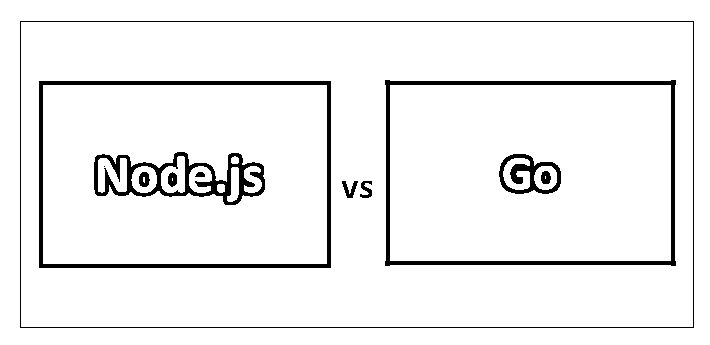
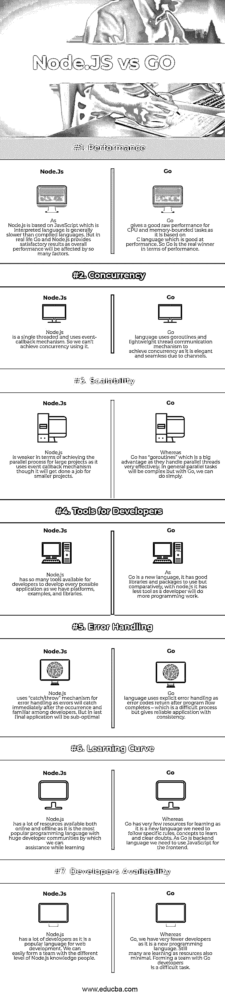

# Node.js vs Go

> 原文：<https://www.educba.com/node-js-vs-go/>

## Node.js 与 Go 的区别

Node.js 是一个基于 JavaScript 引擎的跨平台、快速、精简的 JavaScript 运行时环境。Node.js 对服务器和桌面应用程序都很有用。Go 是一种开源编程语言。节点非常适合处理异步 JS 代码来执行许多活动。Go 简单、强大、静态、结构化，易于阅读，是处理并发编程的一种有效方式，与其他编程语言相比有巨大的性能改进。

### 围棋是什么？

Go 是由开发者在谷歌开发的开源编程语言，于 2009 年首次发布。Go 是通过结合现有编程语言的优势来实现更好的性能而创建的。Go 结构是 C 和 Python 编程语言基本原理的结合。Go 将作为开发并发应用的主要选择，因为技术巨头 Google、Dropbox 和 Docker 已经开始使用 Go。围棋也叫 Golang。随着它的受欢迎程度逐年增加，正在开发的教程非常有限。尽管 Go 有很好的标准库、垃圾收集处理和动态接口，但它不是 web 开发的最佳选择，而是实时应用程序开发、云基础设施、微服务和网络开发的最佳选择。

<small>网页开发、编程语言、软件测试&其他</small>

### Node.js 是什么？

Node.js 是一个基于 JavaScript 引擎的跨平台、快速、精简的 JavaScript 运行时环境。Node.js 使用事件驱动的非阻塞 I/O，通过它我们可以实现低延迟和高吞吐量，并使它变得轻量级和高效。Node.js 是用 c/c++，JavaScript，以及它的包生态系统 npm(节点包管理器)编写的，包里有很多开源库。Node.js 是 Ryan Dahl 在 2009 年为 Linux 和 MacOS 推出的。Node 有许多内置模块，我们可以在其中使用命令行。

### Node.js 与 Go 的正面比较(信息图)

下面是 Node.js 与 Go 性能之间的 7 大差异

### Node.js 与 Go 的主要区别

两种性能都是市场上的热门选择；让我们讨论 Node.js 与 Go 之间的一些主要区别:

*   用 Node.js 构建区块链应用程序是可能的，但用 Go 构建区块链应用程序要容易得多。
*   对于基于 CPU 和内存的任务，Go 具有更好的原始性能，而 Node.js 的性能相对较低，但在实时方面，Go 和 Node.js 都会给出令人满意的结果。
*   Go 具有出色的可伸缩性和并发能力，因为它使用 goroutines 来管理线程，并且它们可以非常有效地并行处理通信，而 node.js 是单线程的，用于通信的事件回调机制具有可伸缩性，但 Node.js 有望完成这项工作。
*   Node.js 具有更好的错误处理，因为它使用“抛出/捕捉”机制来在错误发生后立即捕捉错误，而 Go 需要显式的错误机制，因为它在程序流完成后给出错误，这是一个困难的过程，但最终会给出可靠的一致的应用程序。
*   Node.js 有更好的学习曲线，因为它是一种流行的语言；它有很多学习和帮助的资源和论坛，而 Go 语言是一种新语言，学习资源很少，很难自学，因为我们的资源很少。
*   Node.js 具有良好的开发者可用性，因为它是一种流行的语言；显然，许多开发人员将拥有 Node.js 技能，而寻找 Go 开发人员是一项困难的任务，因为它是一种新的编程语言，只有少数开发人员可用，而且他们的需求量很大。

### Node.js 与 Go 对照表

主要比较如下所述:

| **比较的基础** | **节点。Js** | **出发** |
| **性能** | 由于 Node.js 是基于 JavsScript 的，而 JavsScript 是解释型的，所以语言一般比编译型语言要慢。但是在现实生活中，Go 和 Node.js 提供了令人满意的结果，因为整体性能会受到许多因素的影响。 | Go 为 CPU 和内存受限的任务提供了良好的原始性能，因为它基于 C 语言，这在性能方面很好。所以从性能上来说，围棋才是真正的赢家。 |
| **并发** | Node.js 是单线程的，使用事件回调机制。所以我们不能用它来实现并发。 | Go 语言使用 goroutines 和轻量级线程通信机制来实现并发性，因为它是优雅的，并且由于通道而无缝。 |
| **可扩展性** | Node.js 在实现大型项目的并行过程方面较弱，因为它使用事件回调机制，尽管它可以完成较小项目的工作。 | 而 Go 有“goroutines”，这是一个很大的优势，因为它们可以非常有效地处理并行线程。一般来说，并行任务会很复杂，但有了 Go，我们可以简单地完成它。 |
| **开发者工具** | Node.js 有如此多的工具可供开发人员开发每一个可能的应用程序，就像我们有平台、示例和库一样。 | 由于 Go 是一种新语言，它有很好的库和包可供使用，但相比之下，node.js 的工具较少，因为开发人员需要做更多的编程工作。 |
| **错误处理** | Node.js 使用“捕捉/抛出”机制进行错误处理，因为错误会在发生后立即捕捉，这是开发人员所熟悉的。但是在最后的应用中将是次优的 | Go 语言使用显式错误处理，因为程序流完成后会返回错误代码——这是一个困难的过程，但可以提供具有一致性的可靠应用程序。 |
| **学习曲线** | Node.js 拥有大量在线和离线资源，因为它是最受欢迎的编程语言，拥有庞大的开发人员社区，我们可以通过它在学习时提供帮助。 | 鉴于围棋作为一门新语言，学习资源非常少，我们需要遵循特定的规则、概念来学习并消除疑虑。由于 Go 是一种后端语言，我们需要使用 JavaScript 作为前端。 |
| **开发者可用性** | Node.js 有很多开发者，因为它是一种流行的 web 开发语言。我们可以很容易地和不同水平的 Node.js 知识人组成一个团队。 | 而 Go，我们的开发者很少，因为它是一种新的编程语言。尽管如此，许多人正在学习资源也很少。与围棋开发人员组成一个团队是一项艰巨的任务。 |

### 结论

最后是 Node.js vs Go 语言的概述。希望你看完这篇文章后能更好的理解这些 Node.js vs Go 编程语言。我们在几个方面比较了 Node.js 和 Go，它们各有优缺点，所以很难说哪一个更好。从性能方面来说，Golang 比 Node.js 更好，但是您需要根据项目、其规模和结构来决定，根据您的业务需求来制定计划。Node.js 比较流行，广泛用于后端开发，而 Golang 则高度一致，性能用于后端开发。

### 推荐文章

这是 Node.js 和 Go 之间主要区别的指南。在这里，我们还将讨论信息图和比较表的主要区别。您也可以看看下面的 Node.js vs Go 文章来了解更多信息

1.  [围棋 vs Java](https://www.educba.com/go-vs-java/)
2.  [雨燕 vs 围棋](https://www.educba.com/swift-vs-go/)
3.  [Node JS vs Ruby on Rails](https://www.educba.com/node-js-vs-ruby-on-rails/)
4.  [围棋 vs Python](https://www.educba.com/python-vs-go/)

