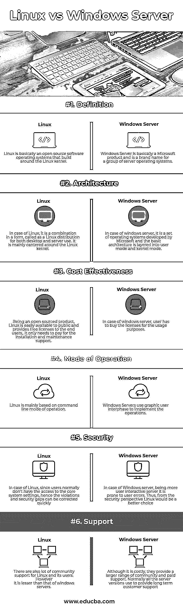

# Linux 与 Windows 服务器

> 原文：<https://www.educba.com/linux-vs-windows-server/>

## Linux 和 Windows Server 的区别

Linux vs Windows 服务器是软件运营行业中两种重要的 web 托管服务。Linux 基本上是一个围绕 Linux 内核构建的开源软件操作系统。它是一种叫做 Linux 发行版的形式的组合，既适用于桌面，也适用于服务器。Linux 操作系统的主要功能是管理软件资源及其工件。Windows Server 基本上是微软的产品，是一组服务器操作系统的品牌名称。它是微软开发的一套操作系统，基本架构分层为用户态和内核态。

### Linux 操作系统

Linux 主要是围绕 Linux 内核展开的。Linus Torvalds 最初在 1991 年开发了它。Linux 操作系统的主要功能是管理软件资源及其工件。

<small>网页开发、编程语言、软件测试&其他</small>

#### 基本特征

1.  它提供多用户能力支持。
2.  Linux 的一个主要特点是它的可移植性
3.  它有能力在一个时间点处理许多实例和任务。从最终用户的角度来看，这种多任务特性提供了另一层重要性
4.  它为最终用户提供了良好的社区支持，同时也为其维护和新实现的版本提供了良好的社区支持。
5.  它提供了 3 层(身份验证、授权和加密)安全框架方法。

#### 赞成的意见

1.  它是开源的，因此可以免费获得
2.  它非常安全，不容易受到任何网络威胁
3.  它支持多任务功能
4.  它还从系统管理支持的角度提供管理支持。

#### 骗局

1.  与 windows 服务器相比，它并不那么用户友好
2.  从游戏和娱乐支持的角度来看，它不如 windows 服务器兼容
3.  从驱动程序创建和存储管理的角度来看，它通常没有那么多支持
4.  从技术支持的角度来看，它也比 windows 支持略逊一筹

### Windows 服务器

不同版本的发布一般微软支持 10 年，包括 5 年主支持和 5 年扩展支持。Windows Server 基本上是微软的产品，是一组服务器操作系统的品牌名称。

#### 赞成的意见

1.  它是用户友好的，并基于图形用户界面的方法
2.  它支持大量第三方应用程序
3.  它为所有版本提供长期和广泛的支持
4.  从最终用户的角度来看，它遵循一种易于定制的方法
5.  与竞争对手相比，系统更新很容易安装

#### 骗局

1.  它不是免费提供的，并且涉及高成本的许可方法。
2.  它容易受到安全威胁和网络犯罪的攻击
3.  从多用户的角度来看，这不是一个有利的选择。
4.  它还容易出现用户制造的错误和恶意软件。

### Linux 和 Windows Server 的面对面比较(信息图表)

下面是 Linux 和 Windows 服务器之间的 6 大区别

### Linux 和 Windows Server 之间的主要区别

两种性能都是市场上的热门选择；让我们讨论一些主要的。

1.  Linux 是围绕 Linux 内核构建的开源软件操作系统，而 Windows Server 是微软的产品，是一组服务器操作系统的品牌名称。
2.  Windows 服务器比 Linux 更加用户友好
3.  Windows 服务器提供长期和广泛的客户支持，而 Linux 也为其用户提供技术支持，但这比 windows 少得多
4.  Linux 提供 3 层安全方法，对恶意软件和网络威胁非常安全，而 Windows 服务器更容易受到安全威胁和网络犯罪
5.  从游戏和娱乐的角度来看， [windows 服务器比 Linux 更受欢迎](https://www.educba.com/windows-operators/)
6.  Linux 服务器和软件比 windows 服务器更容易修改
7.  从最终用户和定制的角度来看，windows 服务器提供了比 Linux 更多的功能

### Linux 与 Windows 服务器比较表

主要比较如下所述:

| **比较的基础** | **Linux** | **Windows 服务器** |
| **定义** | Linux 基本上是一个围绕 Linux 内核构建的开源软件操作系统。 | Windows Server 基本上是微软的产品，是一组服务器操作系统的品牌名称。 |
| **架构** | 在 Linux 的例子中，它是一种叫做 Linux 发行版的形式的组合，供桌面和服务器使用。它主要是围绕 Linux 内核展开的。 | 在 windows server 的情况下，它是由微软开发的一套操作系统，基本架构分为用户模式和内核模式。 |
| **成本效益** | 作为一个开源产品，Linux 很容易被公众获得，并向最终用户提供免费许可证；它只需要支付安装和维护支持的费用。 | 在 windows 服务器的情况下，用户必须购买许可证才能使用。 |
| **操作模式** | Linux 主要是基于命令行的操作方式 | Windows 服务器使用图形用户界面来实现操作 |
| **安全** | 在 Linux 中，由于用户通常无法访问核心系统设置，违规和安全漏洞可以很快得到纠正。 | 在 Windows 服务器的情况下，作为一个用户交互性更强的服务器，它很容易出现用户错误。因此，从安全的角度来看，Linux 将是一个更好的选择。 |
| **支持** | 还有很多社区支持 Linux 及其用户。但是，它比 windows 服务器的低。 | 虽然费用昂贵，但他们提供了更大范围的社区和付费支持。通常，所有服务器版本都用于提供长期客户支持。 |

### 结论

在比较了一系列因素的市场份额后，可以得出结论，这是应用程序开发的两个主要的 web 托管服务，但在同一时间点，每一个都有自己的优点和缺点。因此，在选择其中任何一个之前，开发人员应该学习和分析这两个系统的不同方面。因此，基于项目需求的类型、工作时间和其他讨论的方面，应该选择这两者中的任何一个来达到期望的目标。

### 推荐文章

这是 Linux 和 Windows 服务器之间最大区别的指南。在这里，我们还将通过信息图和比较表来讨论市场份额的主要差异。您也可以看看以下文章，了解更多信息–

1.  [OS X 与 Linux 的差异](https://www.educba.com/os-x-vs-linux/)
2.  [Linux 与 Windows 性能对比](https://www.educba.com/linux-vs-windows-performance/)
3.  [Linux 与 Ubuntu-有价值的差异](https://www.educba.com/linux-vs-ubuntu/)
4.  [Oracle 与 PostgreSQL 的差异](https://www.educba.com/oracle-vs-postgresql/)
5.  [Oracle vs MSSQL:函数](https://www.educba.com/oracle-vs-mssql/)
6.  [Linux vs BSD:有什么区别](https://www.educba.com/linux-vs-bsd/)
7.  [Oracle vs OpenJDK:哪个最有利](https://www.educba.com/oracle-vs-openjdk/)
8.  [Linux vs Android:有什么区别](https://www.educba.com/linux-vs-android/)
9.  [iPhone vs Android 完整指南](https://www.educba.com/iphone-vs-android/)
10.  [Linux 与 BSD |大差异](https://www.educba.com/linux-vs-bsd/)

