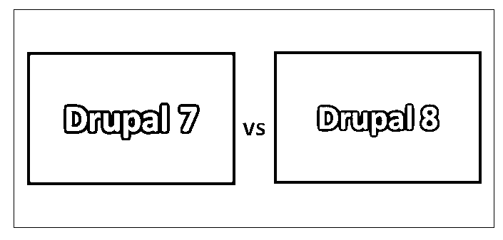
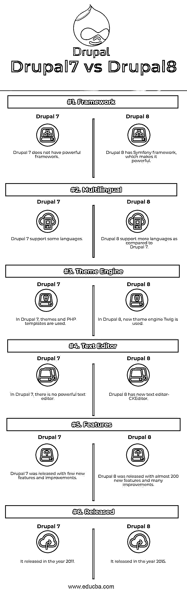

# Drupal 7 vs Drupal 8

> 原文：<https://www.educba.com/drupal-7-vs-drupal-8/>

## Drupal 7 和 Drupal 8 的区别

Drupal 7 是由 Drupal 组织推出的。随着 Drupal 7 的发布，为开发人员和用户提供了许多特性和改进，以便高效地使用这个内容管理系统。Drupal 7 在主题、模块、多支持等方面对开发者帮助很大。Drupal 8 是由 Drupal organization 发布的，有将近 200 个新的内置特性和许多改进。Drupal 8 发布了新的页面编辑器和其他优化选项，以改进多语言特性和全球化。Drupal 8 具有更简单的 web 服务配置、广泛的字段类型、视图、内容类型、提高网站加载速度以及网站的可访问性等。

*   Drupal 被称为内容管理框架、博客软件和社区。它是由 Dries Buytaert 开发或创建的。它于 2000 年发行。它也被称为开源内容管理系统。它主要支持类 Unix 和 windows 操作系统。Drupal 是用 PHP 语言编写的，面向开发者和用户提供多种语言版本。
*   Drupal 有一个名为“Drupal Core”的标准版本，它提供了大量的特性和功能。它包含内容管理系统的基本功能，包括帐户注册和维护、菜单管理、定制页面布局、系统管理和 RSS 提要。它可以提供或视为一个简单的网站，用户博客，在线论坛，使用用户内容的社区网站。
*   Drupal 的核心主题提供了不同于网站和博客的感觉和外观。Drupal core 提供了不同的功能，如高级搜索、书籍、博客、评论、多级菜单系统、多站点支持、多用户内容创建、安全性和新的更新、工作流工具、用户配置文件、访问静态和日志记录，这些对创建站点和博客非常有帮助。
*   Drupal 基于架构模式，这被称为表示抽象控制(PAC)。Drupal 被认为是一个灵活且功能丰富的内容管理系统。Drupal 有一个很棒的社区支持系统和一个在线论坛来帮助开发者。它还提供了一个安全的 API 和 SEO 友好。Drupal 是一个可扩展的开放平台，用于 web 内容管理和数字体验。它为开发网站或写博客提供了强大的功能和无限的灵活性。
*   与 Drupal 7 相比，Drupal 8 通常被认为是一个笨重的系统，因此它被批评为速度慢、性能差。但是这个假设是错误的；Drupal 8 更具可扩展性，因为它更重，速度更快，可伸缩，内容缓存，视图处理，认证拖放页面等。

### Drupal 7 和 Drupal 8 的面对面比较(信息图)

下面是 Drupal 7 和 Drupal 8 的 6 大区别

<small>网页开发、编程语言、软件测试&其他</small>

### Drupal 7 和 Drupal 8 的主要区别

两者都是市场上的热门选择；让我们讨论一些主要的区别:

1.  Drupal 7 缓存页面交付性能要好得多，因为它占用的内存更少，并且易于解析。Drupal 8 缓存交付性能相对较差。
2.  Drupal 8 附带了 routing，开发人员使用它来开发比 Drupal 7 更加 SEO(搜索引擎优化)友好的 URL。
3.  在 Drupal 8 中，oops 概念可以用于 Symfony 框架的实现，这使得 Drupal 8 比 Drupal 7 更强大。
4.  Drupal 7 开发安全性较低的应用程序。在 Drupal 8 的帮助下，可以轻松开发安全可靠的应用程序。
5.  与 Drupal 7 相比，Drupal 8 中添加了新的字段类型。它帮助开发人员轻松地添加字段，只需定义字段名和字段类型就可以添加这些字段。
6.  在 Drupal 7 中，不能从网站的 UI 编辑内容。在 Drupal 8 中，添加了一个新模块，它有助于从网站 UI 编辑内容。
7.  在 Drupal 7 中，视图被用作模块。在 Drupal 8 中，视图被用作核心组件，可以很容易地访问和定制。
8.  在 Drupal 7 中，需要在图像样式的帮助下根据屏幕大小调整图像的大小。在 Drupal 8 中，为图像和不同屏幕尺寸的不同屏幕提供了广泛的样式。
9.  对于 Drupal 7，开发一个多语言网站需要任意数量的模块。在 Drupal 8 中，语言、内容、界面和配置翻译等四个关键核心模块使得开发多语言网站变得更加容易。
10.  Drupal 7 需要许多模块来创建 web 服务。在 Drupal 8 中，HAL、HTTP 认证、restful web 服务和序列化都得到了改进，使得网站的开发变得更加容易。
11.  Drupal 7 有大量插件来实现应用程序的复杂功能。Drupal 8 不支持 Drupal 7 的插件，这使得开发者很难让应用变得更加强大和定制化。

### Drupal 7 与 Drupal 8 对比表

主要比较如下所述:

| **比较的基础** | **Drupal 7** | **Drupal 8** |
| **框架** | Drupal 7 没有一个强大的框架 | Drupal 8 有一个 Symfony 框架，这使得它很强大。 |
| **多语言** | Drupal 7 支持一些语言。 | 与 Drupal 7 相比，Drupal 8 支持更多的语言 |
| **主题引擎** | 在 Drupal 7 中，使用了主题和 PHP 模板。 | 在 Drupal 8 中，使用了新的主题引擎 Twig。 |
| **文本编辑器** | 在 Drupal 7 中，没有强大的文本编辑器。 | Drupal 8 有一个新的文本编辑器——CKEditor。 |
| **特性** | Drupal 7 发布了一些新特性和改进。 | Drupal 8 发布了近 200 个新特性和许多改进。 |
| **发布** | 它于 2011 年发布 | 它于 2015 年发布 |

### 结论

在 Drupal 7 和 Drupal 8 的文章中，我们看到了 Drupal 7 和 Drupal 8 都广泛用于内容管理系统。Drupal 8 自带 symphony 框架和 twig 主题引擎，使得应用开发更快、更有趣、更容易。从上面 Drupal 7 和 Drupal 8 的区别来看，很明显 Drupal 8 更有优势来开发应用程序供开发者和用户使用。

Drupal 7 和 Drupal 8 都有不同的语法，这使得定义应用程序使用的平台变得容易。Drupal 7 vs Drupal 8 都是各有利弊；每一种都可以根据需要来使用，并且易于学习和掌握。

### 推荐文章

这是 Drupal 7 和 Drupal 8 之间的主要区别的指南。在这里，我们还讨论了信息图和比较表的 8 个关键差异。您也可以看看以下文章，了解更多信息–

1.  [WordPress vs Weebly——哪个更好](https://www.educba.com/wordpress-vs-weebly/)
2.  [WordPress 和 Tumblr——哪个更有利](https://www.educba.com/wordpress-vs-tumblr/)
3.  [Drupal vs Joomla](https://www.educba.com/drupal-vs-joomla/)
4.  [Mobx vs Redux](https://www.educba.com/mobx-vs-redux/)
5.  [CSS vs CSS3](https://www.educba.com/css-vs-css3/)
6.  [WordPress vs Drupal](https://www.educba.com/wordpress-vs-drupal/)
7.  [CSS 与 JavaScript:最佳差异](https://www.educba.com/css-vs-javascript/)

