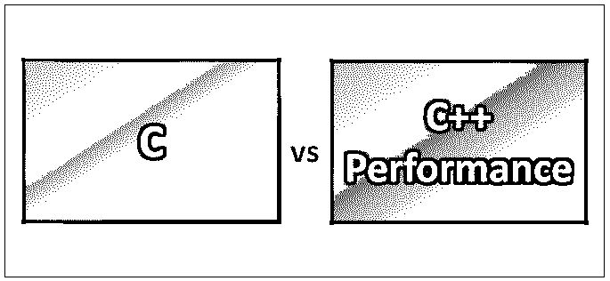
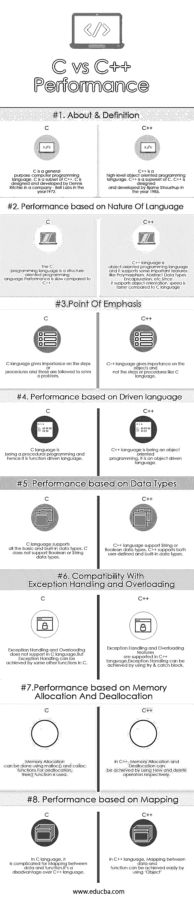

# C 与 C++性能对比

> 原文：<https://www.educba.com/c-vs-c-plus-plus-performance/>

## C 与 C++性能的差异

c 是一种通用计算机编程语言。c 被认为是一种高级编程语言，这种编程语言非常适合开发可移植的应用程序或固件。C 编程语言是一种面向结构的编程语言，它是经过验证的，非常灵活和强大，可以用于各种不同的应用程序。 [C++是 C 语言的增强](https://www.educba.com/c-programming-language-basics/)和高级，是一种[面向对象编程语言](https://www.educba.com/functional-programming-vs-oop/)的通用。C++是 C 家族的超集，它是许多人创建大规模应用程序的首选语言。C++被认为是一种编译语言，这种语言的实现可以在许多平台上实现。

**让我们更详细地学习一下 C 和 C++吧:**

<small>网页开发、编程语言、软件测试&其他</small>

*   c 语言是由 Dennis Ritchie 在 1972 年为 UNIX 操作系统设计和开发的。最近稳定发布的 C 编程语言[是在 2011 年 12 月](https://www.educba.com/career-in-c-programming/)发布的。
*   C++是由比雅尼·斯特劳斯特鲁普在 1985 年设计和开发的。最初，C++被称为“带类的 C”，后来在 1983 年被重新命名为 C++。符号++表示 C 中的增量运算符象征性地代表了 C 的高级版本。
*   C++的主要基础是，它允许硬件访问和抽象，并且有效地执行，这使得 C++有别于其他编程语言。

如前所述，C++是一种面向对象的编程语言。它有两个主要组成部分:

1.  它直接映射主要由 C 子集提供的硬件特征，
2.  基于硬件映射的零开销抽象。

与 C 语言类似， [C++编程语言](https://www.educba.com/c-plus-plus-commands/)支持四种类型的内存管理:

*   静态存储持续时间对象。
*   线程存储持续时间对象。
*   自动存储持续时间对象和
*   动态存储持续时间对象。

### C 和 C++性能的直接比较(信息图表)

下面是 C 和 C++性能之间的 8 大差异:

### C 和 C++性能的主要区别

C vs C++性能都是市场上的热门选择；让我们讨论一下 C 和 C++性能之间的一些主要区别:

*   因为 C 不能处理和管理一些复杂性，所以 C++语言被发明来管理这些复杂性。这将有助于提高性能。
*   就基本面向而言，C 语言支持面向结构的编程。而 C++支持面向对象编程、泛型编程以及元编程。
*   C++编程语言支持重载和异常处理特性，而 C 语言不支持这些特性。
*   继承在 C 语言中是可能的，而在 C++中是不可能的。
*   C 编程语言遵循自顶向下的编程方法，而 C++语言遵循自底向上的编程方法。
*   C 编程语言与泛型编程不兼容，而 C++语言则非常兼容。
*   在 C 语言中，“scanf”函数用于标准输入，“printf”函数用于标准输出。而“cin”和“cout”分别用于标准输入和输出。
*   C++语言中的数据安全性更高，而 C 编程语言中的数据并不安全。因为数据在 C++语言中是隐藏的，不能通过使用外部函数来访问。
*   C++语言支持引用变量，通过引用变量可以提高性能，但是 C 语言不支持引用变量。
*   c 编程语言通过使用 malloc()和 calloc()函数来促进动态内存分配，对于内存释放，它使用 free()函数。
*   而 C++语言通过使用 new 操作符简化了内存分配，并通过使用 delete 操作符简化了内存释放。

### C 和 C++性能比较表

下面讨论 C 和 C++性能之间的主要比较。

| **C 与 C++性能比较的基础** | **C** | **C++性能** |
| **关于&的定义** | C is a general-purpose computer programming language. C is a subset of C++.c 语言是由丹尼斯·里奇在 1972 年在贝尔实验室设计和开发的。 | C++ is a high-level object-oriented programming language. C++ is a superset of C.

C++是由比雅尼·斯特劳斯特鲁普在 1985 年设计和开发的。

 |
| **表现——基于语言的本质** | The C programming language is a structure-oriented programming language.与 C++相比，性能较慢。 | C++ language is an object-oriented programming language, and it supports some important features like Polymorphism, Abstract Data Types, Encapsulation, etc.因为它支持面向对象，所以速度比 C 语言快。 |
| **重点** | c 语言重视步骤或过程，并遵循这些步骤或过程来解决问题。 | C++语言重视对象，而不像 C 语言那样重视步骤或过程。 |
| **性能-基于驱动语言** | c 语言是过程化编程，因此它是一种函数驱动语言。 | C++语言正在被面向对象编程；它是一种对象驱动的语言。 |
| **性能-基于数据类型** | c 语言支持所有基本的和内置的数据类型。c 不支持布尔或字符串数据类型。 | C++ language support String or Boolean data types.C++支持用户定义的和内置的数据类型。 |
| **与异常处理和重载的兼容性** | Exception Handling and Overloading does not support in the C language.但是异常处理可以通过 c 中的一些其他函数来实现。 | Exception Handling and Overloading features are supported in the C++ language.

异常处理可以通过使用 try & catch 块来实现。

 |
| **性能-基于内存分配和释放** | Memory Allocation can be done using malloc() and calloc functions.对于释放，使用 free()函数。 | 在 C++中，内存分配和释放可以分别通过使用 new 和 delete 操作符来实现。 |
| **性能-基于映射** | In C language, it is complicated to Mapping between data and function.与 C++语言相比，这是一个缺点。 | 在 C++语言中，使用“对象”可以很容易地实现数据和函数之间的映射。 |

### 结论

在 C 与 C++性能之间做出结论是非常简单明了的。

众所周知，C++是 C 的高级和超集。因此，与 C 编程语言相比，C++编程语言拥有许多新的和高级的特性。这也包括性能特征。但事实是，许多开发人员仍然更喜欢使用 C 语言来开发/构建只使用 C 语言的操作系统。最后，同时使用 C 和 C++性能编程语言的应用程序的性能取决于您不开发的需求/应用程序。

### 推荐文章

这是 C 与 C++性能之间最大差异的指南。在这里，我们讨论了 C 与 C++性能的直接比较、关键差异、信息图和比较表。您也可以看看以下文章，了解更多信息–

1.  [c++编程语言(基础)备忘单惊人指南](https://www.educba.com/c-programming-language-basics/)
2.  [计算机编程语言的重要基础](https://www.educba.com/computer-programming-language/)
3.  [C 与 c++–哪个更有用](https://www.educba.com/c-vs-c-plus-plus/)
4.  [Java vs C#](https://www.educba.com/java-vs-c-sharp/)
5.  [Python 与 C++的最大区别](https://www.educba.com/python-vs-c-plus-plus/)
6.  [CSS vs CSS3](https://www.educba.com/css-vs-css3/)
7.  [C++向量 vs 数组:函数](https://www.educba.com/c-plus-plus-vector-vs-array/)
8.  [C 与 C#:差异](https://www.educba.com/c-vs-c-sharp/)
9.  [CSS 和 JavaScript 的区别](https://www.educba.com/css-vs-javascript/)

