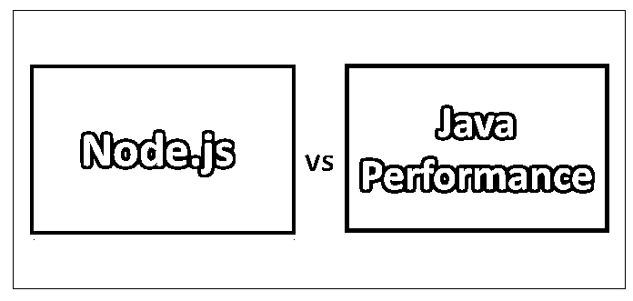
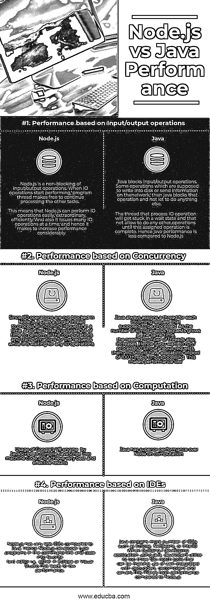

# Node.js 与 Java 性能

> 原文：<https://www.educba.com/node-js-vs-java-performance/>

## Node.js 和 Java 性能的区别

Node.js 是一个开源的非常强大的框架/跨平台 JavaScript 运行时环境。Node.js 在服务器端执行 JavaScript 代码。Node.js 主要用于开发服务器端应用和网络应用。Java 是一种非常流行的编程语言，也是开发应用程序的计算平台。Java 性能很高，而且快速、健壮、可靠、安全。Java 以其独特的特性而闻名；也就是说，它是一种独立于平台的语言。

### 节点. js

Node.js 建立在谷歌 Chrome 的 JavaScript 引擎(即 V8 引擎)之上。在市场上引入 Node.js 之前，JavaScript 仅用于客户端脚本，脚本嵌入在网页的 HTML 中，并由用户浏览器中的 JavaScript 引擎在客户端运行。引入 Node.js 的目的是允许开发人员使用 JavaScript 进行服务器端脚本编写，并在服务器端运行它，以在特定页面被发送到用户浏览器之前生成动态网页内容。Node.js 还为各种 [JavaScript 模块](https://www.educba.com/javascript-modules/)提供了大量的库，这在很大程度上帮助开发者使用 Node.js 开发 web 应用。即，

<small>网页开发、编程语言、软件测试&其他</small>

**Node.js =运行时环境+ JavaScript 库**

Node.js 是由 Ryan Dahl 开发的，它最初于 2009 年 5 月 27 日发布。当 Node.js 推出时，它仅在 Mac OS X 和 Linux 操作系统中受支持，但它支持所有操作系统——Linux、Mac OS、Microsoft Windows、SmartOS、FreeBSD 和 IBM AIX。

以下是 Node.js 的一些重要特性:

*   单线程但高度可扩展
*   无缓冲
*   执照。
*   异步和事件驱动
*   非常快

### Java 性能

*   Java 最初是由 Sun 公司开发发布的，但后来，Sun 公司在 2009 年被甲骨文公司收购。如今，Java 平台通常被用作应用程序开发的基础，也用于在 web 上交付内容。
*   Java 以其独特的特性而闻名；也就是说，它是一种独立于平台的语言(意味着它不特定于任何处理器，也不运行在大多数操作系统上，包括 Mac OS、Windows 和 Linux。
*   Java 平台是帮助应用程序开发和运行用 Java 编程语言编写的程序的程序集合。Java 平台还包括一个执行引擎、编译器和一组库。

### Node.js 和 Java 性能的直接比较(信息图表)

下面是 Node.js 与 Java 性能的四大区别

### Node.js 与 Java 性能的主要区别

Node.js vs Java Performance 都是市场上的热门选择；让我们讨论 Node.js 与 Java 性能之间的一些主要差异:

*   Node.js 是非阻塞的输入/输出操作。这意味着 Node.js 可以轻松、非常高效地执行 IO 操作。它还一次发出许多 IO 操作，因此有助于显著提高性能。Java 阻止了输入/输出操作。处理 IO 操作的线程将陷入等待状态，并且不允许执行任何其他操作，直到这个分配的操作完成。
*   因此，与 Java 性能相比，Node.js 大大提高了性能。
*   Node.js 有很多时间使用单线程为请求进行所有的计算和转换。而 Java 对一个请求使用一个线程，因此要花很多时间来处理并发请求。
*   因此，与 Java 性能相比，Node.js 的性能很高。
*   Java 中的变量是静态类型的，而在 [Ruby 中，变量](https://www.educba.com/ruby-variables/)是动态类型的。
*   Java 在计算性能上优于 Node。而 JavaScript 使用 Google 的 V8 引擎将 JavaScript 编译成机器码，以达到非常好和有效的效果。
*   Node.js 开发人员在命令行中键入程序，并编码到最喜欢的文本编辑器中，即在 Eclipse 或 Visual Studio 中。Java 有许多 ide，如 Eclipse、NetBeans 或 IntelliJ，开发人员在这里编写代码。因此，与 Node.js 相比，使用 Java 提高了性能。

### Node.js 与 Java 性能比较表

主要的比较讨论如下:

| **比较的基础** | **Node.js** | **Java** |
| **性能-基于**
**输入/输出操作** | Node.js 是非阻塞的输入/输出操作。当 IO 操作开始执行时，程序线程释放出来继续处理其他任务。
这意味着 Node.js 可以轻松、出色、高效地执行 IO 操作。此外，它一次发出许多 IO 操作，因此有助于显著提高性能。 | Java 阻塞输入/输出操作。有些操作应该是写入磁盘或在网络上发送信息，然后 java 会阻止该操作，不让它做其他任何事情。处理 IO 操作的线程将陷入等待状态，并且不允许做任何其他操作，直到这个分配的操作完成。
因此 java 的性能不如 Node.js |
| **性能——基于**
**并发** | 因为在 Node.js 中 I/O 操作没有被阻塞，所以它使用一个线程一次处理所有传入的请求。此外，Node.js 在等待任何 IO 操作时，会提供大量时间来执行所有请求的计算和转换。 | Java 总是为每个应该被处理的传入请求分配一个线程。随着并发请求数量的同时增长，所需的线程数量也在增加。
因此，如果您想要同时运行/处理 100 个请求，那么您应该有 100 个线程池来进行处理。
这使得性能低下。 |
| **性能——基于**
**计算** | JavaScript 使用 Google 的 V8 引擎将 JavaScript 编译成机器代码，并获得最佳和有效的结果。 | Java 在计算性能上优于 Node。 |
| **业绩-基于**
**IDEs** | 与 Java 相比，Node.js 的 ide 非常少。因此，Node.js 开发人员在命令行中键入程序，并在最喜欢的文本编辑器中编写代码，例如，在 Eclipse 或 Visual Studio 中。这导致了低性能。 | Java 包含许多 ide，如 Eclipse、NetBeans 或 IntelliJ。当使用 java 构建/开发应用程序时，开发人员会利用它的三大顶级工具，这些工具可以与调试器、反编译程序和服务器很好地集成在一起。
与 Node.js 相比，这带来了高性能 |

### 结论

计算 Node.js 和 Java 的性能非常复杂。Node.js 和 Java 性能各有优劣，各有千秋。

例如，这取决于我的团队能够熟练使用哪种语言来实现性能，也就是说，会选择懂 C++、c#-Java 的团队，他们也更容易掌握。拥有 Python、Ruby、PHP 和 JavaScript-Node 知识的团队可能会更容易。

因此得出结论，这完全取决于选择的要求。但是在性能比较方面，Node.js 比 Java 更胜一筹。

### 推荐文章

这是 Node.js 与 Java 性能之间主要差异的指南。在这里，我们还将讨论 Node.js 与 Java 性能的主要差异，并提供信息图表和比较表。您也可以看看以下文章，了解更多信息–

1.  [Java vs Ruby](https://www.educba.com/java-vs-ruby/)
2.  [Node.js vs Go](https://www.educba.com/node-js-vs-go/)
3.  [Java vs PHP](https://www.educba.com/java-vs-php/)
4.  [Asp.net](https://www.educba.com/node-js-vs-asp-net/)T2【vs node . js

