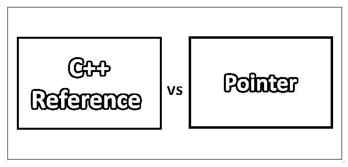

# c++引用与指针

> 原文：<https://www.educba.com/c-plus-plus-reference-vs-pointer/>




## C++引用和指针的区别

尽管 C++对指针的引用看起来是相似的，但 C++引用和指针之间有着显著的区别。引用变量可以说是现有变量的另一个名称。一旦这个变量被初始化，变量名就可以用来引用另一个变量。另一方面，指针是存储变量地址的变量。像任何变量一样，首先声明这些变量，然后任何变量的地址都可以存储在其中。

### C++引用和指针的直接比较(信息图)

下面是 C++引用和指针的 7 大区别

<small>网页开发、编程语言、软件测试&其他</small>


### C++引用和指针的主要区别

两者都是市场上的热门选择；让我们讨论一些主要的区别:

C++引用和指针的主要区别在于，一个引用另一个变量，而后者存储变量的地址。引用不会改变原始变量，而如果指针改变了，它会影响原始变量。引用必须在声明中初始化，而指针一旦被声明就没有必要初始化。可以创建指针数组，但不能创建引用数组。null 值不能赋给引用，但可以赋给指针。

### C++引用与指针对照表

主要比较如下所述:

| **比较的基础** | **C++参考** | **指针** |
| **变量** | 引用可以说是现有变量的别名。这个变量的主要用途是作为一个参数，作为一个传递引用。这被传递给一个函数。传递到的函数处理原始变量，而不是按值传递的副本。函数内部的变化也会反映到外部。 | 指针变量是存储地址的变量。不像通常的变量，比如 int，double 和 char，它存储内存地址。为了使编程更容易，需要这个变量。它是一个可以存储特定类型值的变量。 |
| **申报** | Declaration of a C++ reference variable is done by adding a ‘&’ symbol before a variable. When it is used with an expression it denotes that it is working as an address of the operator. It is used to provide another name to an existing variable.**语法:**

```
type &newName = existingName;
// or
type& newName = existingName;
// or
type & newName = existingName;
For eg:
/* Test reference declaration and initialization */
#include <iostream>
using namespace std;
int main() {
string name = "Priya";          // Declare a string variable called name
string & refName = name; // Declare a reference (alias) to the variable name
// Both refName and name refer to the same value of “Priya”
cout << name << endl;    // It prints value of the variable “Priya”
cout << refName << endl; // It prints value of reference “Priya”
```

**现在更改名称**的值

```
refName = "Karishma"; // Re-assign a new value to refName
cout << refName << endl;
cout << name << endl;    // Value of number also changes "Karishma"
name = "Snehal";   // Re-assign a new value to name
cout << namer << endl;
cout << refName << endl; // Value of refName also changes "Snehal"
}
```

这意味着引用变量的值可以在变量的原始和副本中更改。 | Before using a pointer anywhere in the program, it should be declared in advance. To declare a pointer and let the system know that it is a pointer, a variable is prefixed by a ‘*’. A pointer is accompanied by the data type, which can be an int or a double.

**语法:**

```
type *pntr;   // Declare a pointer variable called pntr as a pointer of type
// or
type* pntr;
// or
type * pntr;
```

**例如:**

```
int * newPtr;     // Declare a pointer variable called newPtr pointing to an int (an int pointer)
This pointer will hold the address. That address holds an int value.
double * newdPtr;  // Declare a double pointer
```

*表示指针正在被声明，并且不充当运算符。

 |
| 再分配 | A reference variable cannot be reassigned.**举例:**

```
int x = 5;
int y = 6;
int &r = x;
```

 | A pointer can be reassigned, and this property comes in handy when a developer is implementing data structures like linked lists, trees, etc.**举例:**

```
int x = 5;
int y = 6;
int *p;
p =  &x;
p = &y;
```

 |
| **内存地址** | 引用变量与原始变量共享相同的地址。这些引用可以传递给不同的函数；它们可以存储在不同的类中，等等。在旧变量被删除或超出范围之前，引用永远不会指向新变量。 | 指针有自己的内存地址，并将其存储在堆栈中。指针是一个独立的变量，可以赋予它自己新的值。 |
| **空值** | 引用不能分配空值。 | 指针可以直接赋空值。 |
| **自变量** | 引用变量可以通过值旁路引用。这里参数通过值传递给函数。制作一个克隆并发送给使用它的函数。对副本所做的更改对原始变量没有影响。 | 当我们希望改变原始副本时，可以通过将对象的指针传递给函数来实现。这就是所谓的引用传递。 |
| **何时使用** | References are indirectly accessing a variable. Consider the following**举例:**

```
enum day
{
Sunday, Monday, ...
};
If we define a variable
day x;
And we want to overload an operator to the statement then we can write as below:
day &operator++(day &d)
{
d = (day)(d + 1);
return d;
}
```

简而言之，这可以用在函数参数和引用类型中。 | Using pointers is without any pre-declaration.

```
day *operator++(day *d);
```

这可以用来实现数据结构和指针算术运算。 |

### 结论

C++引用和指针很难处理，但是它们在很大程度上提高了程序的效率。C++引用和指针都有各自的用途和服务于各自的目的。当您希望实现数据结构和算法时，可以使用指针，而当您希望使用具有返回类型的函数和参数时，可以使用引用。

### 推荐文章

这是 C++引用和指针之间主要区别的指南。在这里，我们还将讨论信息图和比较表的主要区别。您也可以看看以下文章，了解更多信息–

1.  [Python 与 C++的区别](https://www.educba.com/python-vs-c-plus-plus/)
2.  [C 与 C++性能的最佳差异](https://www.educba.com/c-vs-c-plus-plus-performance/)
3.  [MongoDB vs Cassandra](https://www.educba.com/mongodb-vs-cassandra/)
4.  [Mobx vs Redux](https://www.educba.com/mobx-vs-redux/)
5.  [C++向量与数组:最大差异](https://www.educba.com/c-plus-plus-vector-vs-array/)
6.  [MongoDB vs DynamoDB:函数](https://www.educba.com/mongodb-vs-dynamodb/)
7.  [MongoDB vs SQL:有哪些函数](https://www.educba.com/mongodb-vs-sql/)
8.  [C 与 C#:函数](https://www.educba.com/c-vs-c-sharp/)


