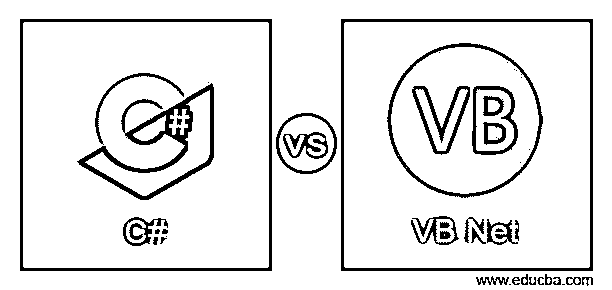
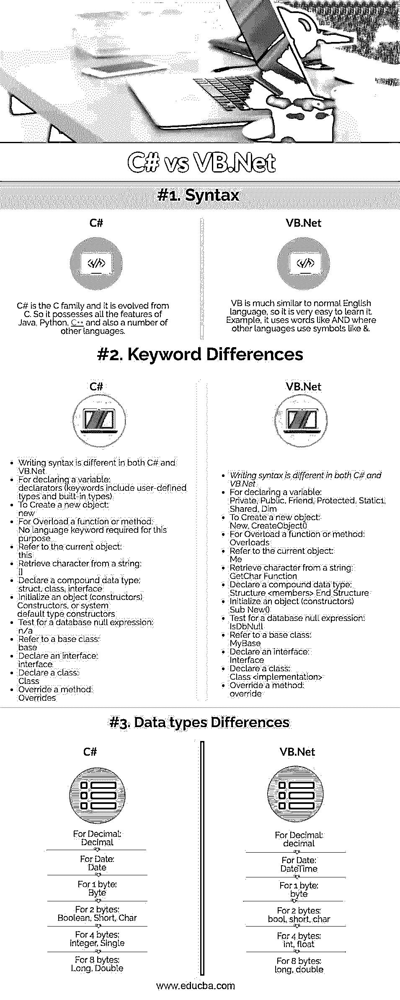

# C#与 VB.Net

> 原文：<https://www.educba.com/c-vs-vb-net/>




## C#和 VB.Net 的区别

C#是一种通用的现代面向对象编程(OOP)语言，由微软提供，运行在。Net 框架。C#读作“升 C 调”。C#是专门为与微软的. Net 平台一起工作而设计和开发的。C#有望使其运行更快，以良好的质量和稳定的服务向市场推出新产品。VB.NET 发音为可视化 Basic.Net，它是一种面向对象的编程语言，在。微软的. NET 框架。其中一个很好的特点是 VB.Net 程序也可以在 **Mono** 上运行，这意味着它不仅可以在 Windows 下运行，甚至可以在 Linux 或 Mac OSX 上运行。

### C#

C#是一种编程语言，被称为公共语言基础结构(CLI)语言。通过使用 C#编程语言，可以开发不同类型的安全和健壮的应用程序。

<small>网页开发、编程语言、软件测试&其他</small>

下面列出了一些应用程序:

*   窗口应用程序。
*   网络应用和网络服务应用。
*   分布式应用程序。
*   数据库应用等。

软件巨头微软在 2000 年开发了这种编程语言，它就是 C 家族。C#被 ECMA 和 ISO 认证为标准编程语言。

设计 C#编程语言的主要目的是通过 Web 服务提供信息交换和服务，并使开发人员能够构建健壮的可移植应用程序。

它通过使用 XML(可扩展标记语言)和简单对象访问协议(SOAP)简化了编程，程序员不需要为每个步骤编写额外的代码。

### VB.Net

VB.NET 是针对微软的经典 Visual Basic 语言的更新。NET 框架。VB.NET 和 visual basic 有很多相似之处，也有一些不同之处。

它是最著名的，同时也是一个高效、稳定的工具，可以非常快速地开发应用程序，因为它可以在。NET 框架。

软件巨头微软在 2001 年开发了 giant 编程语言，并且它实现了 on.Net 框架，并且它可以完全访问 the.Net 框架中的所有库。

### C#和 VB.Net 的直接比较

以下是 C#与 VB.Net 之间的三大区别




### C#和 VB.Net 的主要区别

如你所见，有许多不同之处。让我们来看看最大的区别——

1.为了释放非托管资源，在 C#中使用 using 关键字，这在 VB.NET 中是不可用的。
2。VB.NET 提供并支持一个可选参数，这在 C#中是没有的。
3。在 VB.NET 中，将支持结构化和非结构化错误处理，而在 C#编程语言中不支持非结构化错误处理。
4。VB.Net 的事件会自动绑定，而这在 C#中是不可能的。
5。C#的语法区分大小写，而 VB.NET 不区分大小写。

*   **隐藏:–**VB.Net 支持隐藏特性，允许基类成员的新实现，而无需覆盖该成员。它还允许派生类中的基类成员只需使用关键字“Shadows”即可。

C#不支持此功能:

*   **隐藏:**–隐藏是 C#支持的一个特性，它允许基类成员的新实现，而无需覆盖该成员。它还允许派生类中的基类成员只需使用关键字“new”。VB.Net 不支持此功能。

6.VB.NET 允许并强制参数按值传递，而不用担心这些参数是如何声明的，只需将参数括在额外的括号中。而在 C#中根本不可能实现这一点。

**举例:**

```
Dim y As Integer = 5
Dim z As Integer
z = Add(y) //This will set both Y and Z to 6.
z = Add((y)) //This will set Z to 6 but the Value of Y will not be changed, as we have included extra parentheses while calling.
```

**添加功能:**

```
Public Function Add(ByRef x As Integer) As Integer
x = x + 1
Return x
End Function
```

### C#与 VB.Net 对比表

主要比较讨论如下:

| **比较的基础** | **C#** | **VB.Net** |
| **语法** | C#是 C 家族的一员，它是由 C 进化而来的，因此它拥有 Java、Python、 [C++](https://www.educba.com/c-plus-plus-vector-vs-array/) 以及其他一些语言的所有特性。 | VB 和普通的英语很相似，所以学起来很容易。例如，它使用像和这样的词，而其他语言使用像&这样的符号。 |
| **关键词差异** | 在 C#和 VB.Net 中编写语法是不同的 | 在 C#和 VB.Net 中编写语法是不同的 |
| 用于声明变量:
声明符(关键字包括用户定义的类型和内置类型) | 用于声明变量:
私有、公共、友元、受保护、静态 1、共享、Dim |
| 创建新对象:
新建 | 创建一个新对象:
New，CreateObject() |
| 对于重载函数或方法:
不需要语言关键字 | 对于重载函数或方法:
重载 |
| 参考当前对象:
this | 参考当前对象:
我 |
| 从字符串中检索字符:
[] | 从字符串中检索字符:
GetChar 函数 |
| 声明复合数据类型:
结构、类、接口 | 声明一个复合数据类型:
结构<成员>结束结构 |
| 初始化一个对象(构造函数)
构造函数或系统默认类型的构造函数 | 初始化一个对象(构造函数)
Sub New() |
| 测试数据库空表达式:
n/a | 测试数据库空表达式:
IsDbNull |
| 引用基类:
base | 引用基类:
MyBase |
| 声明一个接口:
接口 | 声明一个接口:
接口 |
| 声明一个类别:
类别 | 声明一个类:
类<实现> |
| 覆盖方法:
覆盖 | 覆盖方法:
覆盖 |
| **数据类型差异** | 对于小数:
小数 | 对于小数:
小数 |
| 日期:
日期 | 日期:
日期时间 |
| 对于 1 字节:
字节 | 对于 1 字节:
字节 |
| 对于 2 字节:
布尔型、短整型、字符型 | 对于 2 个字节:
bool，short，char |
| 
为 4 字节:整数，单精度 | 对于 4 个字节:
int，float |
| 
长 8 字节，双精度 | 
长 8 字节，双精度 |

### 结论

两者都是由微软建立的 on.Net 框架，以使开发者根据他们的需要和要求更容易地构建应用程序。通过上面的 C#与 VB.Net 的文章，可以得出结论，开发者可以根据喜好和需求选择任何一种编程语言。

### 推荐文章

这是 C#和 VB 之间最大区别的指南。在这里，我们还讨论了 C#和 VB.Net 的关键区别，并提供了信息图表和比较表。您也可以看看以下文章，了解更多信息–

1.  [ASP.NET 与 c#-有用的比较](https://www.educba.com/asp-net-vs-c-sharp/)
2.  [ASP vs ASP.NET](https://www.educba.com/asp-vs-asp-dot-net/)
3.  [C++和 c#-哪个更好](https://www.educba.com/c-plus-plus-vs-c-sharp/)
4.  [PHP vs.Net](https://www.educba.com/php-vs-dot-net/)
5.  [需求 vs 导入:特性](https://www.educba.com/require-vs-import/)
6.  [C++ vs Visual C++:想知道哪个最好](https://www.educba.com/c-plus-plus-vs-visual-c-plus-plus/)
7.  [ACCA vs CIMA:有什么区别](https://www.educba.com/acca-vs-cima/)
8.  [PHP vs C#:特点](https://www.educba.com/php-vs-c-sharp/)
9.  [C#与 JavaScript:差异](https://www.educba.com/c-sharp-vs-javascript/)
10.  [Rust vs C++](https://www.educba.com/rust-vs-c/)


