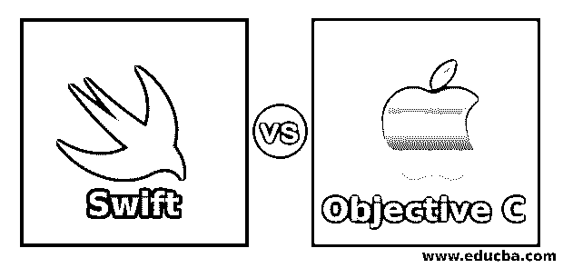
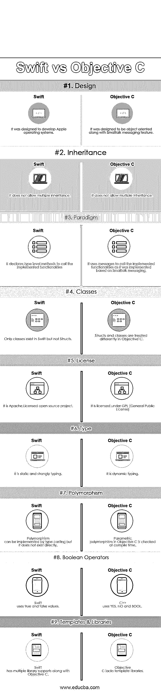

# Swift 与 Objective C

> 原文：<https://www.educba.com/swift-vs-objective-c/>

## Swift 与 Objective C 之间的差异

**[Swift 是](https://www.educba.com/what-is-swift/)** 一种多范式、通用编程语言，由苹果公司为其不同的操作系统如 iOS、tvOS、macOS、watch OS 开发。它是根据 Apache License 2.0 许可的。它最早出现在 2014 年。支持 Linux、Darwin、Free BSD 等多种操作系统。;它是静态的、强类型的规程。Swift 旨在与苹果的 Cocoa 框架和 Objective C 库一起在苹果产品中工作。swift 文件的文件扩展名为。swift，它支持 Objective C 中的许多核心组件。

**Objective C** 也是一种面向对象的通用编程语言，加上 C 编程语言的闲聊式消息传递。它是反射式的，基于类的，由 Brad Cox 和 Tom Love 在一家名为 Stepstone 的公司设计，于 1984 年首次出现。它是一种静态和动态类型的编程语言。它支持跨平台应用程序，并且受到了 Small talk 和 C 编程语言的影响。Objective C 是 C 编程语言的超集。文件扩展名通常包括。m 或者。h，取决于是程序文件还是头文件。让我们在本帖中详细了解 Swift 和 Objective C 的区别。

<small>网页开发、编程语言、软件测试&其他</small>

### Swift 和 Objective C 之间的直接比较(信息图表)

以下是 Swift 和 Objective C 之间的 9 大对比:

### Swift 与 Objective C 的主要区别

让我们讨论一下 Swift 与 Objective C 之间的一些主要差异:

1.  Swift 是苹果公司开发的最新编程语言，可以在各种跨平台操作系统上运行，如 Linux、Darwin、Free BSD 等。，而 Objective C 是一种通用的、面向对象的编程语言，苹果公司在其操作系统和 APIs Cocoa 等中使用。
2.  Swift 有几个编程特性，如安全编程模式、像 Objective C 一样的语法、对 Cocoa 框架的完全访问，而 Objective C 也支持除 STL 之外的与 C++相同的特性，并包括基础框架。
3.  Swift 在其语言中具有面向对象和程序的特性，在其库中具有内置功能，而 Objective C 具有不同的数据类型、用于识别标识符、声明和赋值的标记以及用于定义常数的预处理程序。
4.  Swift 支持不同的运算符，如算术运算符、逻辑运算符、按位运算符、关系运算符、赋值运算符、范围运算符和其他运算符，而 Objective C 也支持相同的运算符，但范围和预处理器除外，它们不属于编译过程。
5.  Swift 支持字典、函数、闭包、枚举、结构等。，而 Objective C 支持造型、扩展、动态绑定、协议、复合对象、内存管理和枚举。
6.  Swift 支持可选链接、类型转换、泛型、协议、下标等。，而 Objective C 允许动态分派、自动生成访问器来访问成员变量和属性，并允许方法和名称共享同一个标识符。
7.  在 Swift 中，调用方法将在编译时决定，类似于面向对象编程，而在 Objective C 中，调用方法将在运行时决定，Objective C 还有一些特殊功能，如添加或替换已存在的类上的方法。
8.  在 Swift 中，可以使用协议来处理错误，以避免意外的程序控制流，而 Objective C 有 nil，可以通过安全地向 nil 对象发送消息来安全地处理 nil。
9.  在 Swift 中，操作符重载是受支持的，并且就范围和简单性而言是全局的，而 Objective C 不支持默认参数，但可以通过多个方法操作来实现，并且也不支持私有成员。
10.  在 Swift 中，Arc(自动引用计数)是处理垃圾收集的特性，其中清空的内存被分配给所需的进程。相比之下，Objective C 不支持基于堆栈的内存对象，在 Objective C 中分配内存是非常昂贵的。它在编写交付高效应用程序的成功程序中起着关键作用。
11.  在 Swift 中，类对象是正常声明的。它们类似于一般的面向对象编程语言。相比之下，Objective C 具有一个复合对象特性，在一个对象中嵌入了一个对象，这意味着一个私有的集群对象将被嵌入到主对象和一些原语方法中。
12.  在 Swift 中，高级运算符用于处理复杂值的操作，而 Objective C 具有快速枚举功能，集合是该功能的核心组件。

### 快速客观 C 对照表

下面我们来看一下 Swift 和 Objective C 之间的主要对比——

| **比较的基础** | 雨燕 | **目标 C** |
| **设计** | 它被设计用来开发苹果操作系统 | 它被设计成面向对象的，并具有 Smalltalk 消息传递特性 |
| **继承** | 它不允许多重继承 | 它不允许多重继承 |
| **范式** | 它声明类型级方法来调用实现的功能 | 它使用消息来调用实现的功能，因为它是基于 Smalltalk 消息实现的 |
| **类** | Swift 中只存在类，而不存在结构 | struts 和类被视为 |
| **执照** | 这是 Apache 许可的开源项目 | 它是根据 GPL(通用公共许可证)授权的 |
| **类型** | 它是静态的和强类型的 | 它是动态类型 |
| **多态性** | 多态性可以通过[类型转换](https://www.educba.com/what-is-type-casting/)来实现，但它不是直接存在的。 | Objective C 中的参数多态性是在编译时检查的 |
| **布尔运算符** | Swift 使用真值和假值 | C++使用 YES，NO 和 BOOL |
| **模板&库** | Swift 拥有多种库支持以及 Objective C | 目标 C 缺少模板库 |

### 结论

Swift 是一种编程语言，主要用于苹果操作系统的开发，也用于苹果操作系统，其中不同的苹果产品有不同的操作系统。Objective C 主要用于苹果产品如 Mac 或 iPhone 的操作系统如 OS X 和 iOS 的开发。Objective C 主要用于 Apple 操作系统，并仅限于 Apple 产品开发，而 C++是开源的，可用于大多数硬件和嵌入式应用程序，但在使用编程功能和被管理的数据方面缺乏安全性。

Swift 与 objective C 一起用于大多数苹果产品的应用程序开发。Objective C 也用于开发 Swift 应用程序。我希望现在你已经对 Swift 和 Objective C 有了一个更公平的概念。请继续关注我们的博客，阅读更多类似的文章。

### 推荐文章

这是 Swift 与 Objective C 之间差异的有用指南。在这里，我们通过信息图和比较表讨论 Swift 与 Objective C 之间的主要差异。您也可以阅读以下文章，了解更多信息——

1.  [Swift 与 Go 对比](https://www.educba.com/swift-vs-go/)
2.  [C 与 C++性能对比](https://www.educba.com/c-vs-c-plus-plus-performance/)
3.  [惊人迅捷的面试问题](https://www.educba.com/swift-interview-questions/)
4.  [C++与围棋的差异](https://www.educba.com/c-plus-plus-vs-go/)

