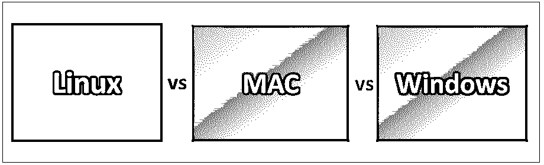
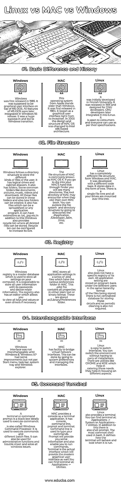

# Linux vs MAC vs Windows

> 原文：<https://www.educba.com/linux-vs-mac-vs-windows/>

## Linux 与 MAC 和 Windows 的区别

操作系统被认为是任何系统的支柱。没有操作系统，用户和系统就不能交互。它充当这两者之间的调解人。我们主要有三种操作系统，即 Linux、MAC 和 Windows。首先，MAC 是一个专注于图形用户界面的操作系统，由苹果公司为他们的 Macintosh 系统开发。微软开发了视窗操作系统。开发它是为了克服 MS-DOS 操作系统的局限性。Linux 是 UNIX，就像一个源代码软件，可以使用一个提供完全内存保护和多任务操作的操作系统。这是任何人都无法回避的问题。

### **Linux 和 MAC 与 Windows 的正面比较**(信息图)

下面是 Linux 与 MAC 和 Windows 的五大对比

<small>网页开发、编程语言、软件测试&其他</small>

### Linux、MAC 和 Windows 之间的主要区别

这些是市场上流行的选择；让我们来讨论一些主要的区别

这些是最常用的操作系统。尽管这三者都被广泛使用，但 Linux 与 MAC 和 Windows 之间还是有显著的区别。Windows 比其他两个占优势，因为 90%的用户更喜欢 Windows。Linux 是使用最少的操作系统，用户占比 1%。MAC 很受欢迎，在全球拥有 7%的用户群。

说到恶意软件的风险，Windows 是最容易受到攻击的。这是由于更大的用户群。Linux 不太可能受到恶意软件的影响。MAC 在恶意软件方面也是类似的。

Windows 价格昂贵，成本从 100 美元起。Linux 是免费的，任何人都可以下载使用。MAC 比 Windows 贵，用户被迫购买苹果打造的 MAC 系统。

### 对比表 Linux vs MAC vs Windows

如你所见，有很多比较。让我们看看下面的顶部对比——

| **比较的基础** | **窗户** | **MAC** | **Linux** |
| 基本区别和历史 | Windows 于 1985 年首次发布。它应该是 MS-DOS 上的一个图形用户界面。MS-DOS 的所有功能后来都集成到了 Windows 95 版本中。这是一个巨大的成功，并导致了 Windows 的过渡。 | 苹果的这个操作系统比 Windows 还要老。它于 1984 年首次发行。它从一开始就是一个图形用户界面。2005 年，MAC OS 的设计和结构改为基于英特尔 x86 的架构。 | 它最初是在芬兰大学开发的。它发布于 1991 年，是为 GNU 开发者设计的。GNU 开发者后来将其集成到 Linux 中。它对消费者开放，每个人都可以按照自己的规范使用它。 |
| 文件结构 | Windows follows a directory structure to store the different kinds of files of the user. It has logical drives and cabinet drawers. It also has folders. Some common folders like documents, pictures, music, videos, and downloads. All these files can be stored in these folders, and also new folders can be created. It also has files which can be a spreadsheet or an application program. It can have extensions as .txt, .jpg etc.除此之外，Windows 还提供了一个回收站，可以存储所有已删除的文件。回收站可以配置为增加其大小。 | MAC 的文件结构俗称 MAC OS X，如果你通过 finder 去挖掘你 MAC 的硬盘，会看到很多目录。MAC 的根目录可能会在他们访问自己的 MAC book 时遇到。您可以通过转到/Application、/Developer、/sbin、/tmp 等目录来探索文件系统和目录结构。 | Linux 的文件结构与 Windows 和 MAC 完全不同。它是用不同的代码库开发的。它以树的形式存储数据。有一个单独的文件树，所有的驱动器都安装在这个树上。 |
| 登记处 | Windows 注册表是一个主数据库，用于存储计算机上的所有设置。它负责存储所有用户信息及其密码和设备相关信息。注册表也有一个编辑器，允许您查看所有的键和值，甚至驱动程序，如果必要的话。 | MAC stores all application settings in a series of .plist files, which have the various preferences folder in MAC. This .plist file contains all properties in either plain text or binary format. These are stored at:

/资源库/偏好设置文件夹

 | Linux 也没有自己的特定注册表。所有应用程序设置都以程序为基础存储在不同用户下，以相同的层次结构格式存储文件。没有用于存储这些细节的中央数据库，因此也不需要定期清理。 |
| 可互换接口 | Windows 界面在 Windows 8 之前是不可互换的。Windows XP 有一些改进，但还不够好。开始菜单、任务栏、系统托盘和 Windows 资源管理器。 | MAC 具有桥接虚拟网络接口的功能。这可以通过进入系统偏好设置和管理界面来完成。 | Linux 很容易切换界面。您可以切换环境，而不必进行所有安装。有像 GNOME 和 KDE 这样的工具可以帮助满足这些需求。它们有助于关注不同的方面。 |
| 命令终端 | 终端或命令提示符是用来执行命令的理想黑匣子。它也被称为 Windows 命令处理器。它用于执行命令和不同的批处理文件。它还可以用于管理功能以及故障诊断和解决所有 windows 问题。 | MAC provides a console as a terminal application. It has a console, command line, prompt and terminal. A Command-line is used to type your commands. Prompt will provide you with some information and also enable you to run commands. A terminal is an actual interface that will provide the modern graphical user interface as well.您可以在“应用程序”->“实用程序”中找到该终端。 | Linux 也提供了一个终端。您可以在以下位置找到终端:应用程序->系统或应用程序->实用程序。除此之外，还有一个 shell 提示符。bash 中最常用的 shell。它定义了终端运行时的行为和外观。 |

### 结论

所有这些操作系统都各有利弊。这取决于用户以及他们对操作系统的选择和偏好。Windows 可以用来玩游戏。程序员可以用 Linux，对图形感兴趣的人可以用 MAC。

### 推荐文章

这是一个关于 Linux 与 MAC 和 Windows 之间区别的有用指南。在这里，我们还将讨论信息图和比较表的主要区别。您也可以看看以下文章——

1.  [Linux vs Mac](https://www.educba.com/linux-vs-mac/)
2.  [Linux vs Windows Server](https://www.educba.com/linux-vs-windows-server/)
3.  [Linux vs Windows](https://www.educba.com/linux-vs-windows/)
4.  [Linux vs Mac](https://www.educba.com/linux-vs-mac/)

