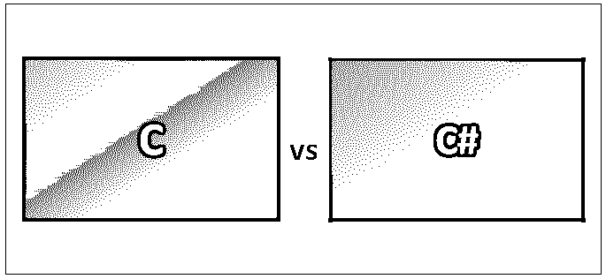
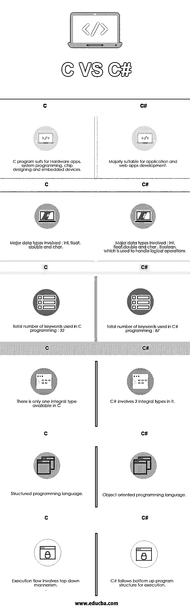

# C 与 C#

> 原文：<https://www.educba.com/c-vs-c-sharp/>

## C 和 C#的区别

c 被称为高级编译语言。高级计算机语言的计划是提供一种简单自然的方式给计算机一个命令程序。C#源自 C 编程语言，类似于 Java，C#是面向对象的，带有广泛的类库，并且链接了异常处理、多种类型的多态性以及接口与实现的分离。该语言被提议用于开发适合在分布式环境中部署的软件组件。

### 什么是 C？

就 C 而言，C 最早是由丹尼斯·里奇在 1969 年到 1973 年间开发的。它最初是作为编写操作系统的系统编程语言而开发的。原始计算机的语言是一串称为机器代码的数字。因此，HLL 的工作是提供一组新的黑盒指令，这些黑盒指令可以交给计算机，而我们不需要看到它们内部发生了什么，编译器的工作是填充这些“黑盒”的细节

<small>网页开发、编程语言、软件测试&其他</small>

**C 语言的主要特点是:**

*   对内存的低级访问
*   一组简单的关键字
*   干净的风格

所有上述特征使 C 语言适合于系统编程，如操作系统或编译器开发。甚至后来的语言直接或间接地借用了 C 语言的语法/特性。和 Java 的语法一样，PHP、JavaScript 等很多语言都是以 C 语言为主。

### 什么是 C 调？

C#语言被设计成一种简单、现代、通用、面向对象的编程语言。像 NUnit11 这样的测试框架使得 C#适合于测试驱动的开发，所以是一种用于极限编程的好语言。C#功能强大的开发工具、多平台支持和泛型，使 C#成为许多类型软件开发项目的首选，如下所示。

*   快速应用开发项目
*   个人实施的项目
*   大型或小型团队，互联网应用
*   具有严格可靠性要求的项目。

此外，它坚固的类型有助于避免弱类型语言中常见的许多编程错误。

**ECMA 标准列出的 C#的设计目标:**

*   C#语言被设计成一种简单、现代、通用、面向对象的编程语言。
*   该语言及其实现应该提供对软件工程原理的支持

1.  强类型检查
2.  数组边界检查
3.  检测使用未初始化变量的尝试
4.  自动垃圾收集。
5.  软件健壮性
6.  持久性
7.  程序员的生产力很重要。

*   源代码的可移植性非常重要，程序员的可移植性也是非常重要的，尤其是对于那些已经熟悉 C 和 C++的程序员。
*   提供对国际化的支持。
*   C#被精心设计成适合于为托管和嵌入式系统编写应用程序，从使用复杂操作系统的大型应用程序，到具有专用功能的小型应用程序。
*   尽管 C#应用程序在内存和处理能力需求方面很经济，但这种语言无法直接与 C 或汇编语言的性能和大小相抗衡。

### C 和 C#的直接比较(信息图)

下面是 C 与 C#的 6 大区别

### C 和 C#的主要区别

两者都是市场上的热门选择；让我们讨论一些主要差异:

因为 C#是基于的，所以语法更倾向于相似。用于段编码结构的括号和包含依赖项和库的 C 风格面向对象代码非常相似。从 C#迁移到 C++可能更困难，因为它是一种更低级的语言。C#处理 C++程序中必须测量的大部分开销。这也是 C++被认为是更难的语言的一个主要原因。

*   面向对象的设置:尽管语法差别很大，但是类、继承和多态等主要概念是相同的。
*   编译语言:与 Java 和解释语言不同，C 和 C#都是编译语言。这意味着在 PC 或服务器上启动应用程序之前，必须将代码转换为二进制文件，然后执行。可执行的 EXE 文件就是一个很好的例子，可以用 C++或 C#编写编译文件。

**进一步区别:**

*   C#由。NET CLR，而 C #是非托管代码。
*   c 可以在跨平台环境中执行。而 C#需要。NET Framework 来执行。
*   C#更多的是在设计上。c 更多的是关于函数
*   C#垃圾回收是由 CLR 完成的，而 C 不持有垃圾回收的概念。
*   C 支持指针，但 C#不支持。

### C 与 C#比较表

| **C** | **C#** |
| c 程序适合硬件应用、系统编程、芯片设计和嵌入式设备。 | 主要适用于应用程序和 web 应用程序开发。 |
| 涉及的主要数据类型:int、float、double 和 char。 | 涉及的主要数据类型:int，float，double 和 char，Boolean。用于处理逻辑操作。 |
| C 编程中使用的关键字总数:32 | C#编程中使用的关键字总数:87 |
| C #中只有一种整型可用 | C#包含了两种整型。 |
| 一种结构化编程语言。 | 一种面向对象的编程语言。 |
| 执行流程涉及自上而下的习惯主义。 | C#遵循自底向上的程序结构来执行*。* |

### 推荐文章

这是 C 与 C#之间最大差异的指南。在这里，我们还将讨论信息图和比较表的主要区别。您也可以看看下面的 C 与 C#文章来了解更多信息——

1.  [C#列表与数组](https://www.educba.com/c-sharp-list-vs-array/)
2.  [C 与 C++性能对比](https://www.educba.com/c-vs-c-plus-plus-performance/)
3.  [C # vs.Net 差异](https://www.educba.com/c-sharp-vs-net/)
4.  [C++ vs Objective C](https://www.educba.com/c-plus-plus-vs-objective-c/)
5.  [C#与 JavaScript:有什么区别](https://www.educba.com/c-sharp-vs-javascript/)
6.  [Rust 与 C++的有用区别](https://www.educba.com/rust-vs-c/)
7.  [C 与 C++的 13 大差异](https://www.educba.com/c-vs-c-plus-plus/)

