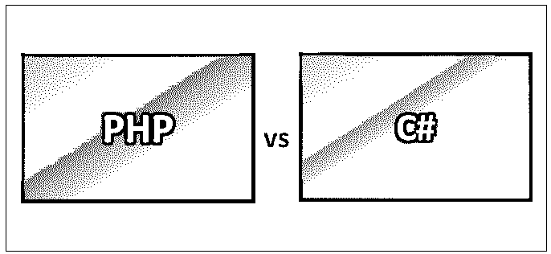
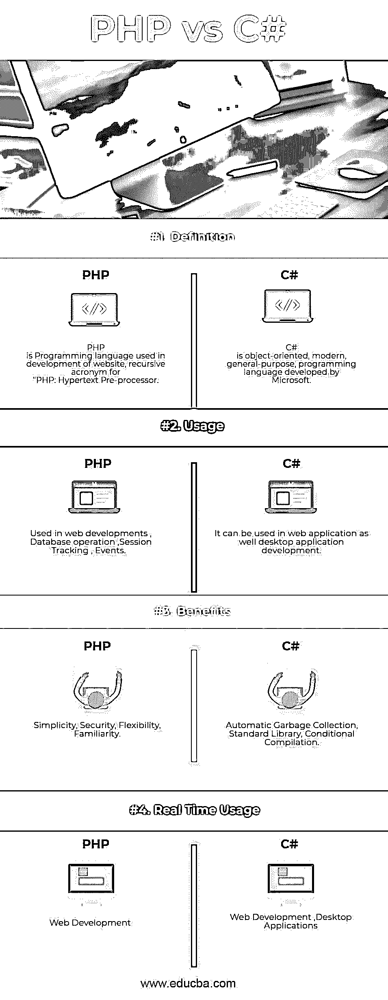
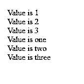
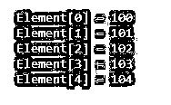

# PHP 与 C#

> 原文：<https://www.educba.com/php-vs-c-sharp/>




## PHP 和 C#的区别

PHP 是网站开发中使用的编程语言，是“PHP:超文本预处理器”的递归缩写。PHP 是一种服务器端脚本语言，为开发人员在 web 开发应用程序中使用提供了许多功能。C#是微软开发的面向对象的现代通用编程语言。它得到了欧洲计算机制造商协会(ECMA)和国际标准组织(ISO)的认可。

**让我们详细学习一下 PHP 和 c#:**

<small>网页开发、编程语言、软件测试&其他</small>

*   PHP 由拉斯马斯·勒德尔夫开发，于 1995 年首次发布。可以使用 PHP 开发企业应用程序，它可以处理会话跟踪、数据库读写操作、动态内容。PHP 集成了许多流行的数据库 Postgre SQL，包括 MySQL、Oracle、Informix、Sybase 和 Microsoft SQL Server。
*   PHP 支持大量协议，如 IMAP、POP3 和 LDAP。PHP4 增加了对 Java 和分布式对象架构(COM 和 CORBA)的支持，使得 n 层开发第一次成为可能。Php 很容易学，因为它的语法类似于 C，任何懂 C 的人都可以很容易地学会 PHP。
*   C#是由安德斯·海尔斯伯格和他的团队开发的。C#是为公共语言基础结构(CLI)设计的，它由可执行代码和运行时环境组成，允许在不同的计算机平台和体系结构上使用各种高级语言。
*   PHP 执行系统功能，即从系统上的文件中，它可以创建、打开、读取、写入和关闭它们。PHP 可以处理表单，即从文件中收集数据，将数据保存到文件中，通过电子邮件可以发送数据，将数据返回给用户。数据库操作通过 PHP 添加、删除、修改数据库中的元素。访问 cookie 变量并设置 cookie。使用 PHP，您可以限制用户访问您网站的某些页面。它可以加密数据。

### PHP 和 C#的要点

以下是 PHP 和 C#的一些要点:

#### C#语言的优势

*   它是面向对象的。
*   这很容易学。
*   它是一种现代的通用编程语言
*   它是面向组件的。
*   它是一种结构化语言。
*   它可以在各种计算机平台上编译。
*   它产生高效的程序。
*   这是 of.Net 框架的一部分。
*   C#强大的编程功能

#### PHP 的特点

五个重要的特征使得 PHP 的实用性成为可能

*   安全性
*   简单
*   效率
*   熟悉
*   灵活性

#### C#的重要特性

下面列出了 C#的一些重要特性

*   自动垃圾收集
*   标准程序库
*   条件编译
*   布尔条件
*   LINQ 和拉姆达表达式
*   程序集版本控制
*   属性和事件
*   代表和活动管理
*   易于使用的泛型
*   索引器
*   简单多线程
*   与 Windows 集成

**举例:在 PHP 中**

PHP 中的“Hello World”脚本

```
<html>
<head>
<title>Hello World</title>
</head>
<body>
<?php echo "Hello, World!";?>
</body>
</html>
```

它将产生以下结果:


**例子:** **在 C#中**

#C 中的 HelloWorld 示例

```
using System;
namespace HelloWorldApplication {
class HelloWorld {
static void Main(string[] args) {
Console.WriteLine("Hello World");
Console.ReadKey();
}
}
}
```

它将产生以下结果:


### PHP 和 C#的面对面比较(信息图表)

下面是 PHP 和 C#的最大区别




### PHP 和 C#的主要区别

PHP vs C#性能都是市场上的热门选择；让我们讨论一下 PHP 和 C#之间的一些主要区别:

要运行 PHP 应用程序，我们需要一个环境，PHP 应用程序 1 需要以下工具。Web 服务器——许多 web 服务器都可用，如 Apache、XXamp、IIS。2 PHP 应用程序与数据库交互也需要数据库 PHP 支持所有类型的数据库，如 Oracle，Sybase，MySQL。php 解析还需要解析 PHP 脚本并以 HTML 格式生成输出。

*   **IDE—**微软为 C#提供的集成开发环境有以下 1。Visual Studio，2。Visual C#，3。Visual Web Developer，这些工具是使用 C#应用程序所必需的。

与 c#相比，php 中的变量分类较少。php 中总共有 8 种变量

*   **示例—**整数类型声明$ var = 100，php 中变量以$开头。

与 php 相比，c#的变量分类更广泛，在顶级，它有值类型、引用类型、指针类型变量，它的声明不以$开头，

*   **例—**int a = 10；

PHP 有 while 循环，for 循环，do while 循环，foreach 循环。

C#有 while 循环、for 循环、do while 循环、嵌套循环。

**PHP 代码:**

Php 中的数组声明。

```
<?php
$numbers = array( 1, 2, 3,);
foreach( $numbers as $value ) {
echo "Value is $value <br />";
}
$numbers[0] = "one";
$numbers[1] = "two";
$numbers[2] = "three";
foreach( $numbers as $value ) {
echo "Value is $value <br />";
}
?>
```

**输出:**




**C#代码:**

C#中的数组声明

```
using System;
namespace ArrayApplication {
class MyArrayDemo {
public static void Main(string[] args) {
int []  n = new int[5]; /* n is an array of 10 integers */
int i,j;
/* initialize elements of array n */
for ( i = 0; i < 5; i++ ) {
n[ i ] = i + 100;
}
for (j = 0; j < 5; j++ ) {
Console.WriteLine("Element[{0}] = {1}", j, n[j]);
}
Console.ReadKey();
}
}
}
```

**输出:**




Php 没有像特性那样的结构。

C#支持结构和联合。

### PHP 与 C#对照表

下面是 PHP 和 C#之间最重要的比较

| **比较的基础** | **PHP** | **C#** |
| **定义** | PHP 是用于网站开发的编程语言，是“PHP:超文本预处理器”的递归首字母缩写。 | C#是微软开发的面向对象的现代通用编程语言。 |
| **用途** | 用于 web 开发、数据库操作、会话跟踪、事件 | 它可以用于 web 应用程序以及桌面应用程序开发。 |
| **好处** | 简单、安全、灵活、熟悉。 | Automatic Garbage Collection, Standard Library, Conditional Compilation. |
| **实时使用量** | Web 开发 | Web 开发、桌面应用程序 |

### 结论

PHP 和 C#的性能各有其重要性，选择哪个取决于项目需求。就 web 开发而言，php 开发人员可以在有限的时间内轻松开发 web 应用程序，MYSQL 数据库嵌入了 PHP 服务器，用于开发 php web 应用程序，因此对于小型网站而言，无需担心与外部数据库的连接，这是开发 web 应用程序的快速方法，并迫使我们在这种情况下使用 PHP，而 C#也可以用于 web 应用程序以及桌面应用程序。所以我们可以根据项目要求选择任何人。

### 推荐文章

这是 PHP 与 C#性能之间最大差异的指南。在这里，我们还将讨论信息图和比较表的主要区别。你也可以看看下面的 PHP 与 C#的文章来了解更多

1.  [ASP.NET vs PHP](https://www.educba.com/asp-net-vs-php/)
2.  [C 与 C#](https://www.educba.com/c-vs-c-sharp/)
3.  [JSP vs PHP](https://www.educba.com/jsp-vs-php/)
4.  [C#数组 vs 列表](https://www.educba.com/c-sharp-array-vs-list/)


