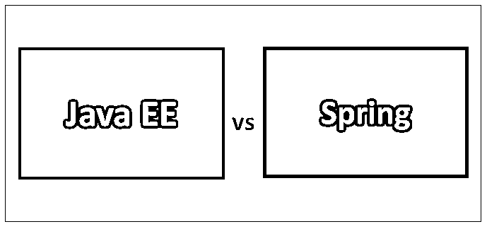
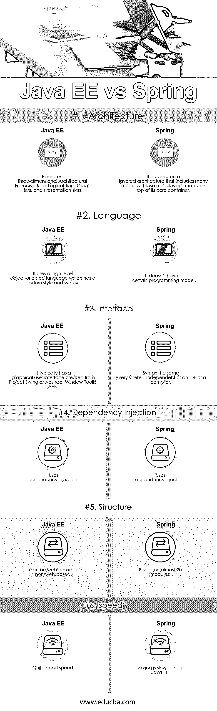

# Java EE vs Spring

> 原文：<https://www.educba.com/java-ee-vs-spring/>

## Java EE 和 Spring 的区别

Java Platform，Enterprise Edition 是 Oracle 针对 Java 语言编程的一个应用编程阶段。Java EE 最初是由 Sun 创建的，Oracle 在 2010 年收购了它，它是在客户机器和企业的数据库和遗产数据框架之间的中心级别上执行的。 [Spring 框架是一个应用系统](https://www.educba.com/spring-framework-interview-questions/)和 Java stage 控件的反转。任何 Java 应用程序都可以利用该结构的中心亮点；但是，在 Java EE(企业版)阶段上构建 web 应用程序还有一些扩展。

**让我们更详细地学习 Java 和 Spring:**

<small>网页开发、编程语言、软件测试&其他</small>

*   Java EE 涉及一个细节、引用执行和一组测试套件。它的核心部分是 Enterprise[JavaBean s](https://www.educba.com/what-is-javabeans/)(EJB)，其次是 Java server Pages(JSP)和 Java servlets 以及各种用于连接企业数据资产的接口。
*   最初的形式是由 Rod Johnson 创作的，他在 2002 年 10 月出版了他的书《一对一的 J2EE 设计和开发专家》,从而释放了这个结构。该结构于 2003 年 6 月首次获得阿帕奇 2.0 许可。
*   Java EE 接口包括用于数据库的 JDBC、用于注册的 JNDI、用于交换的 JTA、用于通知的 JMS、用于电子邮件框架的 JavaMail 以及用于 CORBA 网络的 JavaIDL。Java 连接器是各种继承应用程序的接口。
*   “EE”仍适用于企业版。这基本上使得 Java EE–Java 企业版。如果需要用两三句话来简化 Java EE，大概是这样的——“Java EE 是一个以‘标准决定/API’为特征的阶段，这些决定/API 随后由商家执行，并用于改进大企业(传达的、多层次的、强大的)应用程序。这些应用程序由模块或“部件”组成，这些模块或“部件”利用 Java EE“区间”作为它们的运行时框架。"
*   Spring 框架是开源的；尽管该系统并不强制使用特定的编程模型，但事实证明，作为企业 JavaBeans (EJB)展示的扩展，甚至替代，它在 Java 人群中非常流行。

### Java EE 和 Spring 的面对面比较(信息图)

下面是 Java EE 和 Spring 的 6 大区别

### Java EE 和 Spring 的主要区别

Java EE vs Spring 都是市场上的热门选择；让我们讨论一些主要的区别:

*   Java EE 是一个标准的、官方的，特别是对于一个完全突出的企业应用框架栈。
*   Java EE 整合了对象关系映射、安全性、Web 应用程序、数据库可用性和交换等内容。
*   在 Java EE 决定之上，有 JavaEE 执行/应用服务器，如 JBoss、Glassfish、WebSphere、Weblogic。
*   Spring 是一个在 Java EE 细节上做大量工作的结构，但是是在它自己的框架中。他们不需要 Java EE 决定和 API。然而，它们确实结合了 Web 框架、exchange 管理、安全性和 Java EE 提供的一些不同的安排。
*   Java EE 行业肯定了基于标准 API 的结构。
*   Spring 基于 AOP 和 IOC。
*   Java EE 卓越地建立在 CDI 和注释的基础上。
*   Spring 利用 DAO 结构(针对模板配置设计)与数据库关联。
*   Java EE 应用 JFC MVC 结构进行 web 推进。
*   Spring 依赖于 XML 设计(现在他们正在使用注释)。
*   Java EE 使用 JPA 细节来处理 DB 活动。
*   Spring 与不同的 Java 商家协作来帮助实现不同的能力，例如 struts 等等。
*   Java EE 在执行时使用 JTA API。
*   Java EE 使用 EJB 区间和基于 POJO 的执行。
*   Java EE 是 oracle 许可的。
*   Spring 给出了一个开源许可。
*   春天出谋划策层帮助不同的 JTA 执行商人。
*   Spring 为利用 DI 和 AOP 构建实现自由耦合的 web 应用提供了端到端的平台。

### Java EE 与 Spring 比较表

下面是 Java EE 和 Spring 之间最重要的比较

| **比较的基础** | **Java EE** | **春天** |
| **架构** | 基于三维架构框架，即逻辑层、客户端层和表示层。 | 它基于包括许多模块的分层体系结构。这些模块是在它们的核心容器之上构建的。 |
| **语言** | 它使用一种高级的面向对象语言，这种语言有一定的风格和语法。 | 它没有特定的编程模型。 |
| **界面** | 它通常有一个从项目 Swing 或抽象窗口工具包 API 创建的图形用户界面。 | 语法在任何地方都一样——独立于 IDE 或编译器 |
| **依赖注入** | 使用依赖注入 | 使用依赖注入 |
| **结构** | 可以是基于网络的，也可以是非基于网络的 | 基于近 20 个模块 |
| **速度** | 相当快的速度 | Spring 比 Java EE 慢 |

### 结论

Java EE stage 面向那些需要一个可扩展的、适应性强的分布式框架来构建大量应用程序的组织和公司。它为数据库获取(JDBC，JPA)、远程技术调用(RMI)、通知(JMS)、web 管理、XML 处理合并了额外的库，并为 Enterprise JavaBeans、portlets、servlets、Java 服务器页面等描述了标准 API。Java EE 已经被称为 Java 2 Platform，Enterprise Edition 或 J2EE，由 Sun Microsystems 与 IBM 联合开发。它最初是为了重新安排应用程序的发展，并通过制作标准模块和可以计算机化表单的部件来减少代码编写的工作量。Java EE 的基本目标是理清设计者在通过各种 API 构建当前应用程序时所关注的基本问题。伴随 Java EE 的一些引人注目的 API 合并了 Servlet、Java Server Pages (JSP)、Java Persistence API (JPA)、Enterprise JavaBeans (EJB)、JSP 标准标记库(JSTL)、Java EE holders 等。

Spring 是大企业 Java 的开源推进系统。Spring 框架的核心亮点是可以在构建任何 Java 应用程序时使用，但是在 Java EE 阶段还有构建 web 应用程序的扩展。Spring structure 致力于通过授权一个基于 POJO 的编程模型，使 J2EE 进程更易于使用，并推进伟大的编程实践。从根本上说，Spring 是 reliance infusion 的一个结构，是一个允许构建非常解耦的框架的例子。Spring 是一个不错的网络发展系统。Spring MVC 是 Spring 众多部分中的一个，它是一个利用 Spring 一般亮点的 web 系统，类似于 reliance infusion。这是一个完全非排他性的系统，因为它是非常可配置的:您可以利用不同的数据库层

### 推荐文章

这是 Java EE 和 Spring 之间最大区别的指南。在这里，我们还将讨论信息图和比较表的主要区别。您也可以看看下面的 Java EE vs Spring 文章来了解更多信息

1.  [春天 vs 冬眠](https://www.educba.com/spring-vs-hibernate/)
2.  [春天 vs Spring Boot](https://www.educba.com/spring-vs-spring-boot/)
3.  [Java vs Java EE](https://www.educba.com/java-vs-java-ee/)
4.  [Java vs Ruby](https://www.educba.com/java-vs-ruby/)

