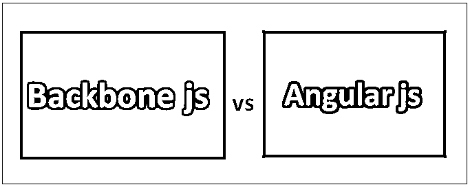
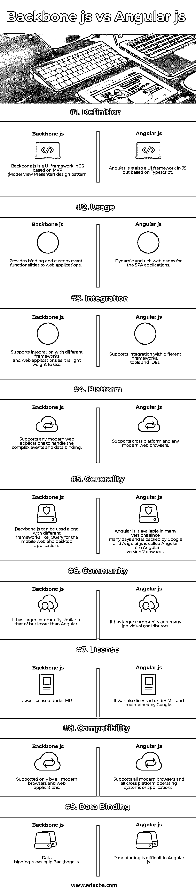

# 骨干 js 与角度 js

> 原文：<https://www.educba.com/backbone-js-vs-angular-js/>

## 骨干 js 和角 js 的区别

Backbone js 是一个 javascript UI 库，它基于 Model View Presenter 应用程序设计模式。它的界面基于 RESTful JSON。它是轻量级的，可以和其他 JS 库一起使用。它是用 JavaScript 写的。它最初发布于 2010 年。杰里米.阿什肯纳斯发明了它。它是在麻省理工学院的许可下授权的。

Angular 也是一个基于 javascript 的 UI(前端)框架，它基于 TypeScript 语言。它是由谷歌的 Angular 团队与社区和个人贡献者一起开发和维护的。它是在麻省理工学院的许可下授权的。它支持跨平台和现代网络浏览器。它最初于 2016 年发布。这是用打字稿写的。它的代码被托管在 Github 仓库中。它有不同的功能，如动态加载，反射，模板的异步编译。angular 的最新版本是 Angular 6，发布于 2018 年 5 月。代码是基于模块化的，由于它是基于组件的模型，所以具有不同的组件。

<small>网页开发、编程语言、软件测试&其他</small>

Backbone js 是非常轻量级的，它的大小在生产中大约为 7.5 KB，在开发中大约为 72 KB。它为 web 应用程序提供键值绑定和定制事件功能。

Angular 提供了更高的速度和性能，支持跨所有平台的开发，并支持不同的集成工具，主要是由 Google 支持的；它有更多的用户基础和更大的社区，更加可信和可靠。

### 骨干 js 和角度 js 的面对面比较(信息图)

以下是骨干 js 和棱角 js 的 9 大区别

### 骨干 js 和角度 js 的主要区别

无论是骨干 js 还是棱角 js 都是市场上的热门选择；让我们讨论一些主要差异:

*   Backbone js 库具有 MVC 模式，其中数据将被抽象为模型，DOM 作为视图，并将这两者绑定为事件，而 Angular js 框架提供了 MVC 框架，该框架需要配置设置，代码需要以松散耦合的方式开发，而不是花费一些时间使其更加复杂。
*   Backbone js 库是轻量级的，可以很容易地与任何基于 JavaScript 的 web 应用程序集成和配置，而在 Angular js 中，所有新的组件或功能都必须通过配置来设置，以便使用或工作，这消耗了一些额外的开发时间。
*   Backbone js 库提供了更强大的功能、更干净、易于维护的代码，而 Angular js 需要更多的配置，并在为绑定事件进行配置时造成了一些混乱。
*   Backbone js 拥有更大的社区支持，并提供离线社区教育计划和移动计划，而 Angular js 用户将不会单独获得 Google 的任何支持，因为它已经有了一个庞大的基于用户的社区和来自其社区的更大支持。
*   Backbone js 库完全基于 JavaScript，而 Angular js 基于 TypeScript。
*   在事件和回调函数处理的情况下，Backbone js 提供绑定功能，而在 Angular 的情况下，最初很难使用这两种类型的绑定，这在开发人员中造成了一些混乱。
*   Backbone js 和基于 MVP 的架构，而 Angular js 是基于 MVC 的架构，不能在浏览器中使用 HTML 解析器。
*   在大量页面和大型应用程序的情况下，Backbone js 的性能比 Angular js 快得多，而在大型数据绑定事件和复杂应用程序的情况下，Angular 的性能要差一些，在小型应用程序的情况下，Angular 的性能可以与之相比。
*   主干 js 主要关注高性能，而角度 js 需要更多的配置和更多的代码用于较小的应用程序。

### 骨干 js 与角度 js 比较表

以下是骨干 js 与角度 js 之间的最高比较:

| **比较的基础** | **骨干 js** | **角度 js** |
| **定义** | Backbone js 是 js 中基于 MVP (Model View Presenter)设计模式的 UI 框架。 | Angular js 也是 js 中的 UI 框架，但是基于 Typescript。 |
| **用途** | 为 web 应用程序提供绑定和自定义事件功能。 | SPA 应用程序的动态和丰富的网页。 |
| **整合** | 支持与不同框架和 web 应用程序的集成，因为它是轻量级的。 | 支持与不同框架、工具和 ide 的集成。 |
| **平台** | 支持任何现代 web 应用程序处理复杂事件和数据绑定。 | 支持跨平台和任何现代网络浏览器。 |
| **通用性** | Backbone js 可以和 jQuery 等不同的框架一起用于移动 web 和桌面应用程序。 | Angular js 在很多天内都有很多版本，并且由 Google 提供支持，Angular js 从 Angular 版本 2 开始就被称为 Angular。 |
| **社区** | 它有一个更大的社区，类似于但小于 Angular。 | 它有一个更大的社区和许多个人贡献者。 |
| **执照** | 这是麻省理工学院许可的。 | 它也获得了麻省理工学院的许可，由谷歌维护。 |
| **兼容性** | 仅受所有现代浏览器和 web 应用程序支持。 | 支持所有现代浏览器和所有跨平台操作系统或应用程序。 |
| **数据绑定** | 主干 js 中的数据绑定更容易。 | Angular js 中数据绑定比较困难。 |

### 结论

在这篇 Backbone js 与 Angular js 的文章中，我们看到了 Backbone js 是一个前端 UI 库，而 Angular 是一个现代移动、web 和桌面应用程序的前端框架，支持不同的第三方工具或应用程序集成，对 Angular js 和 Backbone js 都有更好的社区支持。选择取决于类型，因为 Backbone 是轻量级的，可以与 Angular 一起使用来处理复杂的数据绑定和自定义事件处理。

与单独的 Angular js 相比，Backbone js 和 Angular js 提供了更高的稳定性，建议用于需要质量和适应应用中复杂变化的稳定和高端应用，而 Angular js 可能是单独的首选，用于性能不是问题的较小应用。

框架的选择取决于应用程序和使用应用程序的组织所需的参数、安全特性、社区支持，以及在应用程序功能或组件出现故障时更容易或更快速的技术解决方案。

### 推荐文章

这是骨干 js 和角度 js 之间最大区别的指南。在这里，我们还将讨论信息图和比较表的主要区别。你也可以看看下面的主干 js 与角度 js 的文章来了解更多信息——

1.  [反应与角度](https://www.educba.com/reactjs-vs-angularjs/)
2.  [view . js vs angular](https://www.educba.com/vue-js-vs-angular/)
3.  [棱角 vs 脊柱](https://www.educba.com/angular-vs-backbone/)
4.  [角度 JS 对节点 JS](https://www.educba.com/angular-js-vs-node-js/)

