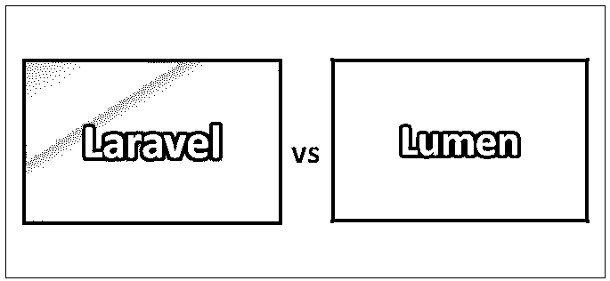
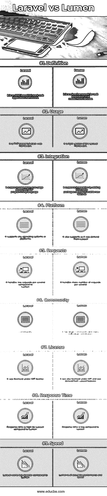

# 拉腊维尔 vs 卢蒙

> 原文：<https://www.educba.com/laravel-vs-lumen/>

## Laravel 和 Lumen 的区别

Laravel 是一个用于 web 开发的开源 PHP 框架。它是免费的，由泰勒·奥特威尔创建。它基于 MVC(模型视图控制器)架构模式。它主要用于 web 应用程序的开发。Laravel 是用 PHP 开发 web 应用程序的易于理解和健壮的 MVC 框架。Lumen 是一个微框架，意味着更小、更简单、更精简、更快；Lumen 主要用于构建具有松散耦合组件的微服务，这些组件可以降低复杂性并轻松增强改进。

### 拉勒韦尔

Laravel 是用 PHP 开发 web 应用程序的易于理解和健壮的 MVC 框架。这是麻省理工学院许可的。它最初于 2011 年 6 月发布。它完全是用 PHP 编程语言编写的。Laravel 提供了一组丰富的功能，用于开发最新的特性。在 web 安全，web 攻击盛行的情况下，Laravel 上的安全特性非常好。

<small>网页开发、编程语言、软件测试&其他</small>

### 流明

Lumen 是一个微观框架，由 Laravel 的创建者 Taylor Otwell 创建。Lumen 意味着完整 web 应用框架的更小、更简单、更精简和更快速的版本。Lumen framework 的基础级别与 Laravel 处于同一级别，大部分组件都很相似。Lumen 在配置 web 应用程序时具有较少的配置和不同的路由参数，有助于快速开发。

### Laravel 和 Lumen 的面对面比较(信息图)

以下是 Laravel 与 Lumen 的 9 大区别:

### Laravel 与 Lumen 的主要区别

两者都是市场上的热门选择；让我们讨论一些主要的区别:

1.  Laravel 是一个全栈 web 应用框架，它封装或支持许多第三方工具和框架，而 Lumen 是一个微框架，用于开发微服务和 API 开发，旨在提供速度和高响应时间。
2.  Laravel 需要不同类型的服务器配置，以及与应用程序一起使用的其他工具，而 Lumen micro framework 是 Laravel 版本的一个轻量级形式，它提供专门的功能，如 API 开发、cookies、模板、缓存、日志、路由、HTTP 会话等。
3.  Laravel 具有干净的架构、开源、不断增长的社区、依赖注入的 PHP 可用框架，而 Lumen 是一个微框架、API 特性、restful 支持、雄辩和易于使用。
4.  Laravel 可以与比 Lumen 更多的工具集成，而 Lumen 与其他工具的集成设施较少。
5.  与 Laravel 相比，Laravel 在 SQL 查询和从应用程序级别调优数据库的情况下性能会很好，而 Lumen 在 SQL 查询和更少功能的情况下性能会下降。
6.  Laravel 在 ORM 框架的情况下有不同的规范，这是雄辩的，Blade 是完全用 PHP 编写的默认模板引擎，而 Lumen 没有直接从 Laravel 派生的规范。
7.  Laravel 有自己的命令行界面，它与框架一起内置，而 Lumen 是一个功能丰富的微框架。
8.  Laravel 有一个优秀的内置对象关系映射框架，而 Lumen 很容易升级。
9.  Laravel 适合构建 RESTful APIs(应用程序编程接口)，而 Lumen 是构建微服务的最高性能微框架 API 之一。
10.  Laravel 有很好的文档来处理和初始化项目启动，而 Lumen 没有清晰的文档，但很容易使用。
11.  Laravel 更容易将身份验证与应用程序集成，而 Lumen 没有内置或易于集成的第三方工具。
12.  Laravel 很容易处理事件队列，而 Lumen 没有内置特性。
13.  Laravel 有一个强大的模板系统，而 Lumen 没有这样的功能。
14.  Laravel 掌握框架的学习曲线很陡，而 Lumen 的学习曲线较短，并且易于实现。
15.  与 Lumen 相比，Laravel 的性能和速度较差，而 Lumen 的性能较好。
16.  Laravel 有一个 Symfony 框架，可以用来创建 Symfony 组件，而 as Lumen 没有这些特性。

### Laravel 与流明对比表

以下是 Laravel 和 Lumen 的一些比较:

| **比较的基础** | 拉勒维尔 | **流明** |
| **定义** | 它是一个基于 MVC 的全栈 web 应用框架。 | 它是创建微服务的 web 应用程序的微框架。 |
| **用途** | 它是基于全栈 web 框架的 PHP。 | 它是 Laravel 框架的轻量级版本。 |
| **整合** | 它支持集成和使用 PHP 编程语言。 | 它通过添加第三方包或工具来支持新功能，从而支持集成。 |
| **平台** | 它支持任何操作系统或平台。 | 它也支持，因为它是从 Laravel 派生的。 |
| **请求** | 与 Lumen 相比，它每秒处理的请求更少。 | 它每秒处理更多的请求。 |
| **社区** | 与 Angular 相比，它的社区更小。 | 它有一个更大的社区和许多个人贡献者。 |
| **执照** | 它是在麻省理工学院的许可下授权的。 | 它也是在麻省理工学院的许可下，由 Laravel 特性派生而来。 |
| **响应时间** | 与 Lumen 相比，Laravel 的响应时间较长。 | 与 Laravel 相比，响应时间更短。 |
| **速度** | 与卢蒙相比，拉韦勒的速度较慢。 | Lumen 的核心是性能和速度。 |

### 结论

Lumen vs Laravel 都是基于 PHP 的 web 应用程序框架，用于现代移动、web 和桌面应用程序，它们支持不同的第三方工具或应用程序集成，Lumen 的社区支持较差，但具有高性能的支持功能，而 Laravel 拥有庞大的用户群和强大的社区支持，并有大量个人贡献者。在社区支持和标准特性的情况下，选择应该是 Laravel，以及许多第三方工具多重集成工具。

与 Lumen 相比，Laravel 更稳定，需要更多的学习，建议在不需要性能但需要应用程序安全性的小型应用程序中使用，而 Lumen 可能是应用程序性能的首选，与使用不同的其他组件和有效技术可以改进的功能和集成设施无关。框架的选择取决于应用程序和使用应用程序的组织所需的参数、安全特性、社区支持，以及在应用程序功能或组件出现故障时更容易或更快速的技术解决方案。

### 推荐文章

这是 Laravel 与 Lumen 之间最大差异的指南。在这里，我们还将讨论信息图和比较表的主要区别。您也可以看看以下文章，了解更多信息–

1.  姜戈 vs 拉腊维尔
2.  [支柱](https://www.educba.com/spring-vs-struts/) [vs 弹簧](https://www.educba.com/spring-vs-struts/)
3.  [PHP vs JavaScript](https://www.educba.com/php-vs-javascript/)
4.  [Codeigniter vs Laravel](https://www.educba.com/laravel-vs-codeigniter/)

