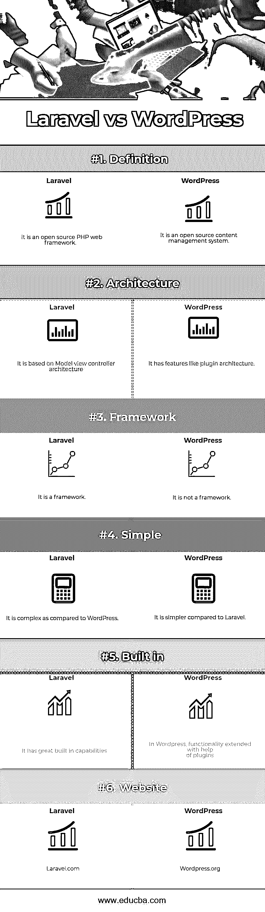

# Laravel vs WordPress

> 原文：<https://www.educba.com/laravel-vs-wordpress/>

## Laravel 和 WordPress 的区别

Laravel 是一个开源框架。它是一个 [PHP Web 框架](https://www.educba.com/php-interview-questions/)。用 PHP 7 编写，支持跨平台操作系统。它主要是为 web 应用程序的[开发而开发的，基于模型视图控制器架构和 symphony。WordPress 是一个开源的内容管理系统。它是免费的，更可靠。主要用于博客和报纸。可以用在小机构，新手或者创业者。](https://www.educba.com/how-to-build-web-applications-using-mongodb/)

### 拉勒韦尔

Laravel 是由 Taylor Otwell 创建和开发的。它最初发布于 2011 年。Laravel 已经发布了内置的身份验证、[本地化](https://www.educba.com/localization-vs-internationalization/)、模型、视图、会话、路由和其他功能，如控制反转和名为 Blade 的模板系统。新特性包括名为 artisan 的命令行界面，内置的对[数据库管理系统](https://www.educba.com/database-management-system-advantages/)的支持，对处理事件和打包系统的支持，称为 bundles。

<small>网页开发、编程语言、软件测试&其他</small>

### WordPress

WordPress 基金会开发了 WordPress。它是用 PHP 写的。它最初发布于 2003 年。它支持类似 Unix 和 windows 的操作系统。它具有插件架构和模板系统等特性。它主要用于写博客和网站管理系统。在 WordPress 中，管理内容很容易，编辑或更新也很容易。在这个更新的功能中，插件是可用的，许多主题是用来增加或定制 web 应用程序和内容的。

### Laravel 和 WordPress 的正面比较(信息图表)

以下是 Laravel 和 WordPress 的 6 大区别:

### Laravel 和 WordPress 的主要区别

让我们来看看 Laravel 和 WordPress 之间的一些关键区别:

*   在 Laravel 中，代码组织得很好。当代码增长时，laravel 负责重用代码，并在更大程度上自动解决问题。在 Word Press 中，所有的内容都需要由开发人员来维护，以它已经被编写的方式，它会以那种方式。
*   在 Laravel 中，框架需要被开发人员理解才能编码。在 WordPress 中，开始构建应用程序真的很容易，也非常容易。
*   在 laravel，有一个很大的学习曲线，这意味着它需要理解。在 WordPress 中，它的学习曲线更少。使用主题，我们可以免费快速地编写和发布我们的内容。
*   在 Laravel 中，有很多特性，如认证、授权、控制反转等。随着最新版本的发布，它变得越来越好。在 WordPress 中，认证已经在使用成熟插件的帮助下得到处理。
*   在 Laravel 中，SEO 需要定义自己的路线，开发一个主要依靠内容的网站需要做大量的工作。在 WP 中，[SEO 的基础做好了](https://www.educba.com/seo-techniques/)。
*   在 Laravel 中，一切都可以定制，并且可以通过事物的工作方式来控制。在 WP 中，内容可以用 WP 可用的主题和高级或免费插件来定制。
*   在 Laravel 中，可以按照自己的方式使用或设计数据库。在 WP 中，数据库不是必需的，因为它主要是静态数据。
*   Laravel 没有一个大的社区和开发者，但是 WordPress 有一个大的社区来支持和提供开发者。
*   [Laravel 简称框架](https://www.educba.com/laravel-commands/)，WordPress 是内容管理系统。
*   Laravel 在更新内容和变化方面不够灵活。但是 Word Press 在编辑和更新内容方面更加灵活。

### Laravel 和 WordPress 对照表

如你所见，Laravel 和 WordPress 之间有很多比较。我们来看看 Laravel 和 WordPress 的顶部对比。

| 【Laravel 和 WordPress 的比较基础 | 拉勒维尔 | **WordPress** |
| **定义** | 它是一个开源的 PHP web 框架。 | 这是一个开源的内容管理系统。 |
| **架构** | 它基于模型视图控制器架构 | 它有类似插件架构的特性。 |
| **框架** | 这是一个框架。 | 它不是一个框架。 |
| **简单** | 与 WordPress 相比，它是复杂的。 | 与 Laravel 相比，它更简单。 |
| **内置** | 它具有强大的内置功能。 | 在 WordPress 中，借助插件扩展的功能 |
| **网站** | Laravel.com | WordPress.org |

### Laravel 和 WordPress 的性能比较

Laravel 是一个框架，真的很快很快。它被称为一个改进的更好的框架。Laravel 使用了口才，因此编写数据库查询变得很容易。如果不使用，laravel 会变得更慢。所以最好了解一下 laravel 的框架，让事情变得又快又快，更好用。

WordPress 被认为主要是因为插件的使用而缓慢。这里要记住的一点是，如果我们使用更好的插件或强编码插件，WordPress 的性能也会更好，速度也会更快。性能和速度纯粹基于插件，这是在 WordPress 中使用的。Word Press 很便宜，对于小型应用程序或博客来说，性能负载更少。如果 WordPress 应用程序有更多的用户，维护负载就变得非常困难，并且它的性能变得太慢。

### 结论

Laravel 和 WordPress 都是不同的，因为 laravel 是一个框架，而 WordPress 是一个内容管理系统。使用 laravel，需要了解面向对象编程，编写代码，开发 web 应用。Laravel 和 WordPress 都主要是用 PHP 编写的，也很流行，但是这里需要注意的关键一点是，这个软件的用途是不同的。

Laravel 被称为工具箱，如果有可用的资源，并且有时间或长期投资，那么 laravel 是开发应用程序的一个好选择。Laravel 比其他框架更昂贵，它需要一个优秀的、有经验的开发人员。主要使用 WordPress 应用程序，但是当需要扩展应用程序或博客时，这些项目大部分都被废弃了。它们将在任何 web 框架中被开发或重写，以使其更加安全和可用。

Laravel 和 WordPress 各有利弊。但两者在专业知识和用法上都确实值得称赞。所以，技术的选择总是基于对未来的展望。技术的选择可以通过资源的可用性和在线社区以及不同领域的帮助来完成。所以，学习新事物和新技术来提升你的技能和专业知识总是更好的。

### 推荐文章

这是 Laravel 和 WordPress 之间最大区别的指南。在这里，我们还将讨论直接比较、关键差异、信息图和比较表。您也可以看看以下文章，了解更多信息–

1.  姜戈 vs 拉腊维尔
2.  [WordPress vs Weebly](https://www.educba.com/wordpress-vs-weebly/)
3.  [Bootstrap vs WordPress](https://www.educba.com/bootstrap-vs-wordpress/)
4.  [WordPress vs Magento](https://www.educba.com/wordpress-vs-magento/)

