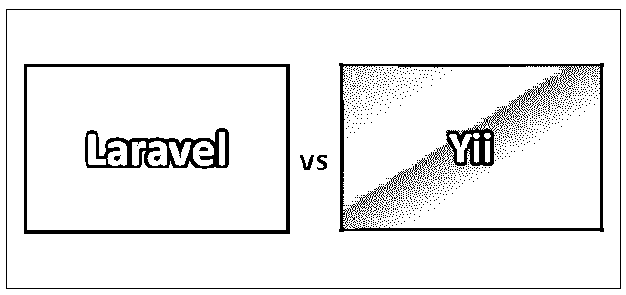
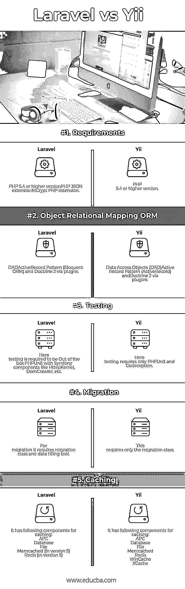

# Laravel vs Yii

> 原文：<https://www.educba.com/laravel-vs-yii/>

## Laravel 和 Yii 的区别

为了构建一些好的 web 应用程序，PHP 框架是有需求的。著名的框架是 Laravel vs Yii。当要构建复杂的语法应用程序时，使用 Laravel。Yii 被用作提供快速开发的高性能框架。让我们比较一下 Yii 和 Laravel 框架，看看它们有什么不同。

### Laravel 和 Yii 是什么？

以下是 Laravel 与 Yii 之间的一些不同点:

<small>网页开发、编程语言、软件测试&其他</small>

*   **验证**

每当用户想要执行基于场景的验证时，Laravel 中没有可用的包。它不提供任何在不同场景中验证模型的构造。Yii 可以用于从请求参数中分配模型，也可以用于模型的验证。这两种情况都可以通过使用 Yii 来管理。你可以根据你的需求定制你的代码。

*   **客户端验证**

为了在客户端进行验证，Laravel 没有提供默认支持。Yii 提供了非常好的表单客户端验证。一旦定义了一组规则，就可以在客户端和服务器端使用。

*   **路由**

使用 Laravel 时，用户需要为控制器的每个动作声明一个路径。同样受到保护的是，如果已经定义了路由，则可以从外部的任何地方访问控制器的功能。Laravel 认为框架应该提供一个默认的路径。在 Yii 中，简单的路由是可能的，因为不是每个动作都需要路由。默认情况下，选择所有路线操作。

*   **积垢生成**

对于管理面板，存在针对不同表的 CRUD 功能。在 Laravel 中没有对此活动的默认支持。Yii 有一个单独的专用工具，称为 Gii，它提供了一个基于 web 的界面，可以在其中生成交互式代码。除此之外，它还提供了一个命令行界面，更喜欢在控制台环境下工作。

*   **文档**

拉弗尔准备了非常充分的文件。它以一种通用的方式组织和编写，以便每个人都能理解它，也能学好它。Yii 没有像 Laravel 那样强大的文档。使用 Yii 的文档，您可以很容易地从基本编码开始，并在此基础上工作。

*   **资源和支持**

许多人使用 Laravel，因此有一个提供良好支持的大型社区。这个社区日益扩大。另一方面，Yii 出现在 Laravel 之前，有更多的开发人员在使用它，从而形成了一个比 Laravel 更大的社区。

### Laravel 与 Yii 的正面比较(资料图)

以下是 Laravel 与 Yii 的 5 大区别

### Laravel 和 Yii 的主要区别

两者都是市场上的热门选择；让我们讨论一些主要的区别:

*   **一般比较:**当应用程序需要复杂的语法时，使用 Laravel。它使认证、路由、创建会话和缓存变得更加容易。Laravel 是所有 [PHP 框架](https://www.educba.com/php-frameworks/)的组合。它提供了许多可靠的应用程序，如一流的 IoC、方便的移植系统和用于模块测试的集成系统。另一方面，Yii 是一个高性能的 PHP 框架，可用于所有现代应用程序的快速开发。Yii 采用 MVC 架构，代码简单。它提供了一个全栈框架，具有查询构建器、 [NoSQL 数据库](https://www.educba.com/what-is-nosql-database/)、RESTful API 和许多其他功能。
*   **模板化:** Laravel 提供了一个刀片模板系统。这个系统允许你在视图中使用 PHP 代码。刀片式服务器也不会保留任何开销，因此应用程序性能得到了提高。这是因为刀片视图文件以. blade.php 扩展名存储在系统中。所有这些代码在处理时都被转换成原始的 PHP 文件。另一方面，Yii 使用默认的模板系统。使用模板的开发团队可以选择模板。它提供的模板是 Twig 和 Smarty。
*   **框架:**Yii vs Laravel 框架在后端使用的框架是不一样的。Yii 使用 MVC 框架。因此，Yii 能够轻松利用所有组件。另一方面，Laravel 没有提供模块化的方法。
*   **性能:**任何应用程序在处理真实和关键数据时，其性能都取决于实时性。Web 应用程序通常不是基于性能的。但是这些框架的性能起着重要的作用。当与最佳编码高性能应用程序进行比较时，Yii 似乎是 PHP 方面最突出和最好的框架。Laravel 相对较慢，而且网上有一些资源，有助于提高性能。
*   **表单验证的实现:**验证在这两个应用程序中的应用是不同的。Laravel 有一个独特的类来执行验证，可以随时随地进行数据库验证。统一可以通过使用其雄辩的 CRM 轻松扩展。而在 Yii 中，表单验证是由模型的类和所有规则处理的，这些规则可以很容易地存储在所创建的模型或表单中。一旦收到来自 data 的更新，您就可以轻松地检查规则和验证脚本，以便对所创建的模型进行更改。当验证在控制器中完成时，这可能会变得复杂。
*   **优点:** Laravel 认证简单。它还有一个简洁明了的 API，可以帮助用户使用云服务发送电子邮件。它非常容易集成所有应用程序。Yii 配备了 [CRUD 发电机](https://www.educba.com/laravel-crud-generator/)。它还有网格格式的 AJAX 助手。此外，它不需要重复编写代码，并且可重用。

### Laravel 与 Yii 对比表

我们来看看顶部的对比

| **比较的基础** | 拉勒维尔 | **好的** |
| **要求** | PHP 5.4 or higher versionPHP JSON 扩展MCrypt PHP 扩展 | PHP 5.4 或更高版本 |
| **对象关系映射表** | DAO

ActiveRecord 模式(雄辩的 ORM)和通过插件的教义 2

 | Data Access Objects (DAO)通过插件的主动记录模式(Active Record)和原则 2 |
| **测试** | 在这里，测试需要使用 Symfony 组件，如 HttepKernel、DomCrawler 等，开箱即用 PHPUnit。 | 这里的测试只需要 PHPUnit 和 Codeception。 |
| **迁移** | 对于迁移，它需要一个迁移类和数据填充工具。 | 这只需要迁移类。 |
| **缓存** | It has the following components for caching:美国动力会议数据库ˌ资料库文件Memcached(在版本 5 中)Redis(版本 5) | It has the following components for caching:

美国动力会议

数据库ˌ资料库

文件

Memcached

雷迪斯

WinCache

XCache

 |

### 结论

Laravel vs Yii 框架都可以用于全栈开发。他们在各自领域都有好有坏。凭借这一点，Laravel 基本上被认为是这两者之间的赢家。有了它，Yii 还提供了一个健壮的环境和极大的安全性。因此，在两者之间进行选择将是开发人员根据他的需求做出的选择，并在两者之间选择最好的。

### 推荐文章

这是 Laravel 和 Yii 之间最大差异的指南。在这里，我们还将讨论信息图和比较表的主要区别。您也可以看看以下文章，了解更多信息–

1.  姜戈 vs 拉腊维尔
2.  [Laravel vs Lumen](https://www.educba.com/laravel-vs-lumen/)
3.  [PHP vs JavaScript](https://www.educba.com/php-vs-javascript/)
4.  [Codeigniter vs Laravel](https://www.educba.com/laravel-vs-codeigniter/)

