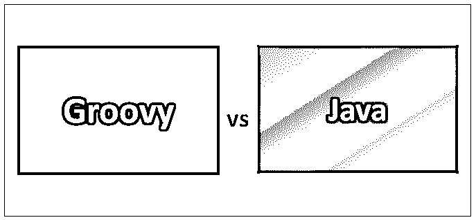
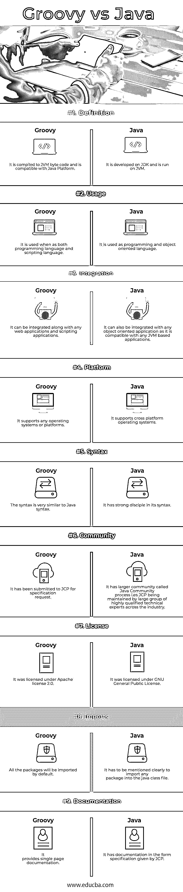

# Groovy vs Java

> 原文：<https://www.educba.com/groovy-vs-java/>

## Groovy 和 Java 的区别

Groovy 是一种面向对象的编程语言，用于在 Java 平台上开发应用程序，其语法与 Java 兼容，由 Apache 项目维护。它的特性类似于 Python、Perl、Ruby 和 Smalltalk 等编程语言的特性。Java 是一种面向对象的编程。它是一种基于类的通用编程语言，具有并发编程特性。它也有[多线程特性](https://www.educba.com/java-multi-threading-interview-questions/)。它旨在开发只需编写一次就可以在任何地方运行的应用程序。

### 绝妙的

Groovy 是由约亨·泽奥多洛、纪尧姆·拉弗吉、塞德里克·尚波和保罗·金开发的。其打字纪律性强，静态和动态。它是在 Apache 2.0 许可下获得许可的。它最早出现在 2003 年。其[文件扩展名为。由詹姆斯·斯特拉坎设计。](https://www.educba.com/install-groovy/)

<small>网页开发、编程语言、软件测试&其他</small>

### Java 语言(一种计算机语言，尤用于创建网站)

詹姆斯·高斯林设计了 Java。它由 Oracle 公司(当时是 Sun 公司)开发和维护。它是一种静态、安全和强类型的编程语言。它的文件扩展名是。它最早出现在 1995 年。它最受客户机-服务器类型的应用程序的欢迎。它是在 GNU 通用公共许可证和 Java 社区进程下授权的。Java 的最新版本是 10，2018 年 3 月发布。

### Groovy 和 Java 的直接比较(信息图表)

下面是 Groovy 和 Java 之间的 9 大区别

### Groovy 和 Java 的主要区别

两者都是市场上的热门选择；让我们讨论一些主要的区别:

*   Groovy 是一种编程语言，也支持脚本语言，而 Java 是一种面向对象的编程语言。
*   Groovy 支持多方法，其中运行方法的选择将在运行时选择，而 Java 通过在编译时而不是运行时选择方法来提供方法的多个声明。
*   在 Groovy 中，自动资源管理机制是不可用的，并且是静态的、匿名的内部类，而 Java 从 Java 7 版本开始提供自动资源管理，并且在内部静态类或[匿名类](https://www.educba.com/anonymous-class-in-java/)方面占上风。
*   在 Groovy 中，有 Lambda 函数等函数式编程特性；函数接口，而 Java 从 JDK 版本 8 开始就有 Lambda 函数、函数接口和许多其他流和并行操作函数。
*   在 Groovy 中，可以使用单引号或双引号格式来定义和声明字符串和字符，而 Java 只有双引号格式来声明和定义字符串或字符。
*   在 Groovy 中，一切都是对象，并且只使用对象。因此，没有自动装箱或取消装箱的概念，也没有原语的转换。相比之下，Java 有原始数据类型[和包装类](https://www.educba.com/wrapper-class-in-java/)来显式或隐式地执行[自动装箱和自动拆箱](https://www.educba.com/autoboxing-and-unboxing-in-java/)。
*   在 Groovy 中，数据类型的自动变宽和变窄有很大的范围，有很多转换，而 Java 在变窄或变宽数据类型方面有限制。
*   Groovy 有一个默认的访问修饰符 public，用于所有类型的类成员或数据，而 Java 有默认的访问级别 package level，这取决于类成员的类型。
*   Groovy 在其类中自动生成 getter 和 setter 来访问和修改类的成员，而在 Java 中，它们必须在类[中用访问修饰符](https://www.educba.com/access-modifiers-in-java/)显式地提到。
*   Groovy 有 Groovy beans，而 Java 有 Java beans。
*   Groovy 也被称为 Java 的超集，因为 Java 程序可以在 Groovy 环境中运行。
*   Groovy 定义类型的语法更简单，只需使用 def 来声明变量，而 Java 使用不同类型的类型名来声明变量或类的任何方法或成员。
*   Groovy 不需要任何 main 方法或方法的入口点来运行类或任何程序，而 Java 需要类中的 main 方法来运行程序。

### Groovy 与 Java 比较表

如您所见，Groovy 和 Java 之间有许多比较。让我们来看看 Groovy 和 Java 之间的主要比较

| **比较的基础** | **Groovy** | **Java** |
| **定义** | 它被编译成 JVM 字节码，并且与 Java 平台兼容。 | 它在 JDK 上开发，在 JVM 上运行。 |
| **用途** | 它既可以用作编程语言，也可以用作脚本语言。 | 它被用作编程和面向对象的语言。 |
| **整合** | 它可以与任何 web 应用程序和脚本应用程序集成在一起。 | 它还可以与任何面向对象的应用程序集成，因为它与任何基于 JVM 的应用程序兼容。 |
| **平台** | 它支持任何操作系统或平台 | 它支持跨平台操作系统 |
| **语法** | 语法非常类似于 Java 语法。 | 它有一个强大的语法信徒。 |
| **社区** | 它已提交给 JCP 进行规格要求。 | 它有一个更大的社区，叫做 Java 社区进程，也就是 JCP，由一大群业界资深的技术专家维护。 |
| **执照** | 它是根据 Apache license 2.0 许可的 | 它是在 GNU 通用公共许可证下授权的。 |
| **进口** | 默认情况下，所有包都将被导入。 | 必须明确指出的是，要将任何包导入 java 类文件。 |
| **文档** | 它提供单页文档。 | 它有 JCP 给出的格式规范的文件。 |

### 结论

Groovy 和 Java 都是面向对象的编程语言，而 Groovy 也支持脚本语言。脚本语言和编程语言的需求给 Groovy 增加了砝码。编程语言的选择取决于通过以有效的方式做出折衷选择来使应用程序有效工作所需的功能和特性。

Java 用的最多。最近，Java 通过提供 Nashorn JavaScript 引擎，允许在 JDK 9.0 版本的 JRE 环境中运行 JavaScript 或脚本语言。因此，在需要更快开发范围和更容易开发复杂服务或应用程序的大型应用程序的情况下，可以考虑将 Java 用于任何类型的应用程序需求，其中优化、消息传递功能和许多其他高效技术在 Java 企业环境中是可用的。

### 推荐文章

这是 Groovy 和 Java 之间最大区别的指南。在这里，我们还将讨论信息图和比较表的主要区别。你也可以看看下面的文章来了解更多。

1.  [Java vs .Net](https://www.educba.com/java-vs-dot-net/)
2.  [Python vs Groovy](https://www.educba.com/python-vs-groovy/)
3.  [围棋 vs Java](https://www.educba.com/go-vs-java/)
4.  [C# vs JavaScript](https://www.educba.com/c-sharp-vs-javascript/)

