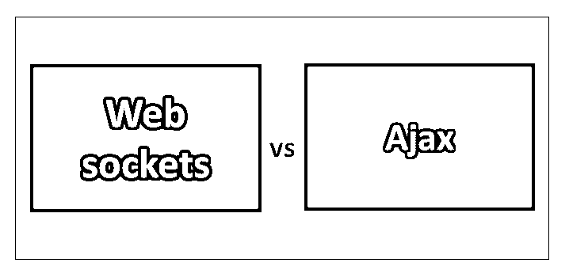
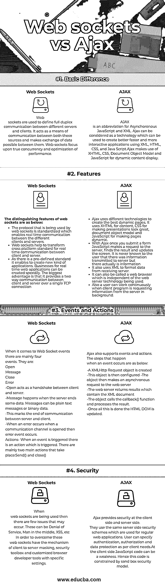

# Web 套接字与 Ajax

> 原文：<https://www.educba.com/web-sockets-vs-ajax/>

## Web 套接字和 Ajax 的区别

web 套接字是计算机使用的一种通信协议。它通过 TCP/IP 协议提供全双工通信通道。它被认为是浏览器和服务器之间完全双向的通道。连接一旦建立，就是持久的，一旦完成，服务器就可以启动与浏览器的通信。与[物联网](https://www.educba.com/iot-applications/)也有优势。Ajax 代表异步 JavaScript 和 XML。它被用作一套 web 开发技术，使 Web 开发变得更加容易。可以说是用于创建异步 web 应用程序的客户端 web 技术。使用 Ajax，web 应用程序可以在不改变当前行为的情况下从给定的服务器检索数据。它于 1999 年推出，并为不同的浏览器创建了 API。随着 web 应用程序不断在服务器和浏览器之间移动， [Ajax](https://www.educba.com/ajax-interview-questions/) 已经成为数据传输的主要媒介。

### Web Sockets 和 Ajax 的直接比较(信息图表)

以下是 Web Sockets 和 Ajax 的四大区别:

<small>网页开发、编程语言、软件测试&其他</small>

### Web Sockets 和 Ajax 的主要区别

两者都是市场上的热门选择；让我们讨论一下 Web 套接字和 Ajax 之间的一些主要区别:

web sockets 的工作是让客户端的 JavaScript 打开一个到服务器的持久连接。当使用 web 套接字时，由于这种已建立的连接，数据可以以快速消息的形式交换。另一方面，Ajax 允许客户端 JavaScript 应用程序请求访问不同的服务器端资源。Ajax 不等待响应，当响应就绪时，它调用回调函数，回调函数将进一步处理请求。此外，Ajax 向服务器轮询数据，而不是从服务器接收数据。当需要速度时，web 套接字总是更好的选择。

其次，Ajax 只能通过字符串数据类型发送调用。这造成了将所有其他数据类型转换为字符串的开销。当[布尔](https://www.educba.com/java-booleans/)出现时，这就很困难了。Web 套接字可以发送 JavaScript 浏览器正在使用的任何数据类型。这意味着布尔值不需要在服务器上进行任何转换。

### Web sockets 和 Ajax 对照表

让我们来看看 Web sockets 和 Ajax 之间的顶部比较。

| **Web Sockets 与 Ajax 的比较基础** | **网络套接字** | AJAX |
| **基本差异** | Web 套接字用于定义不同服务器和客户端之间的全双工通信。它充当这两个源之间的通信手段，并使它们之间的数据交换成为可能。Web 套接字关注真正的并发性和性能优化。 | AJAX 是异步 JavaScript 和 XML 的缩写。Ajax 可以被认为是一种技术，可以用来使用 XML、HTML、CSS 和 JavaScript 创建更好、更快和更具交互性的应用程序。Ajax 利用 XHTML、CSS、文档对象模型和 JavaScript 进行动态内容显示。 |
| **特性** | web 套接字的显著特征如下:

*   The protocol used by web socket is standardized, which enables real-time communication between different clients and servers.
*   Web sockets helps to transform the cross-platform standard of real-time communication between client and server.
*   Because there are predefined standards, new application types can be created. The business of real-time web applications can be quickly created. The biggest advantage is that it provides two-way communication between the client and the server through a TCP connection.

 | Ajax 使用不同的技术来创建最好的动态页面。它将 XHTML 用于内容，CSS 用于使演示看起来很棒，文档对象模型和 JavaScript 用于使页面动态化。*   With Ajax, once the form is submitted, JavaScript makes a request to the server, finds the result and updates the screen. Users never know that information is transmitted to the server, but they are actually transmitting information.*   It also uses XML to format the data from the receiving server.*   It can also be called a web browser, which is independent of the web server technology being used.*   In addition, when the client program requests information from the server in the background, the user can work continuously.T11】 |
| **事件和动作** | When it comes to Web Socket events, there are mainly four events. They are:

1.  打开
2.  消息
3.  关闭
4.  错误

–Open 充当客户端和服务器之间的握手。
–服务器发送一些数据时出现消息。消息可以是纯文本消息或二进制数据。
–这标志着服务器和客户端之间的通信结束。
–当一个错误发生时，当一个通信通道被打开时，那么错误事件发生。
动作-当一个事件被触发时，有一个动作被触发。主要有两个主要的动作发生:
发送()和关闭() | Ajax 也支持事件和动作。事件发生时的步骤如下:
–创建一个 XMLHttpRequest 对象。
–然后配置该对象。
–然后对象向 web 服务器发出一个异步请求。
–web 服务器返回包含 XML 文档的结果。
–对象调用 callback()函数并处理结果。
–一旦所有这些都完成了，HTML DOM 就更新了。 |
| **安全** | 当使用 web 套接字时，可能会出现一些问题。这些可以是拒绝服务、[中间人、](https://www.educba.com/what-is-man-in-the-middle-attack/)、XSS 等。为了克服这些 web 套接字，需要客户端到服务器的屏蔽机制、安全工具箱和具有特定设置的定制浏览器开发工具。 | Ajax 在客户端和服务器端提供安全性。它们使用与常规 web 应用程序相同的服务器端安全方案。用户可以根据客户需求指定身份验证、授权和数据保护。在客户端，JavaScript 代码可能是一个弱点。因此，这段代码受到沙盒安全模型的约束。 |

### 结论

这两者在创建网页时都很有用。当需要传统的请求-响应时，可以使用 Ajax，当涉及实时通信并且需要快速结果时，可以使用 web sockets。连接一旦建立，所需的资源将比 Ajax 少。因此，对于当今世界中更加重视实时数据的应用程序来说，可以使用带有节点 js 的 web 套接字来提高性能。

### 推荐文章

这是 Web Sockets 和 Ajax 之间最大区别的指南。在这里，我们讨论了 Web Sockets 与 Ajax 的直接比较、键差异、信息图和比较表。您也可以看看以下文章，了解更多信息–

1.  [Jira vs Trelo](https://www.educba.com/jira-vs-trello/)
2.  [长轮询 vs WebSockets](https://www.educba.com/long-polling-vs-websockets/)
3.  [JSON vs AJAX](https://www.educba.com/json-vs-ajax/)
4.  [JSP vs JSF](https://www.educba.com/jsp-vs-jsf/)

