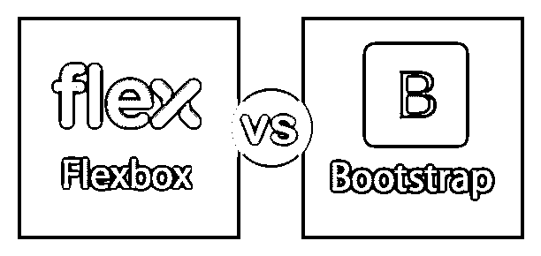
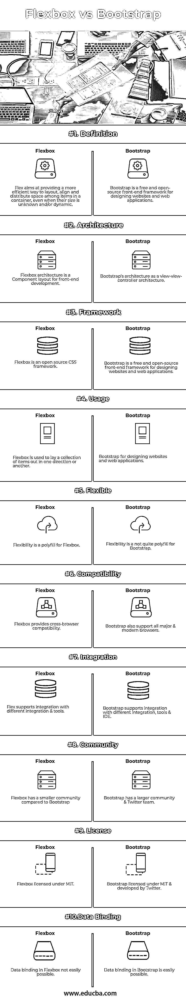

# Flexbox 和 Bootstrap

> 原文：<https://www.educba.com/flexbox-vs-bootstrap/>

## Flexbox 和引导程序简介

随着每个人都在寻找设备友好的用户界面，对响应式设计的需求正在迅速增长。为了实现这种响应性设计，我们要么选择 Flex，要么选择 Bootstrap。

我最喜欢的 CSS 概念之一是 Flexbox，因为它的布局允许容器中的响应元素根据设备的屏幕大小自动排列。这种伸缩技术对项目的大小保持灵活性，对其内容保持灵活性。简而言之，我认为 Flexbox 通常会检查容器中最高的 div，并保持其高度。此外，在 flexbox 中，我们在每个元素中放置了更多的类，这最终会增加 HTML 页面。所有这些导致了检索 HTML 页面的速度。毫无疑问，Flexbox 是标准的部署方式之一。所以对于每一个想成为前端开发者的人来说都是必须的。

<small>网页开发、编程语言、软件测试&其他</small>

另一方面，我们有世界上最受欢迎的用于响应式设计的 UI 库，叫做 Bootstrap。它是一个使用浮动来构建网格系统的框架。同样是 CSS，所以性能很少，除了下载文件。它为每个元素创建了一个或者两个类。在使用 Bootstrap 时，为了避免不同高度的 div 错位，我们必须在每行之后使用 clearfix。Bootstrap 有利于在项目和团队之间建立一致性。还有，Bootstrap 的最后一个版本，也就是 Bootstrap 4，使用的是 flexbox 模型，功能更强大。

### Flexbox 和 Bootstrap 之间的直接比较(信息图表)

以下是 Flexbox 与 Bootstrap 之间的 10 大区别

### Flexbox 和 Bootstrap 的主要区别

两者都是市场上的热门选择；让我们讨论一些主要的区别:

Bootstrap 有一组 CSS 用于设计网页，支持使用媒体查询的响应式布局，这使它不同于 FlexBox。事实上，Bootstrap 4 已经支持 FlexBox。

与 Bootstrap 不同，FlexBox 内置在 CSS3 中，可以更好地定位元素。由于 FlexBox 是一维的，它使得创建困难的布局更加容易。

如果我们想让一行中的所有子元素具有完全相同的宽度，那么我们必须通过将父类定义为 display flex 来创建 flexbox。这样，我们可以对一行或单个元素进行操作。最终，我们消除了浮动的使用。

在 Bootstrap 中，由于已经定义了样式，开发人员不必从头开始编码。它不仅减少了 CSS 编码，而且节省了时间。如果需要，我们还可以定制引导文件。Bootstrap 的响应行为是其中最好的部分。由于一切都是预定义的，所以我们不需要为不同大小的移动设备单独编写代码。

大多数时候，我们在 web 上使用网格，这可以通过 Bootstrap 中的 floats 来实现。然而，flexbox 做了相反的事情，对项目的大小和内容保持灵活性；这类似于使用像素与 em/rem，或者像控制你的 div 只使用边距和填充，从不设置预定义的大小。

由于 Bootstrap 使用 floats，所以每行之后都需要 clearfix 否则，我们将得到不同高度的未对准 div。Flexbox 不使用浮动；相反，它检查容器中最高的 div，并坚持它的高度。

Flexbox 布局最适合应用程序的组件和小规模布局，而 Bootstrap 适用于更小或更大规模的布局。

### Flexbox 与引导比较表

下面是 Flexbox 和 Bootstrap 之间最重要的比较

| **比较的基础** | **柔性盒** | **自举** |
| **定义** | Flex 旨在提供一种更有效的方式来在容器中的项目之间布局、对齐和分配空间，即使它们的大小是未知的和/或动态的。 | Bootstrap 是一个用于设计网站和 web 应用程序的免费开源前端框架。 |
| **架构** | Flexbox 架构是面向前端开发的组件布局。 | 作为视图-视图-控制器架构的 Bootstrap 架构。 |
| **框架** | Flexbox 是一个开源的 CSS 框架 | Bootstrap 是一个用于设计网站和 web 应用程序的免费开源前端框架。 |
| **用途** | Flexbox 用于向一个方向或另一个方向放置一组项目。 | 设计网站和网络应用程序的自举。 |
| **灵活** | 灵活性是 Flexbox 的一个多填充物 | 对于引导来说，灵活性并不是一个非常复杂的问题 |
| **兼容性** | Flexbox 提供跨浏览器兼容性。 | Bootstrap 还支持所有主流和现代浏览器。 |
| **整合** | Flex 支持与不同集成工具的集成 | Bootstrap 支持与不同集成、工具和 IDE 的集成 |
| **社区** | 与 Bootstrap 相比，Flexbox 的社区较小 | Bootstrap 有一个更大的社区& Twitter 团队。 |
| **执照** | 根据 MIT 许可的 Flexbox。 | 麻省理工学院授权的引导程序，由 Twitter 开发。 |
| **数据绑定** | Flexbox 中的数据绑定不容易实现。 | Bootstrap 中的数据绑定很容易实现。 |

### 结论

如果您已经阅读了 Flexbox vs Bootstrap 的整篇文章，那么这个结论应该不会让您感到意外。因为事实是，没有更好的系统了——flex box 和 Bootstrap 擅长不同的事情，应该一起使用，而不是相互替代。

基本上，Flexbox 不能替代 Bootstrap。事实上，Bootstrap 在 Bootstrap 4 中的布局也使用了 flexbox。

为了解决跨浏览器的问题，我们必须通过包含规格化 CSS 来进行引导；它也有一些额外的 CSS 元素(按钮，面板，大屏幕等)。).有三种方法来处理 Bootstrap 的“响应”部分，即通过 Bootstrap 3 中引入的浮动元素或使用 Bootstrap 4 中使用的 Flexbox。

### 推荐文章

这是 Flexbox 与 Bootstrap 之间最大差异的指南。在这里，我们还将讨论信息图和比较表的主要区别。您也可以看看以下文章，了解更多信息–

1.  [Bootstrap vs jQuery UI](https://www.educba.com/bootstrap-vs-jquery-ui/)
2.  [角度与自举](https://www.educba.com/angular-vs-bootstrap/)
3.  [Bootstrap vs WordPress](https://www.educba.com/bootstrap-vs-wordpress/)
4.  [余烬 js vs Angular js](https://www.educba.com/ember-js-vs-angular-js/)

