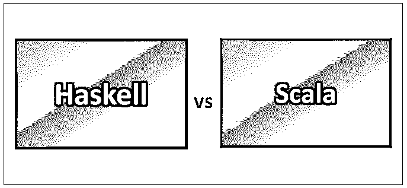
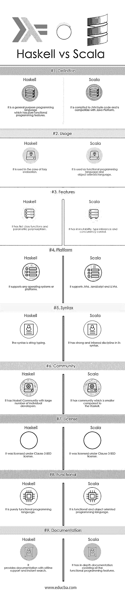

# Haskell vs Scala

> 原文：<https://www.educba.com/haskell-vs-scala/>

## Haskell 和 Scala 的区别

Haskell 是一种标准化的通用编程语言，具有纯函数式编程特性。它是由伦纳特·奥格森、约翰·休斯、保罗·胡达克、约翰·朗什伯里、西蒙·佩顿·琼斯、菲利普·瓦德勒和埃里克·梅耶尔开发和设计的。它的类型学是强的、静态的、推断的，没有严格的语义。它是根据 BSD 许可证条款 3 授权的。它的特点是懒惰、非严格和模块化编程。它最早出现在 2010 年。它的文件扩展名是。hs 或。lhs 并支持跨平台操作系统。

Scala 是一种通用编程语言，具有强大的函数式编程功能。它是一种静态的、推理的、强大的结构化编程语言。它的文件扩展名是。它在 2004 年首次出现。它支持不同的平台，如 JVM、JavaScript 和 LLVM 等。它在客户机-服务器类型的应用程序中最受欢迎。它是根据 BSD 许可证条款 3 授权的。Scala 的最新版本发布于 2018 年 9 月。马丁·奥德斯基设计的。Scala 的源代码转换了 Java 字节码，可以在 JVM 上运行。Scala 具有与 Haskell、标准 ML 和 Scheme 等编程语言相似的特性。实验室开发的编程方法。

<small>网页开发、编程语言、软件测试&其他</small>

### Haskell 和 Scala 的正面比较(信息图)

下面是 Haskell 和 Scala 之间的 9 大区别

### Haskell 和 Scala 的主要区别

两者都是企业中推荐的选项。让我们检查一些关键的区别:

*   Haskell 是一种函数式编程语言，而 Scala 是一种函数式面向对象编程语言。
*   Haskell 具有参照透明性；它的函数是纯一级函数，而 Scala 不保证引用透明，也没有纯函数。
*   Haskell 有一个非严格的惰性求值特性和可选的急切求值，而 Scala 有一个可选的惰性求值特性和严格的急切求值。
*   Haskell 本质上是完全声明性的，通过单子进行异常处理，而 Scala 支持命令式构造和语言级异常处理。
*   Haskell 在定义函数和多态字符串文字时支持 point freestyle，而 Scala 具有可变状态命令式编程、while 循环、代码块等特性。
*   Haskell 有不同的编译器扩展，如视图模式、种类多态性、泛型编程，而 Scala 有一些功能，如面向对象编程、Mixin 类、默认参数、字符串插值、隐式转换和灵活的作用域。
*   在 Haskell 中，一切都是表达式，默认情况下有不可变的变量，完整的类型推断，解释和编译的实现，而 Scala 有诸如结构类型，动态类型等特性。
*   Haskell 提供了更高的生产力、运行时的高性能、大型库和工具支持生态系统以及陡峭的学习曲线，而 Scala 有一个聪明的社区，虽然没有 Haskell 大，但可以轻松地过渡到 Java、 [C++或 C#](https://www.educba.com/c-plus-plus-vs-c-sharp/) 并具有更高的性能。
*   Haskell 有一个编译模型，如 Glasgow Haskell 编译(GHC)模型，而 Scala 有一个类似于 C++和 Java 的编译模型。
*   Haskell 不支持多个库或第三方工具，而 Scala 支持许多与 JVM 兼容的库。
*   Haskell 具有支持跨平台操作系统或不同平台的纯函数式编程特性，而 Scala 支持与 Java 的互操作性以及大型库或可用第三方工具的重用。
*   Haskell 在编码和强大的函数特性方面更适合高算法工作，而 Scala 有不纯的函数编程特性。
*   Haskell 拥有简单的语法和易于使用的简单特性，而 Scala 拥有复杂的语法和复杂的特性。
*   Haskell 简洁、安全且使用起来更快，而 Scala 也简洁、快速且更安全，支持许多库。
*   Haskell 有一流的函数和 pure，而 Scala 就函数式编程特性而言，使用起来严格且不纯。
*   Haskell 有完整的类型推断特性，而 Scala 有不完整的类型推断特性。
*   Haskell 有一个 GHC 编译器，它在系统中有 Scala 没有的高级特性，而 Scala 默认有一个严格的名字注释特性。

### Haskell vs Scala 对照表

如您所见，Haskell 和 Scala 之间有很多比较。再来看顶部对比。

| **比较的基础** | 哈斯克尔 | **Scala** |
| **定义** | 它是一种通用编程语言，具有纯函数式编程特性。 | 它被编译成 JVM 字节码，并且与 Java 平台兼容。 |
| **用途** | 用在懒求值的情况下。 | 它被用作函数式编程语言和面向对象语言。 |
| **特性** | 它具有一流的功能和参数多态性。 | 它具有不变性、类型推断和并发控制。 |
| **平台** | 它支持任何操作系统或平台。 | 它支持 JVM、JavaScript 和 LLVM。 |
| **语法** | 语法是强类型。 | 它在语法上有很强的推理性。 |
| **社区** | 它有一个 Haskell 社区，里面有大量的个人开发者。 | 它有一个比 Haskell 更小的社区 |
| **执照** | 它是根据 BSD 许可证条款 3 授权的 | 它是根据 BSD 许可证条款 3 授权的 |
| **功能性** | 它是一种纯粹的函数式编程语言 | 它是一种面向对象的函数式编程语言。 |
| **文档** | 它提供离线支持和即时搜索的文档。 | 它有涵盖所有函数式编程特性的深入文档。 |

### 结论

Scala 和 Haskell 都是函数式编程语言，而 Scala 也支持面向对象的编程语言特性。面向对象语言和函数式编程语言中的需求赋予了 Scala 很大的分量。编程语言的选择取决于通过以有效的方式做出折衷选择来使应用程序有效工作所需的功能和特性。Haskell 有一个模板 Haskell，Scala 的特性中有宏。

Scala 是最常用的，最近，Scala 被允许提供在 JavaScript 或 JVM 平台上运行的环境。因此，对于需要更快开发范围和更容易开发复杂服务的大型应用程序，或者在 Java 企业环境中提供优化、消息传递功能和许多其他有效技术的应用程序，Scala 可以被考虑用于任何类型的应用程序需求。Haskell 是一种纯函数式编程语言，支持强大的函数式编程语言特性。

### 推荐文章

这是 Haskell 和 Scala 之间最大区别的指南。在这里，我们还讨论了信息图和比较表的区别。你也可以看看下面的文章来了解更多。

1.  [Python vs Scala](https://www.educba.com/python-vs-scala/)
2.  [围棋 vs Scala](https://www.educba.com/go-vs-scala/)
3.  [Scala vs Java 性能](https://www.educba.com/scala-vs-java-performance/)
4.  [科特林 vs 斯卡拉](https://www.educba.com/kotlin-vs-scala/)

