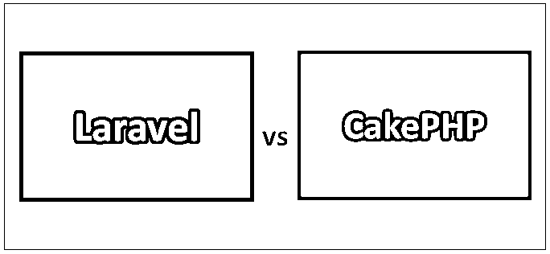
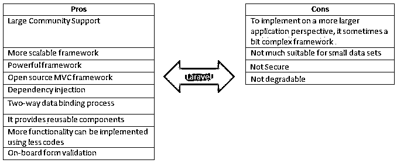
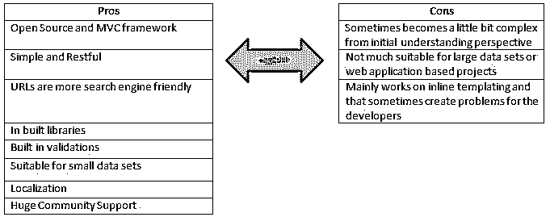
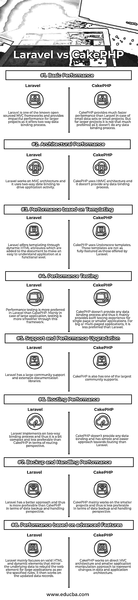

# Laravel vs CakePHP

> 原文：<https://www.educba.com/laravel-vs-cakephp/>

## Laravel 和 CakePHP 的区别

Laravel 基本上是一个强大的开源 MVC PHP 框架，主要用于开发新的、有创意的、优雅的全功能 web 应用程序。它提供了 PHP 框架的一组不同的基本功能。另一方面，CakePHP 是一个开源的 PHP 框架。也像强大的架构一样在 MVC 上实现。它主要实现在以一种更加简单和方便的方式维护、开发应用程序。不同库的存在有助于以更简单的方式实现不同的特性。

### Laravel 的特点

下面是 Laravel 的一些重要特性:

<small>网页开发、编程语言、软件测试&其他</small>

1.  **模块化:**它有 20 个内置的库，从应用程序内置的角度来看，这些库提供了重要的特性。
2.  **配置管理:**它用于在不同的环境中运行，因此有助于以更有效的方式实现和维护配置管理。
3.  **安全和认证:**它具有不同的功能，如注册、忘记密码、发送密码提醒，并且从应用程序开发和安全角度来看，它还具有 3 层认证方法。
4.  测试:它有不同的内置特性，有助于测试不同的场景，这也有助于维护和增强开发代码。

### Laravel 和 CakePHP 的优缺点

以下是 Laravel 和 CakePHP 的一些优缺点:

**拉勒维尔(赞成和反对):**

**CakePHP(利弊):**

### Laravel 和 CakePHP 的正面比较(信息图)

下面是 Laravel 和 CakePHP 的 8 大区别

### Laravel 和 CakePHP 的主要区别

两者都是市场上的热门选择；让我们讨论一些主要的区别:

1.  CakePHP 和 Laravel 都是开源框架，但是 Laravel 是免费的，而 CakePHP 不是。
2.  Laravel 工作于面向对象的模型，而 CakePHP 工作于面向文档的数据库模型。
3.  Laravel 是基于模型视图控制器(MVC)架构的，而 CakePHP 是在分层模型视图控制器(HMVC)架构上实现的。
4.  Laravel 不适合较小的项目，对于较小的项目来说有点复杂，而 CakePHP 更适合构建小规模的项目。
5.  从安全基准的角度来看，CakePHP 扮演着比 Laravel 更重要的角色
6.  从路由角度来看，CakePHP 比 Laravel 更方便。
7.  从可伸缩性的角度来看，Laravel 框架高于 CakePHP 框架，这种情况在考虑构建大型项目时更常见。
8.  从快速 web 开发和增强的角度来看，Laravel 框架是比 CakePHP 更好的选择。
9.  从数据备份和处理的角度来看，Laravel 框架是比 CakePHP 更好的选择。
10.  在 Laravel 的例子中，有一个编译器功能，而 CakePHP 没有这个功能。

### Laravel 与 CakePHP 对照表

下面是 Laravel 和 CakePHP 之间的比较

| **比较的基础** | 拉勒维尔 | **CakePHP** |
| **基本性能** | Laravel 是已知的开源 MVC 框架之一，它提供了双向数据绑定过程，为大型项目提供了有效的性能。 | 在小数据集或小项目的情况下，CakePHP 提供了比 Laravel 快得多的性能。但是对于较大的项目来说，它不是那么受欢迎，因为它不做任何数据绑定过程。 |
| **建筑表现** | Laravel 在 MVC 架构上工作，它使用双向数据绑定来驱动应用程序活动。 | CakePHP 使用 HMVC 架构，它不提供任何数据绑定过程。 |
| **性能-基于模板** | Laravel 通过动态 HTML 属性提供给模板，这些属性被添加到文档中，使应用程序在功能层面上易于理解。 | CakePHP 使用下划线模板。这些模板不像 Laravel 提供的那样功能齐全 |
| **性能测试** | 与 CakePHP 相比，Laravel 更倾向于性能测试。主要是在大型应用的情况下，通过这个框架测试更顺畅。 | CakePHP 不提供任何数据绑定过程，因此它主要为单个页面或较小的应用程序提供快速测试体验。对于大型或多页面应用程序，它不如 Laravel 好 |
| **支持和性能升级** | Laravel 拥有庞大的社区支持和丰富的文档库。 | CakePHP 也拥有最大的社区支持。 |
| **路由性能** | Laravel 实现了一个双向绑定过程，因此从路由的角度来看，它有点复杂，不如 CakePHP 好。 | CakePHP 不提供任何数据绑定，它有一个比 Laravel 更简单、更容易的路由方法 |
| **备份和处理性能** | Laravel 有更好的方法，因此在数据备份和处理方面比 CakePHP 更可取。 | CakePHP 主要用于较小的项目，因此从数据备份和处理的角度来看不太可取。 |
| **性能-基于高级特性** | Laravel 主要关注镜像底层数据的有效 HTML 和动态元素，以便按照指定的规则为大型应用程序重建 web 元素。然后，它处理更新的数据记录。 | CakePHP 基于直接 MVC 架构和一个更小的应用程序操作方法来表示数据和应用程序架构的变化。 |

### 结论

在一系列因素上比较了 Laravel vs CakePHP 之后，可以得出结论，Laravel vs CakePHP 各有利弊。因此，在选择任何一个框架之前，开发人员应该学习和分析 CakePHP 和 Laravel 的不同方面。因此，基于项目需求的类型、工作时间和其他讨论的方面，应该选择这些框架中的任何一个来达到期望的目标。

### 推荐文章

这是 Laravel 和 CakePHP 之间最大区别的指南。在这里，我们还将讨论信息图和比较表的主要区别。您也可以看看以下文章，了解更多信息–

1.  [Django vs Rails](https://www.educba.com/django-vs-rails/)
2.  [Node JS vs Ruby on Rails](https://www.educba.com/node-js-vs-ruby-on-rails/)
3.  [Ruby vs Node](https://www.educba.com/ruby-vs-node/)
4.  [PHP vs C#](https://www.educba.com/php-vs-c-sharp/)

