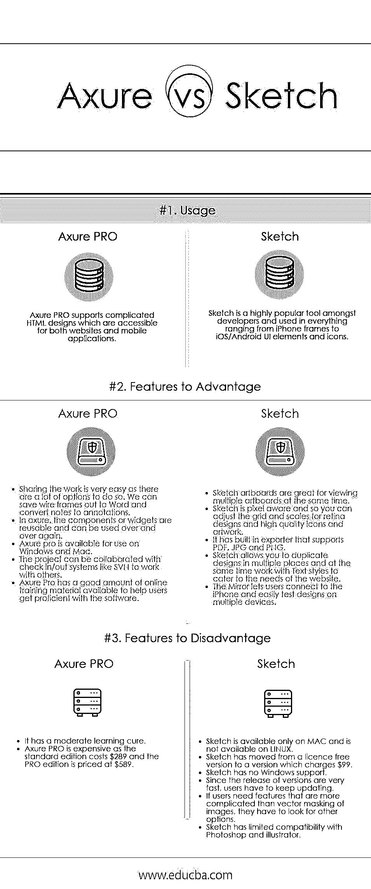

# Axure vs Sketch

> 原文：<https://www.educba.com/axure-vs-sketch/>

## 轴和草图的区别

Axure RP Pro 或 Axure 是针对 web 和桌面应用程序的线框、快速原型、文档和规范软件工具。它提供了小部件的拖放、大小调整和格式化。草图本质上是一种图形设计工具。它是一个具有优秀插件支持的原型工具。Axure 和 sketch 都是原型工具。与草图相比，Axure 是一个更复杂的工具。后者通常与 Axure 一起用于项目。sketch vs axure 各有所长。axure 用于交互设计和功能原型，而草图是一种图形设计工具。

### 下表列出了 acute 和 sketch 的优势和特点。

|  | Axure | 素描 |
| 点进 | ✔ |  |
| 交互式原型 | ✔ |  |
| 条件逻辑 | ✔ |  |
| 专用流程图 | ✔ |  |
| 动画片 | ✔ |  |
| 数据驱动的内容 | ✔ |  |
| 函数(数学、时间和日期等。) | ✔ |  |
| 工作表单元素 | ✔ |  |
| 动画和等级库导出 | ✔ |  |
| 网站地图和大型项目能力 | ✔ |  |
| 团队项目 | ✔ |  |
| 适应性设计 | ✔ |  |
| 基于画布的编辑 | ✔ | ✔ |
| 网格和参考线 | ✔ | ✔ |
| 云托管 | ✔ | ✔ |
| 在设备上查看 | ✔ | ✔ |
| 画板 |  | ✔ |
| 非破坏性矢量编辑 |  | ✔ |
| 像素精度和高缩放系数 |  | ✔ |
| 同步符号库 |  | ✔ |
| 导出生产图形和 CSS |  | ✔ |
| 集成社区 |  | ✔ |

### Axure 和 Sketch 之间的直接对比(信息图)

下面是 Axure 和 Sketch 的最大区别

<small>网页开发、编程语言、软件测试&其他</small>

### Axure 和 sketch 的主要区别

两者都是市场上的热门选择；让我们讨论一些主要的区别:

*   Axure 用于交互设计和功能原型，而 sketch 是一个设计工具包。Axure 通常在有或没有草图的情况下使用。
*   与 sketch 相比，Axure 在功能方面要复杂得多。素描以其简单的用法而闻名，这使得它很有趣。
*   像视觉设计师这样的多面手通常使用草图，而 axure 则被一系列拥有自己技术专长的专家使用，如交互设计师、产品经理、功能设计师、信息架构师、业务分析师等。
*   由于功能设计问题比视觉设计更重要，Axure 通常被认为是更有用的工具，因为它可以帮助用户提供功能性应用程序或网络体验。另一方面，草图更多的是一种视觉设计工具。
*   以 axure 为例，设计的每一个动作都是通过编程来完成的，而不是通过拖动或移动东西来完成的。所以不可能这样看待这个设计。而在草图的情况下，所有动作都是通过复制画板中的动作来完成的。因此，整个设计过程都可以在您工作时看到。

### Axure 与 Sketch 对照表

以下是 Axure 与 Sketch 的一些比较

| **比较参数** | **Axure PRO** | **草图** |
| **用途** | Axure PRO 支持复杂的 HTML 设计，可用于网站和移动应用程序。 | 草图是开发人员非常流行的工具，用于从 iPhone 框架到 iOS/Android UI 元素和图标的所有东西。 |
| **优势特征** | 分享工作非常简单，因为有很多选择。我们可以将线框保存到 Word 中，并将笔记转换为注释。*   In axure, components or widgets are reusable and can be used over and over again.*   Axure Pro can be used on Windows and Mac.*   This project can cooperate with check-in/check-out systems such as SVN and others.*   Axure Pro has a large number of online training materials to help users skillfully use the software.T11】 | 

*   草图画板非常适合同时查看多个画板。
*   草图是像素感知的，因此您可以调整 retina 设计和高质量图标和艺术品的网格和比例。
*   它有一个内置的导出器，支持 PDF，JPG 和 PNG。
*   Sketch 允许您在多个地方复制设计，同时使用文本样式来满足网站的需求。
*   这种镜子让用户可以连接到 iPhone，并在多种设备上轻松测试设计。

 |
| **不利特征** | 

*   It has a moderate learning curve.
*   Axure PRO is expensive, the standard version costs $289, and the professional version costs $589.

 | 

*   Sketches are only available on MAC, not on LINUX.
*   Sketch has moved from the unlicensed version to the version that costs $99.
*   Sketch is not supported by Windows.
*   Because the release speed of the version is very fast, users have to update it constantly.
*   If users need more complex functions than vector mask of images, they have to look for other options.
*   The compatibility between Sketch Photoshop and illustrator is limited.

 |

### 结论

考虑到 sketch 与 axure 的各种功能、用法和优缺点，我们可以得出结论，axure 是一个比 sketch 更复杂的工具，适合需要更多功能细节的项目。另一方面，素描因其简单而受到青睐，并有自己的一套追随者。Axure 比素描贵。重要的是 Axure 同时被 Windows 和 Linux 支持，而 sketch 只被 Linux 支持。记住这些主要因素将有助于开发人员为他们的项目使用正确的工具。

### 推荐文章

这是 Axure 与 Sketch 之间最大差异的指南。在这里，我们还讨论了 Axure 与 Sketch 的主要区别，包括信息图和比较表。你也可以看看下面的文章来了解更多。

1.  [肥皂 vs 休息](https://www.educba.com/soap-vs-rest/)
2.  [Java 8 vs Java 9](https://www.educba.com/java-8-vs-java-9/)
3.  [Groovy vs Kotlin](https://www.educba.com/groovy-vs-kotlin/)
4.  [JSON vs BSON](https://www.educba.com/json-vs-bson/)

