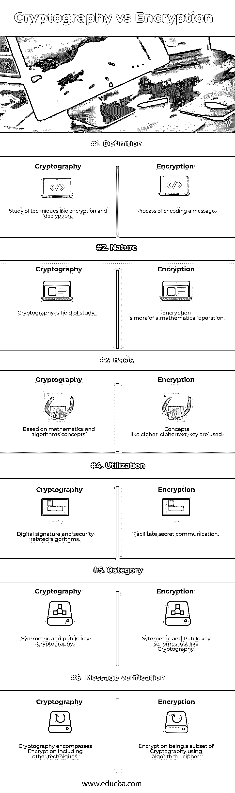

# 密码术与加密

> 原文：<https://www.educba.com/cryptography-vs-encryption/>

## 密码术和加密之间的区别

在存在被称为对手的恶意第三方内容的情况下，可以使用技术来提供安全通信。这些技术可以被称为密码学。使用一组协议，任何私人消息都可以对公众或任何第三方隐藏。这些协议需要以有效的方式进行分析和构建，以保持所发送消息的保密性。现代密码学有一个重要的方面，如数据完整性、认证、保密性等。在现代世界，密码学严重依赖于数学和计算机科学等学科。加密算法的设计方式使得它们在实践中很难被任何恶意的第三方(也称为对手)破解。破解这种算法的实用方法会失败；然而，理论方法可能会破解这样一个系统。因此，任何算法都可以被认为是安全的，如果它的密钥属性不能用给定的密文推导出来的话。密码学可以分为两个分支:对称和非对称。使用对称方法，单个密钥用于[加密和解密](https://www.educba.com/encryption-vs-decryption/)过程，即发送方和接收方应该拥有一个共享密钥。然而，在这种方法中，密钥的分发是一个薄弱环节，这就需要采用一种新的方法。在非对称版本的加密中，发送方和接收方有两个密钥，公钥和私钥。私钥是保密的，而公钥是对外公开的。用公钥加密的任何数据集只能用相应的私钥解密。相比之下，对称方法比非对称方法更快:例如，数字签名利用非对称加密技术来加密散列中的消息，而不是完整的消息。

加密是密码学的一个组成部分，是最有效和最流行的数据安全技术。加密过程包括将数据转换成另一种形式，称为密文，而要加密的原始数据称为明文。明文被提供给一个算法和一个加密密钥，它们创建一个密文。这个密文可以用有效的密钥解密。存储在计算机上的数据需要通过互联网或计算机网络进行传输。在通过网络发送数据时，需要维护数字数据的完整性或安全性；加密在提供数据完整性方面起着关键作用。需要维护一些核心的安全特性:数据完整性、身份验证和不可否认性。身份验证意味着需要验证数据的来源。数据完整性将确保内容在发送后不会被更改。并且，不可否认性将确保发送者不能拒绝发送消息。加密过程服务于这些主要的安全方面。和密码学一样，加密有两种模式:对称和非对称。在执行加密和解密时，发送方和接收方共享相同的密钥。另一方面，非对称方法使用两种不同的密钥，公钥和私钥。加密技术在民用系统、政府和军方保护信息的使用中非常普遍。客户的个人和银行相关数据极易被盗；在安全系统不能保护机密数据的情况下，加密这样的文件总是一个福音。起初，加密似乎是一种复杂的方法，但各种数据丢失防护软件可以有效地处理它。

<small>网页开发、编程语言、软件测试&其他</small>

### 密码术和加密之间的直接比较(信息图表)

下面是密码术和加密之间的 6 大区别

### 密码术和加密之间的主要区别

两者都是市场上的热门选择；让我们讨论一些主要的区别:

*   密码学是对加密、解密等概念的研究，用于提供安全通信，而加密是用算法对消息进行编码的过程。
*   密码学可以被认为是一个研究领域，它包含许多技巧和技术，而加密本质上更多的是数学和算法。
*   密码学作为一个研究领域，有更广泛的类别和范围；加密就是这样一种技术。加密是加密技术的一个方面，可以有效地对通信过程进行编码。
*   密码术在本质上更通用，使用数字签名和另一种技术模式来为数字数据提供安全性，而加密是利用一组被广泛称为密码的算法来加密数字数据。
*   密码术有对称和非对称版本，具有共享和非共享密钥的概念，而加密遵循相同的方法，具有一些特定的术语，如密文、明文和密码。
*   密码学涉及使用具有基本加密属性的算法，而加密是使用称为密码的数学算法的密码学子集之一。
*   密码术具有广泛的应用，其范围从数字数据到经典密码术，而加密用于对通过计算机网络传输的数据进行编码。
*   密码学的领域包括计算机编程、算法、数学、信息理论、传输技术，而加密在现代以来更具有数字化的性质。
*   密码术包括两个主要部分，称为加密和解密，而加密是保护信息以防止未经授权和非法使用的过程。
*   密码术充当加密的超集，即，用于加密的每个过程和术语可以说是密码术的一部分，而加密作为子集，具有其自己的特定术语和过程。

### 密码术与加密对照表

让我们讨论一下密码术与加密之间的比较如下:

| **比较的基础** | **密码术** | **加密** |
| **定义** | 对加密和解密等技术的研究。 | 对信息进行编码的过程。 |
| **性质** | 密码学是一个研究领域。 | 加密更多的是一种数学运算。 |
| **基础** | 基于数学和算法概念。 | 使用了密码、密文、密钥等概念 |
| **利用率** | 数字签名和安全相关算法。 | 便于秘密交流。 |
| **类别** | 对称公钥加密。 | 对称和公钥方案，就像密码学一样。 |
| **消息验证** | 密码学包含加密，包括其他技术。 | 加密是使用算法-密码的加密技术的一个子集。 |

### 结论

密码学涉及各种技术和工艺，包括算法、数学、信息论、传输、加密等。加密就是这样一种密码学技术。独立的加密过程可以保密地提供消息，但同时，还需要其他技术和策略来提供消息的完整性和真实性。因此，简而言之，一个成功的方案应该提供数据完整性、身份验证和不可否认性，这正是密码学所提供的。

加密有两种形式，对称和非对称。对称涉及发送方和接收方之间的单个共享密钥。另一方面，非对称涉及两个公钥和私钥，一个用于发送方，另一个用于接收方。因此，用户可以在任意两种形式中进行选择。公钥加密用于实现许多方案，如数字签名。各种软件都基于公钥算法，在当今世界，公钥算法对于提供安全可靠的数字数据至关重要。可以说，密码术与类似加密的技术是安全可靠的数字数据机制的基础。互联网&没有这两大安全支柱，数字世界将无法生存。

### 推荐文章

这是密码术与加密之间最大区别的指南。在这里，我们还将讨论信息图和比较表的主要区别。您也可以看看以下文章，了解更多信息–

1.  [Laravel vs Codeigniter](https://www.educba.com/laravel-vs-codeigniter/)
2.  [Laravel vs Lumen](https://www.educba.com/laravel-vs-lumen/)
3.  [骨干 js vs 棱角 js](https://www.educba.com/backbone-js-vs-angular-js/)
4.  [JavaScript vs JScript](https://www.educba.com/javascript-vs-jscript/)

