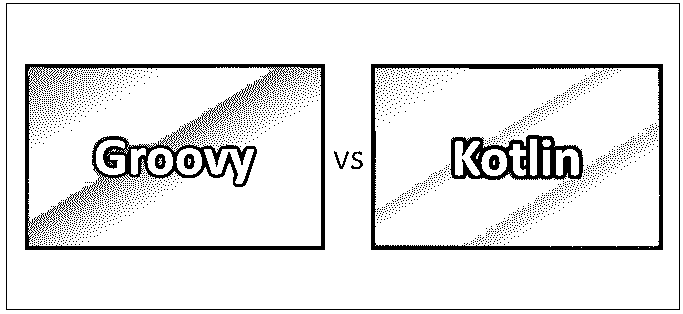
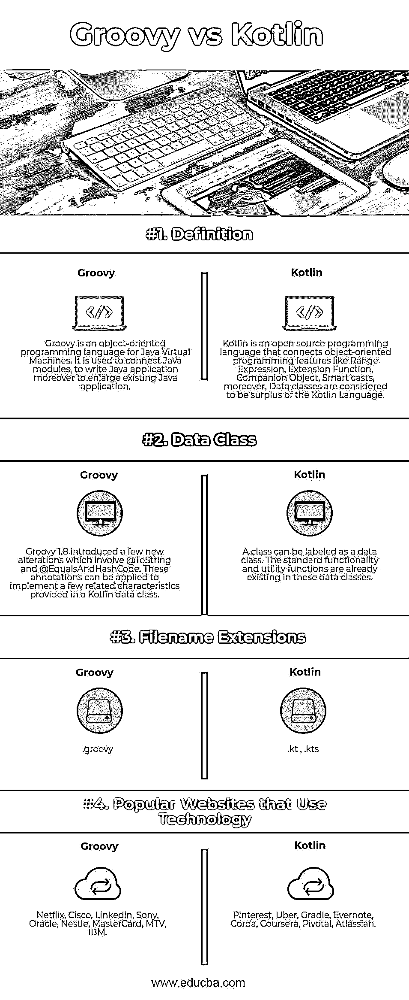

# Groovy vs Kotlin

> 原文：<https://www.educba.com/groovy-vs-kotlin/>

## Groovy 和 Kotlin 的区别

Groovy 是一种基于 Java 平台的面向对象编程语言。Groovy 1.0 发布于 2007 年 1 月 2 日，是 Groovy 2.4 中最流行、最有影响力的版本。但是，它是通过 Apache License v 2.0 分发的。它包含静态和动态语言，包括与 Python、Ruby、Perl 和 Small talk 相关的特性。它既可以用作编程语言。此外，用于 Java 平台的脚本语言被编译成 J.ava 虚拟机(JVM)字节码，也可以通过不同的 Java 代码和库无缝地互操作。Groovy 使用与 Java 类似的花括号语法。Groovy 支持闭包、多行字符串，包括嵌入字符串的表达式。 **Kotlin** 是一种高级的、强静态类型的编程语言，由最智能的 Java IDE 官方设计者 JetBrains 推出，名为 IntelliJ IDEA。Kotlin 运行在 Java 虚拟机(JVM)上。2017 年，谷歌宣布 Kotlin 是 [Android 开发](https://www.educba.com/careers-in-android-development/)的公认语言。Kotlin 是一种开源编程语言，它将面向对象编程和功能特性融合到一个独特的平台上。内容被分成包含相关主题的几个部分，包括可管理的，而且有益的例子。 [Kotlin 是最新的开源编程语言](https://www.educba.com/what-is-kotlin/)类似于 Java、Scala、Groovy、Gosu、JavaScript 等。Kotlin 的语法可能并不特别与 JAVA 相关；然而，在内部，Kotlin 依赖于现有的 Java 类库来为开发人员生成优秀的结果。

### 什么是 Groovy？

Groovy 的许多优势在于它的 AST 转换，由注释触发。在第 2 版之后，Groovy 可以静态编译，允许模型推理，而且性能接近 Java。Groovy 2.4 仍然是 Pivotal Software 在 2015 年 3 月结束赞助后的最新重要版本。Groovy 2.5.2 是 Groovy 开发的持久版本。Groovy 已经将其治理结构改进为 Apache Software Foundation 中的项目管理委员会。Groovy 的特性支持静态和动态类型、操作符重载、包含关联数组的本地列表语法、对正则表达式的本地支持，以及 XML 和 HTML 等几种标记语言。在 Java 和 Groovy 的语法非常相似之后，Groovy 对于 Java 开发人员来说是易于管理的。你可以处理现有的 Java 库也有可能扩展 java.lang.Object.re

<small>网页开发、编程语言、软件测试&其他</small>

### 科特林是什么？

Kotlin 为全世界的程序员提供了互操作性、代码安全性和准确性。Kotlin 可以编译成 JavaScript 源代码，也可以处理 LLVM 编译器基础设施。它的基本发展是一个 JetBrains 开发团队，总部设在俄罗斯的圣彼得堡。虽然语法不支持 Java，但 Kotlin 官方库的 JVM 实现也支持 Java 代码之间的互操作；它依赖于当前 Java 类库中的 Java 代码，比如模型的框架。Kotlin 实践了积极的模型推理来决定值的类型和表达式的类型。这减少了与 Java 相关的语言冗长，在版本 10 之前，这通常需要唯一冗余的类型规范。截至 Android Studio 3.0(2017 年 10 月发布)，Kotlin 完全由谷歌维护，用于他们的 Android 操作系统中；此外，它不可避免地包含在 IDE 的安装包中，作为标准 Java 编译器的一个选项。Android Kotlin 编译器允许用户选择 Java 6、Java 7 或 Java 8 兼容的字节码。

### Groovy 和 Kotlin 的正面比较(信息图)

下面是 Groovy 和 Kotlin 的最大区别

### Groovy 和 Kotlin 的主要区别

两者都是业内认可的选择。让我们考虑一些显著的区别:

*   考虑到 Groovy 是作为一种动态语言创建的，也@Compile Static，同时附上了全面的注释。它的特点似乎有点勉强；此外，它不强迫人们以静态方式编码。不是哪里都适用的。然而，有时即使打开了它，Groovy 似乎也有一些独特的动态性能。科特林是 100%静态的；此外，动态不是一个选项。Kotlin 被设计成一种静态类型语言，包括一个很好的类型系统和额外的静态类型语言优势。groovy——在初始位置是一种动态类型语言，然后也简单地——静态。
*   同时，当你允许在 groovy 中编译 static 时，你得到的显然是 Java。另一方面——kot Lin，在他们的类型系统中，拥有两种类型的引用:可空的和不可空的，所以你可以通过有限的 npe 来编写代码。
*   Kotlin 的另一个特殊之处是——它不做任何隐式转换，另一方面——groovy 隐式地将 double 转换为 big decimal 等等。
*   虽然 Kotlin 有很多其他特性，比如智能强制转换、ADT (doc)、类型安全构建器、零成本抽象，最后还有强大的 IDE 支持。
*   此外，Kotlin 的类型推断工作很有魅力，除了 Groovy 之外，每种语言都没有任何注释。
*   三元运算符:Both，Kotlin vs Groovy 提供 Elvis 运算符；但是，后者缺少三元运算符。

### Groovy 与 Kotlin 比较表

下面是最上面的比较:

| **比较的基础** | **Groovy** | **锅炉** |
| 定义 | Groovy 是一种面向对象的 Java 虚拟机编程语言。它用于连接 Java 模块，编写 Java 应用程序，以及扩展现有的 Java 应用程序。 | Kotlin 是一种开源编程语言，它连接了面向对象的编程特性，如范围表达式、扩展函数、伴随对象、智能强制转换；此外，数据类被认为是 Kotlin 语言的剩余部分。 |
| 数据类 | Groovy 1.8 引入了一些新的变化，包括@ToString 和@EqualsAndHashCode。这些注释可用于实现 Kotlin 数据类中提供的一些相关特征。 | 一个类可以被标记为数据类。标准功能和效用函数已经存在于这些数据类中。 |
| 文件扩展名 | .绝妙的 | .kt，.kts |
| 使用技术的流行网站 | 网飞、思科、LinkedIn、索尼、甲骨文、雀巢、万事达、MTV、IBM | Pinterest、优步、摇篮、Ever note、Corda、Coursera、Pivotal、Atlassian。 |

### 结论

总之，这是对 Kotlin 和 Groovy 之间关系的总结。当谈到新亮点时，社区有着重大的影响，并且总是有[假设 Scala 特性](https://www.educba.com/uses-of-scala/)将成为未来 Java 的一部分。尽管存在差异，但它们完全可以互操作，这表明它们可以在同一个应用程序中共存。Kotlin 和 Groovy 都是 JVM 语言，对开发者友好。

### 推荐文章

这是 Groovy 和 Kotlin 之间最大区别的指南。在这里，我们还讨论了 Groovy 和 Kotlin 在信息图和比较表方面的主要区别。你也可以看看下面的文章来了解更多。

1.  [常规面试问题](https://www.educba.com/groovy-interview-questions/)
2.  [Python vs Groovy](https://www.educba.com/python-vs-groovy/)
3.  [Java vs Kotlin](https://www.educba.com/java-vs-kotlin/)
4.  [科特林 vs 斯卡拉](https://www.educba.com/kotlin-vs-scala/)

