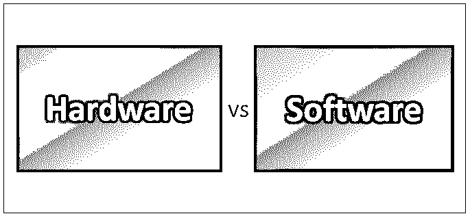
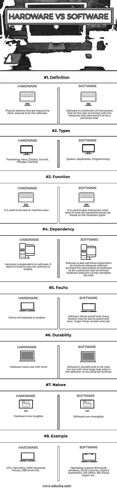

# 硬件与软件

> 原文：<https://www.educba.com/hardware-vs-software/>

## 硬件和软件的区别

硬件与软件是一个与计算机组件相关的比较性话题。硬件是与计算机系统物理关联的有形组件，而软件是计算机系统的无形组件。硬件是通过软件指令控制的，而软件是通过计算机硬件设计和开发来完成特定任务的。一些与计算机相关的硬件是硬盘，显示器，内存和 CPU 来处理计算机。类似地，软件的一些例子是操作系统，例如 Windows、Linux、Mac。谷歌 Chrome、微软 Internet Explorer 等浏览器软件是一些广泛使用的软件。

### 什么是硬件和软件？

让我们更详细地研究一下硬件和软件:

<small>网页开发、编程语言、软件测试&其他</small>

我们在系统中安装的互联网浏览器被视为软件，它允许我们浏览网页/网站以及运行浏览器的操作系统。所有软件都需要至少一个硬件设备才能运行。

**举例:**

我们都玩过某种计算机游戏，它是软件，使用计算机硬件，如处理器(CPU)、内存(RAM)、硬盘、视频卡、声音设备和其他硬件设备来运行，并与用户进行交互。

我们还使用安装在配有处理器、内存、硬盘、鼠标和键盘的计算机中的文字处理软件来创建和保存我们的文档。

在计算机世界里，硬件是使计算机工作的东西。CPU(中央处理器)处理信息，信息可以存储在 RAM(易失性存储器)或硬盘驱动器(非易失性存储器)中。声卡负责处理可能从扬声器(声音设备)听到的声音。视频卡负责显示器上显示的图像和视频。所有这些都是硬件。

可以安装相同系统所需的软件，并允许人与硬件进行交互，有时硬件还需要与相同系统内或系统外的其他硬件设备进行内部通信。

一个操作系统，像 Windows，Ubuntu，MacOS，就是软件。它为人们使用计算机提供了图形界面，也为其他软件在计算机上运行提供了平台。一旦安装了操作系统，则只能安装允许用户执行更专门的任务的任何附加程序。

所以从上面的讨论中，我们可以说软件是在计算机系统上执行某些任务的计算机程序的集合。

**软件类别:**

从技术上讲，在计算机系统中，我们可以将软件分为三大类:

1.  系统软件。
2.  编程软件。
3.  应用软件。

尽管这种分歧是任意的，但是软件通常被编程为容易与系统交互。

类似地，**，**硬件最好被描述为与系统物理连接的设备，比如硬盘，或者可以被物理触摸的东西。显示器、打印机、视频卡都是计算机硬件的例子。一台没有任何硬件或软件就无法运行的计算机将没有任何东西可以运行。

两者相互依存，相互影响。是软件告诉硬件它需要执行哪些任务。

### 硬件和软件之间的直接比较(信息图表)

下面是硬件与软件之间的 8 大区别

### 硬件和软件的主要区别

两者都是市场上的热门选择；让我们讨论一些主要的区别:

*   计算机硬件是任何物理设备，即(外部可拆卸设备)或系统中可用或使用的设备，而软件是需要安装到系统中的代码集合。例如，我们用来阅读文本的计算机显示器是一个输出设备，我们用来浏览网页或滚动或点击的鼠标是一个输入设备，两者都是计算机硬件。
*   两者相互依存。
*   没有软件，硬件无法完成这项任务。同样，没有硬件，软件也不能执行和完成任务。
*   故障可能发生在硬件上，故障背后可能有许多原因。然而，软件中的错误几乎可以忽略不计，但是随着时间的推移，软件中可能会出现 bug。
*   硬件会随着时间而磨损，软件不会随着时间而磨损。
*   硬件只理解机器语言。该软件接受人类可读语言的输入，将其解释为机器语言，并将其传递给硬件以完成任务。

### 硬件与软件对照表

让我们来看看硬件与软件之间的主要对比——

| **比较的基础** | **硬件** | **软件** |
| **定义** | 存储、执行(运行)软件所需的物理设备。 | 软件是一组指令的集合，让用户与硬件交互并命令它完成特定的任务。 |
| **类型** | 处理、输入、输出、控制、存储、外部 | 系统、应用、编程 |
| **功能** | 它用于在机器级别执行任务 | 它用于根据硬件类型给出硬件应该做什么工作的指令。 |
| **依赖关系** | 硬件依赖于软件。一旦载入软件，它就开始工作。 | 软件在某种程度上也依赖于硬件，因为软件向硬件提供指令来完成特定的任务，所以没有硬件，软件就不能完成任务。 |
| **故障** | 硬件故障是随机的。 | 软件故障可能有许多原因，可能是由于系统错误、主要-次要版本错误等。 |
| **耐久性** | 随着时间的推移，硬件会磨损。 | 该软件经久耐用，不会磨损，但随着时间的推移，软件中可能会出现错误，这是可以纠正的。 |
| **性质** | 硬件是有形的。 | 软件是无形的。 |
| **例子** | CPU、硬盘、内存、键盘、鼠标、USB 驱动器等。 | 操作系统(微软的 Windows，Linux 的 Ubuntu，苹果的 Macintosh。)、微软办公软件、微软媒体播放器等。 |

### 结论

在讨论了什么是硬件和什么是软件之后，我们现在可以用两者在计算机系统中都起着重要作用的事实来结束我们的讨论。

两者都是相互依赖的，因此无论是软件还是硬件都不能单独完成任务。

我们还遇到了两者的容错特性，在这两种情况下都可能发生故障。

我们还讨论了它的耐用程度，我们发现硬件会随着时间的推移而磨损，但软件是耐用的；但是，由于许多原因可能会出现错误，并且可以修复。

### 推荐文章

这是硬件与软件之间最大差异的指南。在这里，我们还将讨论信息图和比较表的主要区别。你也可以看看下面的文章来了解更多。

1.  [软件工程师 vs 软件开发人员](https://www.educba.com/software-engineer-vs-software-developer/)
2.  [计算机硬件 vs 网络](https://www.educba.com/computer-hardware-vs-networking/)
3.  [编程 vs 软件工程](https://www.educba.com/programmers-vs-software-engineering/)
4.  [软件开发 vs 网页开发](https://www.educba.com/software-development-vs-web-development/)

