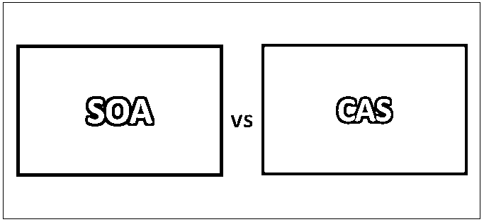
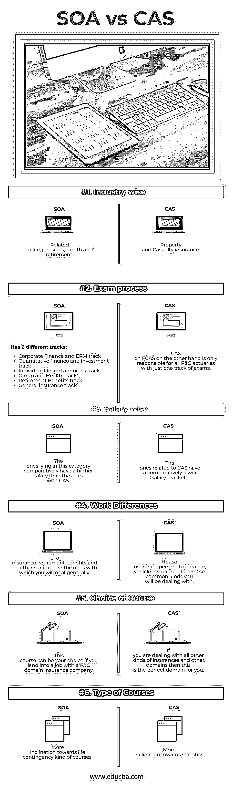

# SOA 与 CAS

> 原文：<https://www.educba.com/soa-vs-cas/>

## SOA 和 CAS 的区别

伤亡保险精算学会(CAS)和精算师学会(SOA)是精算师和精算科学的专业组织。SOA 一直以来都是与精算科学相关的所有职业领域的主导社会，除了那些与意外伤害和财产相关的领域。这些职业包括人寿保险、健康福利和养老金。对于那些在伤亡和财产中的人来说，CAS 一直是占主导地位的社会。显示主要存在于美国和加拿大，在世界其他地方存在有限。

**让我们更详细地研究一下 CAS 和 SOA:**

<small>网页开发、编程语言、软件测试&其他</small>

*   意外险精算师和财产通过 CAS 寻求他们的凭证；所有其他种类的精算师都通过 SOA 追求他们的证书。P、FM、MFE 等基础初试由 SOA 管理，学分由 CAS 授予。由于许多精算爱好者总是在 SOA 和 CAS 之间做出选择，我们旨在通过提供它们之间的相关差异，让您更好地理解 SOA 和 CAS。
*   最近，SOA 已经扩展到非传统领域，比如风险管理和财产与意外事故。当前的部分已经造成了 CAS 和 SOA 社会之间的许多摩擦。
*   SOA 和 CAS 之间的选择取决于您希望做什么和您现在正在做什么。很明显，也很有可能，除非你在那之前在某家公司工作，否则你不会决定选择哪条路。如果他们在 P&C 的公司工作，那么很有可能，他们会选择 CAS 途径。
*   如果候选人得到了某个保险领域公司的工作，那么他/她很可能会选择 SOA 作为他们的职业道路。SOA 和 CAS 之间的前 3 个基础预备考试相互重叠，所以如果你打算开始你的精算之旅，这就成了一个双赢的局面。如果你是一个对数学，尤其是统计学更感兴趣的学生，那么 CAS 是一个不错的选择。如果生命偶然性是精算的一种课程，那么 SOA 是你应该学习的。
*   CAS 和 SOA 在考试过程、工作类型和工资类型上都有所不同。一方面，SOA 为在健康、人寿、养老金和退休领域工作的精算师提供了标准和规则。CAS 考试旨在提供与 P&C 内容相关的信息。由于 CAS 只负责 P&C 精算师，所以只有一个考试轨道，即每个成为 CAS 或 f CAS 研究员的人都必须参加考试。

### SOA 和 CAS 之间的直接比较(信息图表)

下面是 SOA 与 CAS 之间的 6 大区别

### SOA 和 CAS 之间的主要区别

两者都是市场上的热门选择；让我们讨论一些主要的区别:

它们都以自己的方式支持精算师。一方面，CAS 为所有与财产和意外保险相关的候选人提供法规和标准，而 SOA 为所有在健康、人寿、退休和养老金相关领域工作的精算师提供同样的法规和标准。

就考试而言，CAS 考试旨在教授 P&C 精算师需要知道的所有概念，而 SOA 考试旨在教授精算师需要知道的与健康、养老金、退休和人寿相关的概念。

就与薪金有关的参数而言，所有 P&C 薪金的人都相对高于其他人。这也可以推断，保险公司领域相关的公司支付他们的精算师略好于他们的同行。这可能是因为对 P&C 候选人的需求增加或其他原因；原因不明。

如果你谈论与工作有关的差异，最大的差异将是你要处理的保险产品的种类。CAS 精算师将处理房屋保险、个人保险和车辆保险，而 SOA 精算师将处理健康保险、退休福利或健康保险。

无论选择 SOA 还是 CAS，都有 3 门考试需要通关才能拿到考试学分；因此，路径选择将在第 4 步中完成。如果你在美国之外，那么只通过 3 套考试就足以让你找到一份不错的工作，在那里你可以做出明智的选择和更明智的决定。你的第一份工作的类型很大程度上决定了你的职业选择。

### SOA 与 CAS 对照表

下面是 SOA 和 CAS 之间最重要的比较

| **比较的基础** | **SOA** | 化学文摘社 |
| **行业层面** | 与生活、养老金、健康和退休有关 | 财产和意外保险 |
| **考试流程** | 它有 6 个不同的轨道:

*   Corporate Finance and ERM Track
*   Quantitative finance and investment track
*   Individual life and annuity track
*   And group health track.
*   Retirement welfare track
*   General insurance track

 | 另一方面，FCAS 的 CAS 只负责所有 P&C 精算师的单科考试。 |
| **工资方面** | 相对而言，属于这一类别的人比有 CAS 的人工资高。 | 与 CAS 相关的工资级别相对较低。 |
| **工作差异** | 人寿保险、退休福利和健康保险是你通常要处理的。 | 房屋保险、人身保险、车辆保险等。是你将要面对的常见类型 |
| **选择课程** | 如果你在 P&C 的一家保险公司工作，你可以选择这门课程。 | 如果你正在处理所有其他种类的保险和其他领域，那么这是最适合你的领域。 |
| **课程类型** | 更倾向于生活偶然性类的课程 | 更倾向于统计学 |

### 结论

SOA 和 CAS 这两个方向在各自的类型和领域中都很好。选择正确的轨道可能是一项艰巨的任务，但正如上文所解释的，这只是一个兴趣问题，你所从事的工作将定义和决定你未来的行动方向。请继续关注我们的博客，获取更多类似的文章。

### 推荐文章

这是 SOA 和 CAS 之间最大区别的指南。在这里，我们还将讨论信息图和比较表的主要区别。你也可以看看下面的文章来了解更多。

1.  [Groovy vs Java](https://www.educba.com/groovy-vs-java/)
2.  [拉拉维尔 vs Zend](https://www.educba.com/laravel-vs-zend/)
3.  [余烬 js vs Angular js](https://www.educba.com/ember-js-vs-angular-js/)
4.  [SOA 与微服务](https://www.educba.com/soa-vs-microservices/)

