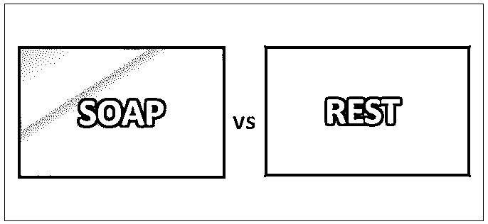
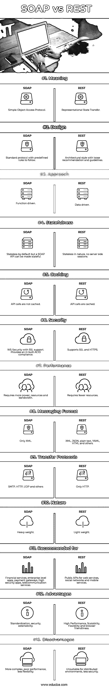

# 肥皂 vs 休息

> 原文：<https://www.educba.com/soap-vs-rest/>

## SOAP 与 REST 的区别

下面的文章提供了 SOAP 与 REST 的概要。网络服务是一种由电子设备向通过互联网相互通信的其他机器提供的服务。在某种程度上，它是驻留在用户设备上的网站和应用程序的唯一前端界面。数据存储在基于远程的服务器上，并通过利用 API 向第三方用户提供 web 服务而被发送到客户端机器。API 使用的架构在不同的情况下是不同的。

SOAP 是大多数 web 服务使用的首选消息协议。然而，当今世界瞬息万变，因此开发人员需要创建轻量级的 web 应用程序和移动应用程序，于是 REST 架构应运而生。今天，大多数公共 web 服务使用 RESTful 架构，而企业甚至今天仍然经常选择使用 SOAP。

<small>网页开发、编程语言、软件测试&其他</small>

SOAP 和 REST 都允许创建自定义 API。它使应用程序内的数据传输成为可能。API 接收请求，并通过 SMTP、HTTP 等互联网协议发回响应。很多网站都为用户提供 API。例如，谷歌地图有自己的公共 API，他们让你用你想要的内容定制它。

### SOAP 与 REST 的直接比较(信息图)

以下是 SOAP 与 REST 之间的 13 大区别:

### SOAP 与 REST 的主要区别

以下是 SOAP 与 REST 的主要区别:

*   SOAP 是一种标准协议，它使用 SMTP 和 HTTP 等其他协议发送消息。SOAP 的官方规范是由 W3C 开发和维护的，而基于 rest 的 web 服务本身并不是一个协议，而是一种架构风格。然而，它规定了一套你需要遵循的指导方针。比如 HTTP 状态码的使用和无状态的存在。
*   SOAP 是一个官方协议，因此它有严格的规则和高级的安全特性。其中一个特性是 ACID 合规性和授权。更高的复杂性需要更多的带宽和资源，最终导致网页渲染速度变慢。使用 REST web 服务解决了此问题。REST 的指导方针是宽松的，它允许开发人员以他们自己的方式创建和实现他们喜欢的建议。这允许不同的消息格式，比如 JSON、HTML、XML 和纯文本文件，而 SOAP 只允许 XML。由于它的轻量级特性，REST 拥有更加灵活的架构。
*   SOAP 只允许使用 XML 文件，而 REST web 服务支持多种文件格式，因此提供了更大的灵活性和相对更快的解析速度。SOAP 不能有效地处理对浏览器客户端的支持，而在基于 REST 的架构中，对浏览器客户端提供了更好的支持。
*   如果您谈论企业级的安全性，那么 SOAP 是一个不错的选择。它支持 WS- Security，这很方便。它还确保数据隐私和完整性不会受到损害。对身份验证的支持是通过利用中介提供的，而不仅仅是点对点。
*   对于 REST 服务中缺少的 SOAP 服务，提供了内置逻辑重试逻辑的功能。另一方面，REST 怀念内置的消息传递系统。如果通信失败，客户端必须重试并处理它。服务和消费者(即双方)需要理解上下文和内容，因为没有正式的文档可用。
*   基于标准 HTTP 的协议使得基于 SOAP 的 web 服务更容易跨越防火墙和其他代理进行操作，而不需要对协议本身进行任何修改。由于其沉重的本质，SOAP 总是比任何中间件如 ICE 或 COBRA 慢。一般来说，一些用例要求在进行交易时使用更高的可靠性。这比 HTTP 所实现的要多。对于任何与 ACID 属性相关的东西，SOAP 都是可以采用的协议。
*   与 RESTful 相比，设计 SOAP 应用程序通常更复杂。然而，对于任何需要支持复杂操作并要求维护上下文和内容的 web 服务来说，SOAP 是可以为您所用的服务。设计它将包括在事务、信任、安全和其他元素的应用程序层中编写较少的代码。

### SOAP 与 REST 对照表

让我们讨论一下 SOAP 和 REST 之间的比较:

| **比较的基础** | **肥皂** | **休息** |
| **意为** | 简单对象访问协议。 | 代表性状态转移。 |
| **设计** | 遵循预定义规则的标准协议。 | 带有松散建议和指导方针的体系结构风格。 |
| **接近** | 功能驱动。 | 数据驱动。 |
| **有状态** | 默认情况下是无状态的，但是 SOAP API 可以变成有状态的。 | 本质上是无状态的，没有服务器端会话。 |
| **缓存** | API 调用不会被缓存。 | API 调用被缓存。 |
| **安全** | 支持 SSL 的 WS-Security。提供内在的耐酸性。 | 支持 SSL 和 HTTPS。 |
| **性能** | 需要更多的电力、资源和带宽。 | 需要更少的资源。 |
| **消息格式** | 只有 XML。 | XML、JSON、纯文本、YAML、HTML 等等。 |
| **传输协议** | SMTP、HTTP、UDP 和其他。 | 只有 HTTP。 |
| **性质** | 要人 | 轻量级选手 |
| **推荐给** | 金融服务、企业级应用、支付网关、高安全性应用、电信服务。 | web 服务、社交网络和移动服务的公共 API。 |
| **优势** | 标准化、安全性、可扩展性。 | 高性能、可扩展性、灵活性和浏览器友好性。 |
| **缺点** | 更复杂，性能差，灵活性差。 | 不适合分布式环境，安全性较差。 |

### 结论

SOAP 和 REST web 服务都适合它们自己的领域和领域。最佳协议可能是对组织、支持所需的客户端类型最有意义的协议。如果安全性和遗留参数是您优先考虑的，那么 SOAP 就是您的解决方案；如果响应性和轻量级是您的要求，REST 是更好的解决方案。REST+JSON 如今已经成为全球领先的市场，这主要是因为大多数 web 浏览器都可以轻松、高效地使用它们。我希望现在您能够在您的组织中实现正确的 web 服务。请继续关注我们的博客，获取更多类似的文章。

### 推荐文章

这是 SOAP vs REST 的指南。这里我们用信息图和比较表来讨论 SOAP 和 REST 的主要区别。您也可以看看以下文章，了解更多信息–

1.  [萨斯对少萨](https://www.educba.com/sass-vs-less/)
2.  [SASS vs CSS](https://www.educba.com/sass-vs-css/)
3.  [Laravel vs Symfony](https://www.educba.com/laravel-vs-symfony/)
4.  [WebSocket vs REST](https://www.educba.com/websocket-vs-rest/)

