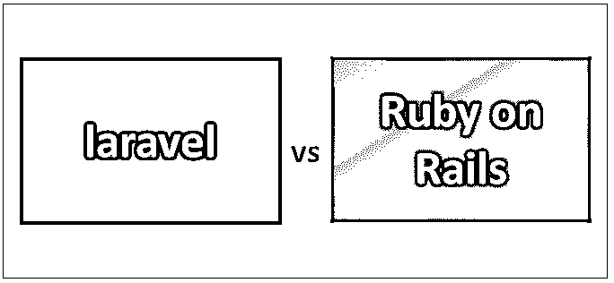
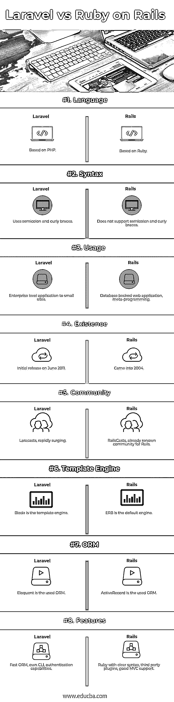

# laravel vs Ruby on Rails

> 原文：<https://www.educba.com/laravel-vs-ruby-on-rails/>

## laravel 和 Ruby on Rails 的区别

Laravel 是一个现代的 web 应用程序框架，可以简单快速地设计 web 应用程序。它可以同样容易地执行 web 应用程序的定制。它是一个用 PHP 编写的开源且被广泛使用的框架。由于它是开源的，所以它的源代码托管在 GitHub 上。Laravel 有几个[特性，可以吸引一个开发者去创建一个 web 应用。它的可伸缩性和性能在开发人员社区中备受瞩目。Ruby on Rails 就是这样一个框架，它用许多现成的特性来帮助开发人员，这样开发人员就可以简单地关注业务逻辑，而不必钻研框架的复杂性。它是用 Ruby 创建的服务器端 web 应用程序框架。](https://www.educba.com/what-is-laravel/)

### 拉勒韦尔

*   对于几乎每个 web 应用程序来说，主要任务仍然很常见，如缓存机制、会话管理、路由、认证等。Laravel 通过简化所有这些常见的任务，为解决开发过程中的问题做出了自己的努力。它的架构风格允许开发人员提出他们自己的基础设施，专门为他们的应用程序创建。
*   由于 Laravel 也有效地使用 MVC 模式，应用程序的业务逻辑可以使用控制器或直接利用声明来实现。它为开发人员提供了灵活性和一些特权，允许他们为小型网站开发具有复杂业务逻辑的企业应用程序。使用 IoC 来维护逻辑，即控制反转，这是一个管理类之间依赖关系的概念。依赖注入和 IoC 在维护依赖方面是一个很好的组合。这个 Laravel 特性是最著名和最常用的特性之一。
*   任何系统的组件都可以分离和重新组合，从而赋予 web 应用程序模块化的特性。Laravel 允许将业务逻辑分散在几个模块中。这种模块化支持是 Laravel 分离业务逻辑的一个关键方面。路由和缓存是 Laravel 毫不费力支持的其他功能。说到测试，Laravel 支持 PHPUnit，尽管它是开箱即用的。Blade 强大的模板引擎是随 Laravel 提供的，其动机是模板继承和节。

### Ruby on Rails

*   Rails 受到 web 标准的支持，如 [JSON 和 XML](https://www.educba.com/json-vs-xml/) ，它们被大量用于数据传输。在 web 开发过程中，一些范例对于任何框架来说都是标准的，比如约定胜于配置，开发人员不应该重复逻辑的枯燥原则。Rails 积极推广和支持这些范例。它基于 MVC，即模型-视图-控制器框架，是网页和 web 服务开发的基准。
*   Ruby on Rails 带来的一个关键特性是元编程。Rails 的几个特性，包括元编程，减少了开发人员的时间，让他们可以专注于业务逻辑。与其他一些开发人员需要从头开始编码的框架不同，元编程为开发人员提供了处理繁重任务的优势。传统的方法比配置更受欢迎，因为配置可以减轻开发人员的负担。

### Laravel 和 Ruby on Rails 的面对面比较(信息图)

以下是 Laravel 与 Ruby on Rails 的 8 大区别:

<small>网页开发、编程语言、软件测试&其他</small>

### Laravel 和 Ruby on Rails 的主要区别

Laravel vs Ruby on Rails 都是市场上的热门选择；让我们讨论一些主要的区别:

1.  Laravel 是 2011 年发布的基于 MVC 的开源框架，而 Rails 是基于 MVC 的，是一个优秀的 web 应用框架，用 Ruby 语言编写，于 2008 年发布。
2.  Laravel 是用 PHP 编写的，在 MIT 的许可下发布，而 Rails framework 是用 Ruby 创建的，在 MIT 的许可下有一个很好的可读语法。
3.  Laravel 适合于小型网站的具有复杂业务逻辑的企业级项目，而 Rails 非常适合于为小型项目编写的元编程语言和 web 应用程序。
4.  Laravel 有一个 MVC 模式，有自己的 CLI 称为 Artisan，可以执行迁移数据库、清除缓存等任务。，而 Rails 由相同的 MVC 模式支持，具有 ActiveRecord 的数据处理特性。
5.  Laravel 有用于 CLI 目的的 ORM 工具，名为雄辩和工匠，而 Rails 使用 web 服务器，如 WEBrick，Apache，NGINX，Cherokee。
6.  Laravel 有一个蓬勃发展的社区，其代码托管在 GitHub 上，而较早进入 web 领域的 Rails 有一个更大的社区，有大量的指南和文档。
7.  Laravel 是用 PHP 编写的，具有简单的学习曲线，为创造力提供了范围，而用 Ruby 编写的 Rails 与经验丰富的开发人员兼容，具有陡峭的学习曲线。
8.  Laravel 有一些很棒的特性，比如 Blade，它是一个模板引擎，也可以在视图中直接使用 PHP 代码，而 Rails 的神奇特性是它支持第三方插件，即 Ruby gems，这些插件有助于开发，并且有很好的文档记录。
9.  Laravel 更适合性能和可伸缩性，而 Rails 在可伸缩性方面较慢。
10.  Laravel 更适合具有内置认证功能的 web 应用程序，而 Rails 以 CoffeeScript 的形式为 web 应用程序提供了出色的特性，这是一个内置的静态编译工具。

### Laravel 与 Ruby on Rails 对比表

下面是 Laravel 和 Ruby on Rails 之间的比较

| **比较的基础** | 拉勒维尔 | **轨道** |
| **语言** | 基于 PHP | 基于 Ruby |
| **语法** | 它使用分号和花括号 | 它不支持分号和花括号 |
| **用途** | 小型站点的企业级应用程序 | 数据库支持的 web 应用程序，元编程 |
| **存在** | 2011 年 6 月首次发布 | 来到了 2004 年 |
| **社区** | 拉腊卡斯特，迅速飙升 | Rails Casts 已经是一个著名的 Rails 社区 |
| **模板引擎** | 刀片是模板引擎 | ERB 是默认引擎 |
| **蛇** | 雄辩是常用的形式 | ActiveRecord 是使用的 ORM |
| **特性** | 快速 ORM，自带 CLI，身份验证功能 | Ruby 具有清晰的语法，第三方插件，良好的 MVC 支持 |

### 结论——laravel 与 Ruby on Rails

在这篇 laravel vs Ruby on Rails 的文章中，我们看到了两个框架都有自己的一套特性，这使得它们以自己的方式独一无二。Rails 是一个更适合小型项目的框架,这些小型项目有很好的文档、指南和丰富的库。它在网络领域的出现比 Laravel 更早；因此它的社区更强大，在开发者中更受欢迎。 [Ruby 同时也是一种很好的可读语言](https://www.educba.com/uses-of-ruby/)；它的编码比其他任何传统的面向对象语言都更容易读写。另一方面，Laravel 装载了更适合创建任何 web 应用程序的特性。它的 ORM 工具口才，CLI 工具，工匠，允许开发人员执行不同的任务缓存清理，迁移数据库轻松。它的文档非常全面，涵盖了语言的各个方面。Laravel 的内置特性有效地支持了 web 应用程序的身份验证特性。

因此，鉴于 laravel 和 Ruby on Rails 框架的诸多方面，你可以选择其中的任何一个。这是一个应用程序需求，以及开发者对语言和框架的熟悉程度，这将决定框架的使用。

### 推荐文章

这是 Laravel 和 Ruby on Rails 之间最大区别的指南。在这里，我们还将讨论 on Rails 与信息图和比较表的主要区别。你也可以看看下面的文章来了解更多。

1.  [Node JS vs Ruby on Rails](https://www.educba.com/node-js-vs-ruby-on-rails/)
2.  [Laravel vs Lumen](https://www.educba.com/laravel-vs-lumen/)
3.  [Ruby vs Ruby On Rails](https://www.educba.com/ruby-vs-ruby-on-rails/)
4.  姜戈 vs 拉腊维尔

