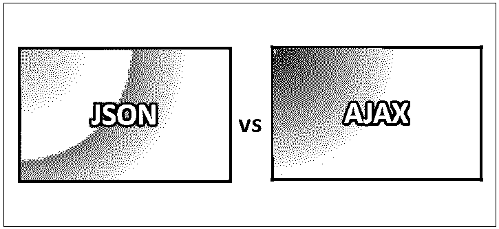
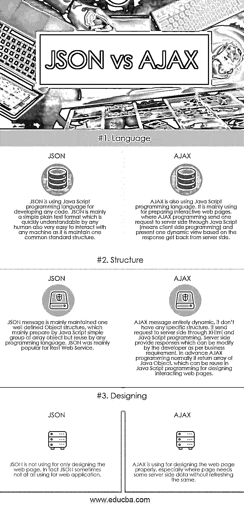

# JSON vs AJAX

> 原文：<https://www.educba.com/json-vs-ajax/>

## JSON 和 AJAX 的区别

JSON (JavaScript 对象表示法)和 AJAX(异步 JavaScript 和 XML)都在某种程度上依赖于 JavaScript 编程语言；至少他们是用 JavaScript 调用的。但是 JSON 和 AJAX 的特点是不同的。JSON 主要以一种开放的标准化开放格式来维护基于文本的数据，这种数据对于任何类型的数据交换都是可读的。而 AJAX 是一种 web 程序，或者可以说是一组 web 程序，主要用于设计复杂的或动态的网站，期望在不刷新页面的情况下从数据库中获取数据。Ajax 主要是为交互式 web 应用而设计的，结合了 XHTML、CSS 的通用样式概念、通过维护适当的 DOM 服务进行数据交互、交换所需数据的 XSL 或 XML 维护结构、以及两种适当的编程语言 JavaScript 和 XMLHttpRequest 概念。

JSON 有助于以适当的组织方式存储信息，这非常容易被每个人访问，并且可以被任何人在任何时间阅读。因为它是具有一个定义标准结构的简单文本消息，所以它也容易被任何机器系统频繁地解析或重新生成。AJAX 主要用于在视图页面中填充相关的服务器端数据，而无需刷新页面。它主要确保网页发送请求数据和从服务器端接收所需的适当的响应数据，这些数据可以很容易地动态用于网站设计，而不需要从屏幕上调用适当的 HTML 请求或响应。JSON 主要由一个对象构成，这个对象代表一些相关的数组。

<small>网页开发、编程语言、软件测试&其他</small>

### JSON 和 AJAX 的面对面比较(信息图表)

下面是 JSON 和 AJAX 的三大区别

### JSON 和 AJAX 的主要区别

两者都是市场上的热门选择；让我们讨论一些主要差异:

1.  JSON 是一个完全简单的面向文本消息的结构，由 JavaScript 编程或任何其他编程语言生成。它主要将一组数组作为一个 JavaScript 对象来维护，任何机器语言系统都可以轻松地阅读和访问这些对象。AJAX 纯粹是 XHTML 和 JavaScript 编程编写的一种特定类型的代码，用于帮助向服务器发送请求并从那里接收预期的响应，现在将相应的响应数据传递给 web 页面的 DOM 元素，以便根据客户端需求设计预期的响应页面。
2.  JSON 主要用于 Restful Web Service，用于任何特定的 Web 应用；它可以用于任何其他类型的应用程序，甚至所有其他编程语言的支持非常顺利。Restful web 服务可以是通常以 JSON 形式提供响应的设计；愿意使用该 web 服务的其他申请人接受该 JSON 响应，并通过各种工具轻松地将其转换为所需的对象。而 AJAX 主要用于准备交互式网页，主要用于 web 应用程序，它通常用于向服务器发送请求并从服务器获得响应；它不像 JSON 那样有任何特定的结构；在得到响应后，AJAX 将数据推送到网页的 DOM 元素中，这取决于开发人员的响应数据结构。现在 DOM element 可以按照客户的期望设计网页了。
3.  AJAX 是各种技术的重要资产，通常用于向服务器端发送一些异步请求，并从那里获得建议响应；请求和响应可以是完全不同的数据格式，这取决于客户端特定的需求。数据格式或使用技术可以是 JavaScript、HTML、XML、普通纯文本甚至 JSON。JSON 是其中一种格式，在 AJAX 中也非常流行，用于服务器端和客户端之间的数据交换。获得这些适当的数据后，AJAX 通常会将这些数据传递给 DOM 元素。DOM 元素负责设计可能的网页。JSON 是标准化定义格式的简单文本，它在 javascript 对象中保存一组数组。几乎所有可用或流行的编程语言都可以非常高效地解析该对象。在 AJAX 的情况下，JSON 数据可以用作来自服务器端组件的原始数据。

### JSON 与 AJAX 比较表

下面是 JSON 和 AJAX 之间最重要的比较

| **基础比较** | **JSON** | AJAX |
| **语言** | JSON 使用 JavaScript 编程语言来开发任何代码。JSON 主要是一种简单的纯文本格式，任何人都可以很快理解，也很容易与任何机器交互，因为它保持了一种通用的标准结构。 | AJAX 也使用 JavaScript 编程语言。它主要用于制作交互式网页，其中 AJAX 编程通过 JavaScript 向服务器端发送一个请求(即客户端编程)，并根据服务器端返回的响应呈现一个动态视图。 |
| **结构** | JSON 消息主要由一个定义良好的对象结构维护，该对象结构主要由 JavaScript 简单的数组对象组准备，但可被任何编程语言重用。JSON 主要流行于 Rest Web 服务。 | AJAX 消息完全是动态的；它没有任何特定的结构。它通过 XHTML 和 JavaScript 编程将请求发送到服务器端。服务器端提供响应，开发人员可以根据业务需求修改这些响应。事先，AJAX 编程通常会返回 Java 对象的数组，这些对象可以在 JavaScript 编程中重用，用于设计交互式网页。 |
| **设计** | JSON 不仅仅用于设计网页。事实上，JSON 有时根本不用于 web 应用程序。 | AJAX 用于正确设计 web 页面，特别是当页面需要一些服务器端数据而不需要刷新时。 |

### 结论

JSON 和 AJAX 都是当今世界非常流行的方法。最受欢迎的应用程序将会非常频繁地使用 JSON 和 AJAX。谷歌是 AJAX 的最大用户之一；他们非常清楚要提前不断改进 AJAX 功能。JSON 几乎经常用于 Rest 服务提供者应用程序。目前，一个非常流行的 Angular JS 应用程序通常完全由 JSON 响应设计，因为 Angular JS 非常开放，可以正确处理 JSON 响应。

### 推荐文章

这是 JSON 和 AJAX 之间最大区别的指南。在这里，我们还将讨论信息图和比较表的主要区别。你也可以看看下面的文章来了解更多。

1.  [JSON vs BSON](https://www.educba.com/json-vs-bson/)
2.  [JIRA vs Bugzilla](https://www.educba.com/jira-vs-bugzilla/)
3.  [JSON vs XML](https://www.educba.com/json-vs-xml/)
4.  [吉拉和特雷罗](https://www.educba.com/jira-vs-trello/)

