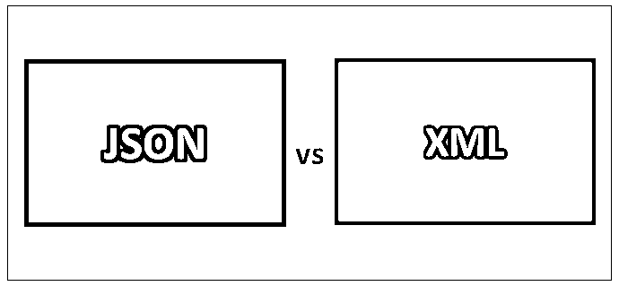
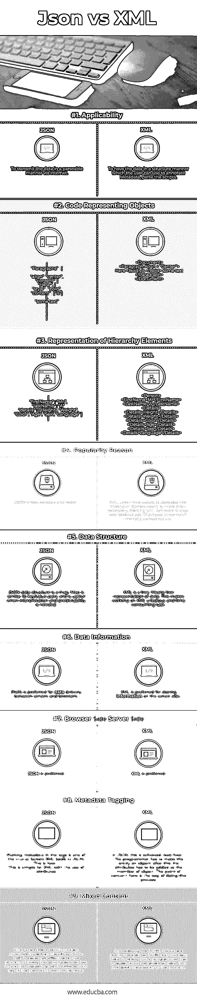

# JSON 与 XML

> 原文：<https://www.educba.com/json-vs-xml/>

## JSON 和 XML 的区别

**JSON** 代表 JavaScript 对象符号。这是一种用于浏览器-服务器通信的开放标准文件格式。这是一种独立于语言的数据格式。 **XML** 代表可扩展标记语言。这是一套帮助用户以人类可读和机器可读的格式对文档进行编码的规则。

**让我们更详细地研究一下 JSON 和 XML:**

<small>网页开发、编程语言、软件测试&其他</small>

“沟通至关重要”。这句话可以举出无数的例子。用专业术语来说，通信意味着共享数据和信息。执行这种通信的主体可以是系统或服务器。随着技术的进步，人类已经将自己组织成一个复杂的结构，这也导致我们创建适合自己需求的网络。

当我们要求计算机处理事物时，实际上它是在加载数据。这个数据加载是至关重要的，因为 CPU 需要将它读入内存。在这样做的过程中，它在存储数字以供读取；这些数据的意义取决于解释的基础。

现在是通信或数据交换部分。实际问题在于，当通信要在世界范围内无数可用的系统和网络之间发生时，以及解释是如何发生的。JSON vs XML 是 web 上数据交换最常用的格式。

为了避免这些问题，必须有一个通用的术语，在全球范围内的系统之间相互关联并且更容易理解。这就消除了解释的必要性。这是至关重要的，因为每台计算机都需要一些标准和通用术语。

### JSON 和 XML 的直接比较(信息图表)

以下是 JSON 与 XML 的 9 大区别:

### JSON 和 XML 的主要区别

两者都是市场上的热门选择；让我们讨论一些主要的区别:

*   JSON 的文件扩展名为。json，而 xml 的文件扩展名是. XML。
*   JSON 有一种“数据交换”文件格式，而 XML 有一种“标记语言”文件格式。
*   JSON 是从 JavaScript 扩展而来的，而 XML 是从 SGML(标准通用标记语言)扩展而来的。
*   JSON 出现在 2002 年(由道格拉斯·克洛克福特提出)，而 XML 出现在 1996 年(由 W3C 提出)。
*   JSON 关于学习和理解的复杂程度比 XML 更容易。
*   JSON 是面向数据的，而 XML 是面向文档的。
*   JSON 不提供显示属性，而 XML 提供(因为它是一种标记语言)。
*   JSON 支持数组，而 XML 不支持。
*   JSON 不如 XML 安全。
*   JSON 文件比它们的对应 XML 更容易阅读。
*   JSON 只支持文本和数字数据类型，而 XML 有文本、数字、图像、图表、图形等多种数据类型。

### JSON 与 XML 比较表

下面是 JSON 和 XML 之间最重要的比较:

| **比较的基础** | **JSON** | **XML** |
| 适应性 | 通过互联网以可解析的方式传输数据 | 为了以结构化的方式获得数据，用户可以用它来注释元数据，需要解析脚本 |
| 代表对象的代码 | {
"段落":[
{
"对齐":"中心"，
"内容":[
"此处"，{
"样式":"粗体"，
"内容":["是"] }，
"某文字。"
] }
] } |  <document><段落 Align = "中心">
此处<粗体>是</粗体>某些文字
</段落>
</文档></document> |
| 层次结构元素的表示 | {
“名字”:“先生”，
“姓氏”:“A”
“细节”:[“身高”、“体重”、“肤色”、“年龄”、“性别”、“语言”] } |  <person><名>先生</名>
<姓>名</姓>
<细节>
<细节>身高</细节>
<细节>体重</细节>
<细节>颜色</细节>
<</person> |
| 流行原因 | JSON 不那么冗长，速度也更快。 | XML 用更多的词来描述意图。有时这是不必要的。解析 XML 软件是一项缓慢而乏味的工作。这在内存消耗方面是有代价的。 |
| 数据结构 | JSON 数据结构是一个映射。该映射类似于键/值对，在需要解释和可预测性时非常有用。 | XML 是一棵树。表示数据的树表示。这使得处理 XML 成为一项乏味而耗时的任务。 |
| 数据信息 | JSON 是服务器和浏览器之间数据传递的首选。 | XML 是在服务器端存储信息的首选 |
| 浏览器端–服务器端 | JSON 是首选 | XML 是首选 |
| 元数据标记 | 将元数据放在标签中是 XML 导致 JSON 的关键因素之一。这就是为什么——这对于使用属性的 XML 来说很简单。 | 在 JSON 中，这是可以实现的，看看如何实现——程序员必须把实体变成一个对象；在这之后，属性必须作为对象的成员添加。这里的关注点是做这个过程的方式。 |
| 混合内容 | 字符串包含结构化的标记。用 XML 处理这个问题更容易也更有效。在这个过程中，程序员必须将标记文本放在它所属的父标签的子标签中。 | Considering the JSON, things are pretty complex as JSON only contains data. In doing this, a programmer has to again store metadata as data. This just adds complexity to the process. |

### 结论

我们可以说，JSON 和 XML 都是一种以众多编程语言和 API 可以理解的格式组织数据(可以说是复杂数据)的方式。这两者(JSON 和 XML)在大多数情况下都在相同操作系统的程序中使用。共享数据的需求是显而易见的。关于这两者，可以肯定的是 XML 肯定比 JSON 更早。最近，由于 JavaScript 的繁荣，JSON 在其用户社区中获得了动力。JSON 也没有 XML 那么集群化。

就适用性而言，它们的目的是一样的，那就是为无数程序和 API 之间的数据结构化和数据交换机制提供一个共同认可的平台，使开发人员紧张的工作生活变得更加轻松。

“这两者中没有一个优于另一个(JSON)已经在用户中获得了势头，每个都有自己的用途，并且根据使用情况更受欢迎”。

### 推荐文章

这是 JSON 和 XML 之间最大区别的指南。在这里，我们还将讨论信息图和比较表的主要区别。你也可以看看下面的文章来了解更多。

1.  [HTML vs XML](https://www.educba.com/html-vs-xml/)
2.  [JavaScript vs JScript](https://www.educba.com/javascript-vs-jscript/)
3.  [JSON vs BSON](https://www.educba.com/json-vs-bson/)
4.  [XHTML vs HTML5](https://www.educba.com/xhtml-vs-html5/)

