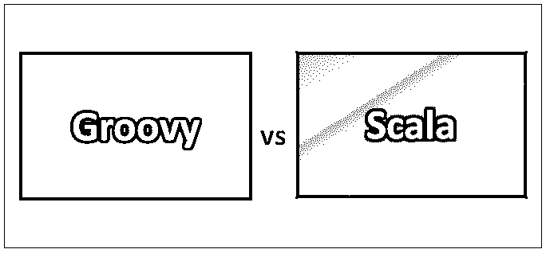
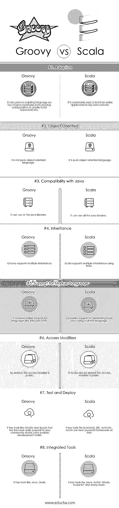

# Groovy vs Scala

> 原文：<https://www.educba.com/groovy-vs-scala/>

## Groovy 和 Scala 的区别

Scala 是可伸缩语言的首字母缩写。Scala 是一种通用的面向对象编程语言，支持函数式编程功能。Scala 运行在 Java 虚拟机(JVM)上；源代码旨在被编译成 Java 字节码。Apache [Groovy 是一种运行在 Java 平台上的面向对象编程语言](https://www.educba.com/what-is-groovy/)。Groovy 既可以作为编程语言，也可以作为运行在 Java 平台上的脚本语言，代码在 Java 虚拟机(JVM)上编译成字节码。

### 什么是 Scala？

*   Scala 有很多函数式编程语言特性，比如 Scheme、标准 ML、惰性求值、模式匹配等。
*   Scala 还有一个高级类型系统，支持代数数据类型、协方差和逆变、高阶类型和匿名类型。
*   Scala 运行在 JVM 上，并有其他编译器，如 Scala.js，它将 Scala 代码编译成 JavaScript。

### 什么是 Groovy？

*   Groovy 既是静态类型也是动态类型，支持各种特性，比如操作符重载、列表、关联数组等等；它还支持正则表达式。
*   Groovy 还支持各种标记语言，如 HTML 和 XML。
*   Groovy 可以使用很多现有的 Java 库。

### Groovy 和 Scala 的面对面比较(信息图)

下面是 Groovy 和 Scala 之间的 8 大区别:

<small>网页开发、编程语言、软件测试&其他</small>

### Groovy 和 Scala 的主要区别

正如你所看到的，Groovy 和 Scala 有很大的不同。让我们看看最大的区别:

*   **静态成员:** Groovy 有静态成员和方法的概念，而 Scala 没有静态的概念；相反，它使用单例对象来代替静态成员或方法。
*   语法: Groovy 使用 Grails、Glide 等库提供对 XML 和 HTML 等标记语言的原生支持。，而 Scala 也通过各种库提供对标记语言的支持，比如 Scala 标签、Udash、静态标签等等。
*   **重载(多方法或多调度):**多调度无非是拥有多个同名但参数不同的方法；那只不过是超载的概念。由于 Groovy 处理 Java 重载的方式，它在运行时支持多个分派，而 Scala 是单个分派，但使用模式匹配来处理多个分派。
*   学习曲线: Groovy 相对简单，需要的学习时间更少，而 Scala 可能需要更多时间来学习这门语言，因为它涉及到很多新事物。
*   **类型检查:** Groovy 动态类型化；也就是说，类型检查发生在运行时，Scala 在这里是静态类型化的；编译时会进行类型检查。

### Groovy 与 Scala 对照表

下面是 Groovy 和 Scala 的顶级对比。

| **比较的基础** | **Groovy** | **Scala** |
| **领养** | 它可以用作 java 代码库之上的脚本语言，例如在日志配置、Gradle 构建框架等中。 | 它通常用于构建大数据领域的整个应用程序。 |
| **面向对象** | 它不是一种纯粹的面向对象语言 | 它是一种纯面向对象的语言 |
| **与 Java 的兼容性** | 它可以使用所有的 java 库 | 它可以使用所有的 java 库 |
| **继承** | Groovy 支持多重继承 | Scala 使用 traits 支持[多个](https://www.educba.com/inheritance-interview-questions/)继承 |
| **支持标记语言** | 它为 XML 和 HTML 等语言提供了本地支持 | 它支持使用 scalatex 语言生成 HTML 文档 |
| **访问修饰符** | 默认情况下，访问修饰符是公共的 | 在 Scala 中，默认情况下，访问修饰符也是公共的 |
| **测试部署** | 它有像 Gradle 和 Spock 这样的工具，这些工具在 Java 社区中非常流行，并被用于 android 开发工具包。 | 它有像 Scala Test、SBT、Junit 等工具。，它们是 JVM 上最强大的框架。 |
| **集成工具** | 它有像 Java，Grails | 它有像 Java、Auth0、UDash、ScalaNLP 等工具 |

### Groovy 与 Scala 之间的性能表

下面是 Groovy vs Scala 的性能表。

| **基于 Groovy 与 Scala 的性能** | **Groovy** | **Scala** |
| **IDE 的** | Groovy 有 IDE，比如 Groovy Eclipse，Groovy 工具套件。groovy 工具套件是一个基于 Eclipse 的 IDE，它为开发人员提供了许多指标，Groovy-Eclipse 来自 Eclipse 基金会，它为开发人员提供了许多内置工具。
它提供了更好的性能，因为它有许多带有许多内置工具的 IDE。 | Scala has IDE’s like Scala IDE for Eclipse and NetBeans.

Scala IDE for Eclipse 为开发纯 Scala 提供了专门的支持，NetBeans IDE 允许开发人员快速轻松地开发桌面、移动和 web 应用程序。Scala 也是如此

 |
| **并发和并行** | Groovy 有一个名为 G Pars 的函数库，为应用程序提供并发性和并行性。 | Scala 使用 JVM，在单线程性能上做得很好；它也有像 Akka 和 Sparks 这样的库，提供机器学习、未来、承诺、数据流和演员。 |
| **速度** | 由于它的动态类型，Groovy 运行起来非常慢。但是具有更快的编译周期 | Scala 编译起来非常慢，但是执行周期更快。 |
| **易用性** | Groovy 用于快速原型和开发。 | Scala 用于开发成熟的生产应用程序。 |

### 结论

正如我们已经看到的，Groovy 和 Scala 之间有很多差异，很难说哪种编程语言更好。他们并不比其他人更好或更差。Groovy 和 Scala 语言都针对两类不同的问题。Scala 是一种高性能的语言，与 java 非常相似，但是没有 java 那么多的样板代码，并且有很多 Java 没有的特性。另一方面，Groovy 用于开发原型，速度没有程序员实现代码所花的时间重要。根据问题的类型，您可以根据自己的开发目的选择任何一种语言。

### 推荐文章

这是 Groovy 和 Scala 之间最大区别的指南。在这里，我们还将讨论信息图和比较表的主要区别。你也可以看看下面的文章来了解更多。

1.  [Python vs Scala](https://www.educba.com/python-vs-scala/)
2.  [围棋 vs Scala](https://www.educba.com/go-vs-scala/)
3.  [Groovy vs Java](https://www.educba.com/groovy-vs-java/)
4.  [Python vs Groovy](https://www.educba.com/python-vs-groovy/)

